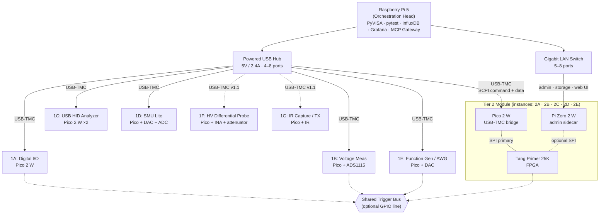

# Poor Man's Validation Bench

## System Design Document

**Version:** 1.0 (May 2026)
**Author:** Bradley Ward

---

## Table of Contents

- [1. Features](#1-features)
- [2. Applications](#2-applications)
- [3. Description](#3-description)
- [4. Functional Block Diagram](#4-functional-block-diagram)
  - [4.1 Top-Level Architecture](#41-top-level-architecture)
  - [4.2 Representative Control Flow](#42-representative-control-flow)
- [5. Module Catalog](#5-module-catalog)
- [6. Specifications](#6-specifications)
  - [6.1 System-Level Specifications](#61-system-level-specifications)
  - [6.2 Per-Tier Specifications](#62-per-tier-specifications)
  - [6.3 ADC and DAC Scaling Path](#63-adc-and-dac-scaling-path)
  - [6.4 Software Stack Version Pins](#64-software-stack-version-pins)
- [7. Detailed Description](#7-detailed-description)
  - [7.1 Design Philosophy](#71-design-philosophy)
  - [7.2 Fundamental Constraints](#72-fundamental-constraints)
  - [7.3 Two-Plane Architecture](#73-two-plane-architecture)
  - [7.4 Orchestration Layer](#74-orchestration-layer)
  - [7.5 Module Tier 1: Microcontroller-Based Modules](#75-module-tier-1-microcontroller-based-modules)
    - [7.5.1 Module 1A: Digital I/O Controller](#751-module-1a-digital-io-controller)
    - [7.5.2 Module 1B: Voltage Measurement Unit](#752-module-1b-voltage-measurement-unit)
    - [7.5.3 Module 1C: USB HID Protocol Analyzer](#753-module-1c-usb-hid-protocol-analyzer)
    - [7.5.4 Module 1D: Source-Measure Unit Lite](#754-module-1d-source-measure-unit-lite)
    - [7.5.5 Module 1E: Function Generator / Arbitrary Waveform Generator](#755-module-1e-function-generator--arbitrary-waveform-generator)
    - [7.5.6 Module 1F: High-Voltage Differential Probe](#756-module-1f-high-voltage-differential-probe)
    - [7.5.7 Module 1G: IR Capture and Transmit](#757-module-1g-ir-capture-and-transmit)
  - [7.6 Module Tier 2: FPGA-Based Modules](#76-module-tier-2-fpga-based-modules)
    - [7.6.1 Module 2A: Logic Analyzer](#761-module-2a-logic-analyzer)
    - [7.6.2 Module 2B: Protocol Exerciser/Analyzer](#762-module-2b-protocol-exerciseranalyzer)
    - [7.6.3 Module 2C: Frequency Counter](#763-module-2c-frequency-counter)
    - [7.6.4 Module 2D: Ethernet MAC and Network Analyzer](#764-module-2d-ethernet-mac-and-network-analyzer)
    - [7.6.5 Module 2E: Mixed-Signal Digitizer / Oscilloscope](#765-module-2e-mixed-signal-digitizer--oscilloscope)
  - [7.7 Module Tier 3: High-Speed Interfaces](#77-module-tier-3-high-speed-interfaces)
    - [7.7.1 Module 3A: USB 2.0 Protocol Analyzer](#771-module-3a-usb-20-protocol-analyzer)
    - [7.7.2 Module 3B: HDMI Sideband Analyzer](#772-module-3b-hdmi-sideband-analyzer)
    - [7.7.3 Module 3C: USB-C Configuration Channel Analyzer](#773-module-3c-usb-c-configuration-channel-analyzer)
- [8. SCPI Command Schema and Auto-Generation](#8-scpi-command-schema-and-auto-generation)
  - [8.1 YAML Schema Structure](#81-yaml-schema-structure)
  - [8.2 IEEE 488.2 Mandatory Commands](#82-ieee-4882-mandatory-commands)
  - [8.3 Code Generation Pipeline](#83-code-generation-pipeline)
- [9. MCP Tool Surface](#9-mcp-tool-surface)
  - [9.1 Tool Naming Convention](#91-tool-naming-convention)
  - [9.2 Parameter Convention](#92-parameter-convention)
  - [9.3 Return Shape Convention](#93-return-shape-convention)
  - [9.4 Big-Data Handling Rule](#94-big-data-handling-rule)
  - [9.5 Per-Node Concurrency Rule](#95-per-node-concurrency-rule)
  - [9.6 Synchronization Rule](#96-synchronization-rule)
  - [9.7 Transport and Authentication](#97-transport-and-authentication)
- [10. Software Stack and Data Flow](#10-software-stack-and-data-flow)
  - [10.1 Software Stack](#101-software-stack)
  - [10.2 InfluxDB Schema and Tag Taxonomy](#102-influxdb-schema-and-tag-taxonomy)
  - [10.3 pytest Fixture Pattern](#103-pytest-fixture-pattern)
  - [10.4 Worked Example: Audio Analyzer Recipe (Module 1E + Module 2E)](#104-worked-example-audio-analyzer-recipe-module-1e--module-2e)
  - [10.5 Report Generation](#105-report-generation)
- [11. Chassis and Mechanical Design Rationale](#11-chassis-and-mechanical-design-rationale)
  - [11.1 Form Factor](#111-form-factor)
  - [11.2 Powered USB Hub](#112-powered-usb-hub)
  - [11.3 Gigabit LAN Switch](#113-gigabit-lan-switch)
  - [11.4 Shared Trigger Bus](#114-shared-trigger-bus)
  - [11.5 Power Architecture](#115-power-architecture)
  - [11.6 Thermal](#116-thermal)
- [12. Verification and Calibration Strategy](#12-verification-and-calibration-strategy)
  - [12.1 Verification Layers](#121-verification-layers)
  - [12.2 Calibration Sources](#122-calibration-sources)
  - [12.3 Calibration Constants](#123-calibration-constants)
  - [12.4 Traceability and Calibration Records](#124-traceability-and-calibration-records)
  - [12.5 Acceptance Criteria for v1.0](#125-acceptance-criteria-for-v10)
- [13. Build Phases and Investment Roadmap](#13-build-phases-and-investment-roadmap)
  - [13.1 Phase 0: Orchestration Bring-Up](#131-phase-0-orchestration-bring-up)
  - [13.2 Phase 1: Tier 1 Core Modules](#132-phase-1-tier-1-core-modules)
  - [13.3 Phase 1.5: Module 1C and Tier 2 Bridge Bring-Up](#133-phase-15-module-1c-and-tier-2-bridge-bring-up)
  - [13.4 Phase 2: Tier 2 Core Modules](#134-phase-2-tier-2-core-modules)
  - [13.5 Phase 2.5: Module 2E (Mixed-Signal Digitizer)](#135-phase-25-module-2e-mixed-signal-digitizer)
  - [13.6 Phase 3: v1.1 Additions](#136-phase-3-v11-additions)
  - [13.7 Phase 4: Tier 3 (Deferred)](#137-phase-4-tier-3-deferred)
  - [13.8 Total Investment Summary](#138-total-investment-summary)
  - [13.9 Upgrade Gates](#139-upgrade-gates)
- [14. Revision History](#14-revision-history)
- [15. References and Further Reading](#15-references-and-further-reading)
- [Acknowledgments](#acknowledgments)

---

## 1. Features

- Modular SCPI instrument bench supporting up to six concurrent instrument modules per chassis.
- Transport-agnostic instrument layer: USB-TMC for direct-attached microcontroller modules; raw SCPI over TCP port 5025 for LAN-attached modules.
- Auto-discoverable instrumentation via standard PyVISA `*IDN?` queries with no hand-coded driver registration.
- Two control planes per module: a VISA/SCPI plane for headless, deterministic, vendor-portable test sequencing, and an MCP plane that exposes the same surface as LLM-callable tools for agent-orchestrated bench sessions.
- Single YAML source of truth per module generates both the firmware SCPI parser and the PyVISA-sim simulation backend, eliminating drift between live and simulated module behavior.
- Time-series measurement storage in InfluxDB with a standardized tag taxonomy across instrument, channel, measurement type, DUT identity, and timestamp.
- Real-time Grafana dashboards with template variables that adapt to the modules currently connected.
- Test sequences authored in pytest with parametric fixtures, programmatic pass/fail gating, and structured result logging.
- Automated PDF and HTML reports generated from InfluxDB queries via Jinja2 templates with embedded Matplotlib plots.
- Hot-swappable instrument modules: the orchestration layer tolerates module attach and detach without re-initialization.
- Per-tier BOM discipline: Tier 1 modules target $7 to $15, Tier 2 modules target $50 to $80, Tier 3 modules budgeted separately when acquired.

## 2. Applications

- USB peripheral debugging and characterization. Module 1C captures HID descriptors and reports in real time, supporting bring-up of mice, keyboards, gamepads, and arbitrary HID-class devices.
- HDMI sideband analysis. Module 3B reads EDID, monitors DDC negotiation at 100 kHz, and captures CEC traffic, addressing the protocol-level failures that account for the majority of consumer HDMI issues.
- USB-C Power Delivery characterization. Module 3C captures BMC-encoded PD negotiation at 300 kHz, decodes source capability messages, and monitors alternate-mode entry.
- Audio chain measurement. The combination of Module 1B (precision voltage measurement) and Module 1D (source-measure) supports swept-sine and noise-floor characterization through audio-frequency signal chains.
- General mixed-signal DUT bring-up. The Tier 1 module set provides GPIO, frequency measurement, voltage measurement, and source-measure capabilities for digital and analog I/O verification on user-designed boards.

## 3. Description

The Poor Man's Validation Bench (PMVB) is a modular SCPI instrument platform that mirrors the architectural conventions of PXIe rack-and-module test systems at hobbyist budget. A Raspberry Pi 5 serves as the orchestration head, running PyVISA, pytest, and a time-series stack (InfluxDB, Grafana). Hot-swappable instrument modules attach over USB or Ethernet and present as independent SCPI-addressable instruments. Each module is purpose-built around a single function (digital I/O, voltage measurement, logic analysis, protocol exercise, and so on) using either a low-cost microcontroller (Raspberry Pi Pico 2 W) or a small FPGA (Sipeed Tang Primer 25K) as its physical layer.

PMVB is designed around two collaborating control planes. The VISA/SCPI plane is the authoritative instrument protocol and supports headless, vendor-portable test sequences driven from pytest. The MCP plane is an overlay that exposes the same instrument surface as LLM-callable tools, allowing agent-orchestrated bench sessions in which a human or AI assistant arms instruments, captures traces, and reasons about results in natural language. Both planes consume the same per-module command schema, so adding a new module exposes it through both surfaces with no double-implementation.

PMVB is a framework for building instruments rather than a single instrument. Each new module expands the platform's capabilities without requiring changes to the orchestration layer or the host software stack. Module designs are kept clear of commercial-grade analog front ends by per-tier cost and complexity discipline rather than by a chassis-wide spending ceiling. The architectural priorities, in order, are: pedagogical clarity (the fewest moving parts that still expose the relevant engineering tradeoffs); end-to-end reproducibility (every measurement run produces a logged dataset and an automated report); and graceful upgrade paths (the orchestration layer, transport stack, and software stack are independent of any specific module's implementation).

## 4. Functional Block Diagram

### 4.1 Top-Level Architecture

The platform decomposes into three physical layers.

The orchestration layer is a single Raspberry Pi 5 hosting the test framework (PyVISA, pytest), the time-series database (InfluxDB), the dashboard server (Grafana), the report generator (Jinja2 with Matplotlib), and the MCP gateway. The Pi 5 carries no instrument hardware of its own; it is a pure software orchestrator and data sink.

The transport layer connects the orchestration layer to the modules through two parallel buses. A powered USB hub (4 to 8 ports, 5 V at 2.4 A per port) hosts USB-TMC instrument bridges built on Raspberry Pi Pico 2 W; the SCPI command and measurement-data path runs over USB-TMC for every module in the chassis. A gigabit Ethernet switch (5 to 8 ports) connects per-module Pi Zero 2 W admin sidecars to the orchestration layer; this network carries module configuration, calibration data, archived captures, and ssh debug traffic, but not the canonical SCPI traffic. An optional shared trigger bus, implemented as one or two GPIO lines daisy-chained between modules that require it, provides sub-microsecond synchronization for measurements that cannot tolerate software-arming jitter.

The module layer attaches to the transport layer in three tiers. Tier 1 is microcontroller-based modules built on Pico 2 W that present as USB-TMC instruments. Tier 2 is FPGA-based modules built on the Sipeed Tang Primer 25K, bridged to the chassis through both a Pico 2 W (USB-TMC, primary instrument transport) and a Pi Zero 2 W (per-module Linux sidecar, storage, Wi-Fi or wired LAN access). Tier 3 is high-speed interface modules deferred until a larger FPGA is acquired; the bridge pattern matches Tier 2.

**Figure 4-1: Top-Level System Block Diagram**



*Tier 3 modules (3A, 3B, 3C) are deferred and follow the same Pico + Pi Zero + FPGA pattern with a larger FPGA; they are documented in section 7.7 and omitted from this diagram for clarity.*

### 4.2 Representative Control Flow

The control flow for a representative measurement, "characterize the noise floor of an external preamplifier," exercises every architectural layer.

A pytest test, or equivalently an MCP-connected agent session, initiates the measurement. Both paths converge on the same per-module SCPI command set, so the orchestration logic is independent of the initiator. PyVISA dispatches `OUTP ON` and `SOUR:VOLT 0.0` to Module 1D (Source-Measure Unit Lite) and a sweep of `MEAS:VOLT:DC?` queries to Module 1B (Voltage Measurement Unit), with optional parameter sweeps under pytest fixture control. Each measurement returns through the SCPI plane to the orchestration layer, which writes a row to InfluxDB tagged by instrument, channel, DUT identifier, run identifier, and timestamp.

The Grafana dashboard, keyed off the same tag taxonomy, updates in real time without further configuration. The pytest test produces a structured pass-fail outcome based on programmatic thresholds (for example, RMS noise less than 100 µV across the integration window). After the run completes, the report generator queries InfluxDB by run identifier and produces a PDF and HTML report containing measurement summaries, plots, and pass-fail records.

The MCP plane is available throughout the run for ad-hoc queries. An agent may inject a `MEAS:VOLT:DC?` request mid-sweep without disturbing the pytest state machine, because both control paths address the same module under the per-node concurrency rules described in section 9.

**Figure 4-2: Representative Control Flow**

```mermaid
sequenceDiagram
    participant U as User or Agent
    participant P as Pi 5 (Orchestrator)
    participant SMU as Module 1D (SMU)
    participant V as Module 1B (Voltmeter)
    participant DB as InfluxDB
    participant G as Grafana
    U->>P: pytest invocation OR MCP tool call
    P->>SMU: SCPI: OUTP ON; SOUR:VOLT 0.0
    SMU-->>P: OK
    loop Sweep / Integration
        P->>V: SCPI: MEAS:VOLT:DC?
        V-->>P: voltage reading
        P->>DB: write point (instrument, channel, DUT, run_id, value)
        DB-->>G: live dashboard update
    end
    P->>P: pytest pass/fail evaluation
    P->>DB: query by run_id
    P->>U: PDF / HTML report
```

## 5. Module Catalog

The platform's instrument modules are organized into three tiers by physical layer cost and complexity. Each module is identified by a two-character ID combining tier number and module letter within tier. The catalog below summarizes the planned module set; full per-module specifications appear in section 7.

**Table 5-1: Module Catalog**

| ID | Tier | Function | Host Platform | Transport | Build Status |
|----|------|----------|---------------|-----------|--------------|
| 1A | 1 | Digital I/O Controller | Pico 2 W | USB-TMC | Planned (v1.0) |
| 1B | 1 | Voltage Measurement Unit | Pico 2 W + ADS1115 | USB-TMC | Planned (v1.0) |
| 1C | 1 | USB HID Protocol Analyzer | Pico 2 W (×2) | USB-TMC | Planned (v1.0) |
| 1D | 1 | Source-Measure Unit Lite | Pico 2 W + MCP4922 + ADS1115 | USB-TMC | Planned (v1.0) |
| 1E | 1 | Function Generator / AWG | Pico 2 W + MCP4922 | USB-TMC | Planned (v1.0) |
| 1F | 1 | HV Differential Probe | Pico 2 W + AD8421 + ADS1115 | USB-TMC | Planned (v1.1) |
| 1G | 1 | IR Capture and Transmit | Pico 2 W + TSOP4838 + IR LED | USB-TMC | Planned (v1.1) |
| 2A | 2 | Logic Analyzer | Tang Primer 25K + Pico 2 W + Pi Zero 2 W | USB-TMC (primary) + LAN (admin) | Planned (v1.0) |
| 2B | 2 | Protocol Exerciser / Analyzer | Tang Primer 25K + Pico 2 W + Pi Zero 2 W | USB-TMC (primary) + LAN (admin) | Planned (v1.0) |
| 2C | 2 | Frequency Counter | Tang Primer 25K + Pico 2 W + Pi Zero 2 W | USB-TMC (primary) + LAN (admin) | Planned (v1.0) |
| 2D | 2 | Ethernet MAC and Network Analyzer | Tang Primer 25K + PHY + Pico 2 W + Pi Zero 2 W | USB-TMC (primary) + LAN (admin) | Planned (v1.0) |
| 2E | 2 | Mixed-Signal Digitizer / Oscilloscope | Tang Primer 25K + AD9226 AFE + Pico 2 W + Pi Zero 2 W | USB-TMC (primary) + LAN (admin) | Planned (v1.0) |
| 3A | 3 | USB 2.0 Protocol Analyzer | Tang Mega 138K Pro / AX7325B + Pico 2 W + Pi Zero 2 W | USB-TMC (primary) + LAN (admin) | Deferred |
| 3B | 3 | HDMI Sideband Analyzer | FPGA + breakout + Pico 2 W + Pi Zero 2 W | USB-TMC (primary) + LAN (admin) | Deferred |
| 3C | 3 | USB-C CC Analyzer | FPGA + Pico 2 W + Pi Zero 2 W | USB-TMC (primary) + LAN (admin) | Deferred |

Build status legend: **Planned** means designed but not yet started; **In Design** means RTL or firmware in progress; **Built** means hardware assembled and basic bring-up complete; **Verified** means full module test suite passing in simulation and on hardware; **Deferred** means gated on a hardware purchase outside the chassis budget.

## 6. Specifications

### 6.1 System-Level Specifications

**Table 6-1: System-Level Specifications**

| Parameter | Value | Notes |
|-----------|-------|-------|
| Maximum concurrent modules | 6 | Bounded by USB hub port count and LAN switch capacity |
| Transport, Tier 1 (instrument) | USB-TMC, USB 2.0 full-speed (12 Mbps) | Pico 2 W native USB |
| Transport, Tier 2 and 3 (instrument) | USB-TMC, USB 2.0 full-speed (12 Mbps) | Pico 2 W bridge to Tang Primer 25K (or larger FPGA at Tier 3) |
| Transport, Tier 2 and 3 (admin / storage) | Gigabit Ethernet or 2.4 GHz Wi-Fi to per-module Pi Zero 2 W | Carries config files, archived captures, ssh access; not the SCPI path |
| Synchronization, v1.0 | Software arming | Inter-module arm jitter approximately 10 to 50 ms |
| Synchronization, v1.1 (planned) | Shared FPGA trigger line | Sub-microsecond hardware sync between modules wired to the bus |
| Chassis power budget | 50 W maximum | 5 V at 12 W from powered USB hub for Tier 1; per-module wall power for Tier 2 |
| SCPI command latency, USB | < 50 ms round trip (target) | USB-TMC overhead estimate |
| SCPI command latency, LAN | < 10 ms round trip (target) | Low-latency LAN estimate |
| Sustainable aggregate measurement rate | ~ 10 kSPS | Beyond which InfluxDB write buffering must be tuned |

### 6.2 Per-Tier Specifications

**Table 6-2: Tier 1 (Microcontroller-Based Module) Specifications**

| Parameter | Value |
|-----------|-------|
| ADC resolution | 16-bit (ADS1115) |
| ADC sample rate | up to 860 SPS |
| ADC voltage range | ±6.144 V differential, PGA-selectable |
| DAC resolution | 12-bit (MCP4922) |
| DAC voltage range | 0 to 4.096 V (internal Vref) |
| DC accuracy | ±0.2% typical, ±0.05% achievable with calibration constants |
| Channel count | 4 single-ended or 2 differential per ADC |
| Throughput to host | ~50 ms per host-paced measurement |

**Table 6-3: Tier 2 (FPGA-Based Module) Specifications**

| Parameter | Value |
|-----------|-------|
| FPGA part | Sipeed Tang Primer 25K (Gowin GW5A-LV25MG121) |
| LUT4 capacity | ~23,040 |
| BSRAM capacity | ~1,008 Kbit (~126 KB) |
| Maximum capture sample rate | 100 MHz logic, channel-count dependent |
| Logic analyzer memory depth | ~63 K samples at 16-channel width |
| Frequency measurement range | 1 Hz to 100 MHz, sub-Hz resolution |
| Protocol coverage | I²C up to 1 MHz, SPI up to 50 MHz, UART up to 12 Mbps, CEC 400 bps |
| Throughput to host, SCPI path | 12 Mbps (USB-TMC over Pico 2 W bridge) |
| Throughput to host, admin path | ~50 Mbps via Pi Zero 2 W on-board Wi-Fi (2.4 GHz); up to ~200 Mbps via USB-Ethernet adapter on the Pi Zero (wired LAN required for the higher rate) |

**Table 6-4: Tier 3 (High-Speed Interface) Specifications, Deferred**

| Parameter | Value |
|-----------|-------|
| Target FPGA | Sipeed Tang Mega 138K Pro or Alinx AX7325B (Kintex-7 325T) |
| USB 2.0 capture rate | 480 Mbps |
| HDMI sideband capture | DDC 100 kHz, CEC 400 bps |
| USB-C PD capture | 300 kHz BMC |
| Throughput to host | Pi 5 may be required as the bridge node for sustained Tier 3 capture |

### 6.3 ADC and DAC Scaling Path

The platform supports a four-tier upgrade path for analog front ends. Tier upgrade is a module swap; the orchestration layer, transport, and software stack are unchanged.

**Table 6-5: ADC and DAC Scaling Path**

| Tier | Part | Resolution | Sample Rate | Approximate Cost | Notes |
|------|------|------------|-------------|------------------|-------|
| Entry | ADS1115 | 16-bit | 860 SPS | $3 (breakout) | 76 µV resolution at ±2.048 V; used by 1B and 1D |
| Precision | ADS1256 | 24-bit | 30 kSPS | $10 (breakout) | Sub-microvolt resolution; precision variant of 1B |
| Waveform | AD9226 + FPGA | 12-bit | 65 MSPS | $10 to $15 | Audio FFT, switching-waveform capture |
| High-speed | AD9254 or HMCAD1511 + FPGA | 14-bit | 150 to 250 MSPS | $70 to $120 (custom PCB) | LVDS or JESD204B to FPGA; approaches commercial digitizer performance |

### 6.4 Software Stack Version Pins

**Table 6-6: Software Stack Version Pins**

| Component | Version | Notes |
|-----------|---------|-------|
| Python | 3.11+ | Targets Pi 5 default Bookworm Python |
| PyVISA | 1.13+ | Vendor-neutral instrumentation library |
| PyVISA-py | 0.7+ | Pure Python VISA backend; supports USB-TMC and TCPIP |
| pytest | 8.x | Test runner with parametric fixtures |
| InfluxDB | 1.8.x preferred on 2 GB Pi; 2.7+ on 16 GB Pi | Lighter footprint at 1.8 |
| Grafana | 10.x OSS | Dashboard server |
| MCP SDK | Anthropic Python SDK, current stable | Updated with platform releases |
| TinyUSB | 0.16+ | Pico 2 W USB-TMC firmware base |

## 7. Detailed Description

### 7.1 Design Philosophy

The platform's design takes its cues from National Instruments' PXIe rack-and-module test architecture, scaled down to hobbyist budget and a single workstation. Three principles drive every architectural decision.

*Modules expose capability through a uniform interface.* Every module, regardless of its physical layer (microcontroller, FPGA, or future custom PCB), presents a SCPI command surface and an MCP tool surface. The orchestration layer never branches on module identity at the transport level; it talks to a logic analyzer and a voltmeter through the same abstractions.

*Transport is a deployment concern, not an architectural concern.* USB-TMC and TCPIP::INSTR are interchangeable from the orchestration layer's standpoint. A module's transport is chosen at design time based on its host platform (Pico 2 W has native USB; Tang Primer 25K does not), not on the module's role in the system. This keeps the path to a heterogeneous chassis open.

*Test artifacts are first-class citizens.* Every measurement run produces a logged dataset in InfluxDB, a structured pass-fail outcome in pytest, and a generated report. The platform is not finished when measurements happen; it is finished when measurements are reproducible from raw inputs by anyone with the same hardware.

### 7.2 Fundamental Constraints

Four constraints shape every component selection and architectural choice in this document.

**Constraint 1: Per-tier cost discipline.** Tier 1 modules target $7 to $15 BOM each. Tier 2 modules target $50 to $80 each (Tang Primer 25K, Pico 2 W bridge, Pi Zero 2 W sidecar, plus per-module front end). Tier 3 modules form a separate budget pool whose ceiling is set by the FPGA platform acquired for the tier (approximately $200 for the Tang Mega 138K Pro, approximately $450 for the Alinx AX7325B). The chassis total is the sum of selected modules plus orchestration overhead and is allowed to grow as the catalog grows. The discipline is on per-module spend within tier, not on chassis total.

Two Tier 2 modules are documented exceptions to the $50 to $80 ceiling. Module 2E (Mixed-Signal Digitizer, approximately $124) earns the exception because the AD9226 ADC and analog front end are intrinsic to the module's purpose and have no cheaper substitute at 25 MHz bandwidth and 12-bit resolution. Module 2D (Ethernet MAC with external PHY, approximately $105) earns the exception because the external PHY adds line-rate capability that the FPGA-only path cannot provide. Going over the per-tier target on a new module requires the same scrutiny as adding the module itself.

**Constraint 2: Hand-solderable assembly.** All custom PCBs must be assemblable with a temperature-controlled iron, fine-tip tweezers, no-clean flux, and an optional cheap hot-air station. This places SOIC-8/14/16 (1.27 mm pitch), SOT-23, TSSOP, and MSOP within scope; QFN with thermal pads requires hot-air rework but stays in scope; BGA is excluded. The constraint is enforced at component selection, not papered over with reflow ovens.

**Constraint 3: Modular and transport-agnostic.** No module's design may presuppose what the orchestration host is, which transport it uses, or which other modules are connected. A module that requires a specific USB hub model, a specific Pi version, or a specific peer module is rejected on architectural grounds. The chassis is a collection of independent SCPI instruments connected by a shared transport layer.

**Constraint 4: Every run reproducible from raw inputs.** Every measurement run must produce a logged dataset, a structured test outcome, and a generated report. The dataset must be sufficient to regenerate the report; the outcome must be sufficient to regenerate the pass-fail decision. A measurement that exists only in conversation, in a chat log, or in a screenshot is not a measurement.

### 7.3 Two-Plane Architecture

The platform exposes every instrument module through two independent control surfaces: the VISA/SCPI plane and the MCP plane. Both planes consume the same per-module command schema and reach the same physical hardware; neither is layered on top of the other.

The VISA/SCPI plane is the authoritative instrument protocol. It is the surface used by pytest test sequences, by headless test runners, and by any vendor-portable tooling that expects standard SCPI behavior. Commands follow IEEE 488.2 conventions (mandatory commands, error queue, status registers); subsystem hierarchies follow SCPI 1999 (`CONF`, `MEAS`, `SOUR`, `CALC`, `SYST`). The plane is deterministic, scriptable, and free of natural-language interpretation. Test code in this plane reads the same on every machine, by every author, on every run.

The MCP plane is an overlay that exposes the same instruments as LLM-callable tools. It is the surface used during interactive bench sessions, exploratory characterization, and any work where natural-language reasoning over measurement results is part of the workflow. The MCP server for each module advertises a small, schema-validated tool surface (for example, `set_voltage(channel: int, volts: float)`) generated mechanically from the module's SCPI command schema. An agent calling `set_voltage(0, 3.3)` produces the same on-the-wire SCPI command as a pytest test issuing `SOUR:VOLT 3.3, (@0)`.

The two planes coexist without locking. A pytest run can hold a sequence of measurements while an agent injects an ad-hoc query; both arrive at the module as SCPI commands and the module's SCPI parser serializes them. The per-node concurrency rules in section 9 ensure that no module is asked to do two things at once on the same physical channel.

A third control plane, an inference plane running narrow ML models on a Raspberry Pi AI HAT+, was specified in earlier revisions and is reserved for a future release. It is out of scope for this document.

### 7.4 Orchestration Layer

The orchestration layer is a single Raspberry Pi 5. The current build uses the 2 GB variant; a planned upgrade to the 16 GB variant is gated on a budget increase. The 2 GB variant is sufficient for the current platform with care taken on the time-series database choice (described below); the 16 GB variant relaxes that choice and absorbs concurrent dashboard, report-generation, and MCP-server workloads without per-component tuning.

The Pi 5 hosts six software services, all running natively under the same Raspberry Pi OS Bookworm instance.

PyVISA and PyVISA-py provide instrument discovery and SCPI dispatch. PyVISA-sim provides the simulation backend, generated mechanically from each module's command schema. pytest is the test runner, with parametric fixtures keyed off the module catalog. InfluxDB is the time-series database; the 2 GB Pi runs InfluxDB 1.8 (Go-based, ~150 MB resident under typical load), and the 16 GB Pi runs InfluxDB 2.7+ (Flux query language, web UI, ~600 MB resident). Grafana 10.x OSS edition serves dashboards. The MCP gateway runs as a Python process exposing the module surface as MCP tools to local or LAN-connected clients.

The Pi 5 does not host any instrument hardware. It does not connect to DUT-facing analog or digital signals; it does not provide bench power; it does not act as a USB device. All instrument I/O happens at the module layer, accessed through the transport layer. This separation lets the Pi 5 be replaced (with a Pi 6, an Intel mini PC, or a desktop workstation) without changing any module design.

---

### 7.5 Module Tier 1: Microcontroller-Based Modules

Tier 1 modules use the Raspberry Pi Pico 2 W (RP2350 dual Cortex-M33 with optional dual Hazard3 RISC-V cores, 520 KB SRAM, 4 MB external flash, native USB device controller, 2.4 GHz Wi-Fi and BLE) as their host platform. All Tier 1 modules present to the orchestration layer as USB-TMC instruments through the chassis-wide powered USB hub. The Pico 2 W runs bare-metal C firmware built against the Pico SDK and TinyUSB; the SCPI parser is generated mechanically from each module's YAML command schema (see section 8). Tier 1 modules do not include a Pi Zero 2 W sidecar; their persistent state (configuration, calibration constants) lives in the Pico's external flash.

#### 7.5.1 Module 1A: Digital I/O Controller

Module 1A provides programmable digital I/O, PWM generation, and frequency measurement on a Pico 2 W with no external peripherals. The eight GPIO lines are independently configurable as inputs or outputs at 3.3 V CMOS levels, and are 5 V tolerant via the chassis-supplied bidirectional level shifter when 5 V interfacing is required. Two PWM outputs are driven by the RP2350's PWM peripheral; one dedicated frequency-counter input uses a PIO state machine implementing reciprocal counting with a 32-bit accumulator.

**Table 7-1: Module 1A Specifications**

| Parameter | Value |
|-----------|-------|
| GPIO channels | 8 |
| GPIO logic level | 3.3 V CMOS, 5 V tolerant via level shifter |
| GPIO direction | Independently configurable per channel |
| PWM channels | 2 |
| PWM frequency range | 100 kHz to 50 MHz |
| PWM duty cycle resolution | 8-bit |
| Frequency-counter inputs | 1 |
| Frequency measurement range | 1 Hz to 100 MHz |
| Frequency measurement resolution | 1 Hz at 1 s gate (sub-Hz at longer gates) |

**SCPI Command Set, Module 1A**

- `*IDN?` returns identification string
- `DIGI:OUTP <chan>, <0|1>` sets output state
- `DIGI:INP? <chan>` reads input state
- `DIGI:DIR <chan>, <IN|OUT>` sets channel direction
- `PWM:FREQ <chan>, <freq>` sets PWM frequency in hertz
- `PWM:DUTY <chan>, <0..255>` sets PWM duty cycle
- `PWM:STAT <chan>, <ON|OFF>` enables or disables a channel
- `FREQ:MEAS? <gate_ms>` measures frequency on dedicated input

**Table 7-2: Module 1A BOM**

| Item | Approximate Cost | Notes |
|------|------------------|-------|
| Raspberry Pi Pico 2 W | $7 | RP2350 host |
| 0.1" pin headers | $1 | DUT-side connection |
| 3D-printed enclosure | $1 | PETG print cost |
| **Total** | **~$9** | |

#### 7.5.2 Module 1B: Voltage Measurement Unit

Module 1B is a four-channel single-ended (or two-channel differential) voltmeter using a Texas Instruments ADS1115 16-bit Σ-Δ ADC on a SparkFun-style breakout connected to the Pico 2 W over I²C. The PGA-selectable range covers ±0.256 V to ±6.144 V; the noise floor at the most sensitive range is approximately 76 µV per LSB with a roughly 25 µV RMS noise floor after averaging. Calibration constants for offset and gain are stored in the Pico's external flash and applied by firmware before SCPI return values.

A precision variant of Module 1B substitutes the ADS1115 for an ADS1256 (24-bit Σ-Δ, 30 kSPS, sub-microvolt resolution) on an SPI bus. Firmware and SCPI command surface are identical except for the sample rate and resolution metadata returned by `MEAS:VOLT:DC?` queries.

**Table 7-3: Module 1B Specifications (Standard Variant)**

| Parameter | Value |
|-----------|-------|
| ADC | ADS1115, 16-bit Σ-Δ |
| Channels | 4 single-ended or 2 differential |
| Voltage range | ±0.256 V to ±6.144 V (PGA selectable) |
| Resolution at most-sensitive range | 7.8125 µV per LSB |
| Sample rate | 8 to 860 SPS, configurable |
| DC accuracy | ±0.2% typical, ±0.05% achievable with calibration |
| Input impedance | ~10 MΩ |

**SCPI Command Set, Module 1B**

- `*IDN?` identification
- `MEAS:VOLT:DC? <chan>` single voltage measurement (auto-config)
- `CONF:VOLT:DC:RANG <chan>, <range>` sets PGA range
- `CONF:VOLT:DC:RATE <chan>, <SPS>` sets sample rate
- `MEAS:VOLT:DC:AVER? <chan>, <n>` averaged measurement of n samples
- `CALC:CAL:OFFS <chan>, <volts>` sets offset calibration
- `CALC:CAL:GAIN <chan>, <factor>` sets gain calibration

**Table 7-4: Module 1B BOM (Standard Variant)**

| Item | Approximate Cost | Notes |
|------|------------------|-------|
| Raspberry Pi Pico 2 W | $7 | |
| ADS1115 breakout | $5 | Adafruit, SparkFun, or CJMCU |
| Hookup wire and headers | $1 | I²C bus and channel inputs |
| 3D-printed enclosure | $1 | |
| **Total** | **~$14** | |

The precision variant replaces the ADS1115 breakout ($5) with an ADS1256 breakout ($10); module total approximately $19.

#### 7.5.3 Module 1C: USB HID Protocol Analyzer

Module 1C captures USB Human Interface Device traffic from a device under test and decodes HID descriptors and reports for inspection. The module pairs two Pico 2 W boards. The first (chassis-facing) Pico presents as the USB-TMC instrument over the chassis powered USB hub. The second (DUT-facing) Pico runs TinyUSB in host mode and enumerates the device under test. The two Picos communicate over a UART link at 1 Mbps. This split avoids the dual-role USB complexity that would arise from trying to use a single Pico as both USB-TMC device (uplink) and USB host (downlink) simultaneously, since the RP2350's USB controller supports either role but not both on the same port.

The DUT-facing Pico captures full HID descriptors, parses report descriptors, and forwards either decoded reports or raw bytes back to the chassis-facing Pico for SCPI response. Capture buffer is approximately 32 KB on the DUT-facing Pico; longer captures stream live to the chassis side over UART.

**Table 7-5: Module 1C Specifications**

| Parameter | Value |
|-----------|-------|
| DUT USB connection | USB 2.0 full-speed (12 Mbps) host |
| Devices supported | HID class (mouse, keyboard, gamepad, generic HID) |
| Descriptor parsing | Full device, configuration, interface, HID, report |
| Report capture | Live streaming up to 1000 reports per second |
| Capture buffer | 32 KB on-board, plus UART streaming |

**SCPI Command Set, Module 1C**

- `*IDN?` identification
- `USB:HID:ENUM?` lists connected device VID, PID, and string descriptors
- `USB:HID:DESC? <descriptor_type>` returns raw descriptor bytes
- `USB:HID:REPORT:STAR` starts report capture
- `USB:HID:REPORT:STOP` stops report capture
- `USB:HID:REPORT:DATA?` returns captured reports as decoded JSON

**Table 7-6: Module 1C BOM**

| Item | Approximate Cost | Notes |
|------|------------------|-------|
| Raspberry Pi Pico 2 W (chassis-facing) | $7 | USB-TMC instrument |
| Raspberry Pi Pico 2 W (DUT-facing) | $7 | USB host for DUT |
| USB-A receptacle for DUT | $2 | Hand-soldered or breakout |
| Hookup wire and headers | $2 | UART link, USB host wiring |
| 3D-printed enclosure | $1 | |
| **Total** | **~$19** | |

#### 7.5.4 Module 1D: Source-Measure Unit Lite

Module 1D provides synchronized voltage sourcing and voltage/current measurement for IV-curve generation, low-power source-measure characterization, and transient response capture. The module pairs a Pico 2 W with a Microchip MCP4922 dual 12-bit DAC (SPI) and an ADS1115 ADC (I²C). Two source channels, each with an op-amp output stage providing 0 to 5 V with software-selectable gain to ±10 V, drive the DUT. Two voltage measurement channels and two current measurement channels (via 1 Ω shunt and differential ADC reading) close the loop on the DUT response.

The "Lite" qualifier differentiates the module from a full bench SMU; current capability is bounded at ±30 mA by the op-amp output stage and shunt heat dissipation. A higher-current variant (replacing the op-amp output with an LM317-based regulator) extends capability to roughly ±500 mA but reduces voltage range and accuracy.

**Table 7-7: Module 1D Specifications**

| Parameter | Value |
|-----------|-------|
| DAC | MCP4922 dual 12-bit SPI |
| DAC update rate | 8 µs settling per channel |
| Source channels | 2 |
| Source voltage range | 0 to 5 V (default), ±10 V with gain |
| Source resolution | 1.22 mV per LSB at 0 to 5 V range |
| Voltage measurement channels | 2 |
| Current measurement channels | 2 (via 1 Ω shunt and differential ADC) |
| Current measurement range | ±30 mA, 1 µA resolution |
| ADC | ADS1115, 16-bit |
| Sweep modes | Linear, log, list |

**SCPI Command Set, Module 1D**

- `*IDN?` identification
- `SOUR:VOLT <chan>, <volts>` sets source voltage
- `OUTP <chan>, <ON|OFF>` enables or disables channel output
- `MEAS:VOLT? <chan>` measures DUT voltage
- `MEAS:CURR? <chan>` measures DUT current
- `SOUR:VOLT:SWEEP <chan>, <start>, <stop>, <points>, <dwell_ms>` performs a linear sweep
- `MEAS:VOLT:SWEEP? <chan>` returns sweep voltage results
- `MEAS:CURR:SWEEP? <chan>` returns sweep current results

**Table 7-8: Module 1D BOM**

| Item | Approximate Cost | Notes |
|------|------------------|-------|
| Raspberry Pi Pico 2 W | $7 | |
| MCP4922 breakout | $4 | Dual 12-bit DAC |
| ADS1115 breakout | $5 | 16-bit ADC |
| MCP6232 op-amp (DIP) | $2 | Output stage |
| 1 Ω current shunt resistors (qty 2) | $1 | Through-hole |
| Hookup wire, headers, perfboard | $2 | |
| 3D-printed enclosure | $1 | |
| **Total** | **~$22** | |

#### 7.5.5 Module 1E: Function Generator / Arbitrary Waveform Generator

Module 1E is an audio-band programmable function generator and arbitrary waveform generator. The module pairs a Pico 2 W with a Microchip MCP4922 dual 12-bit DAC clocked at the Pico SDK's maximum DMA-driven SPI rate (approximately 1 MSPS sustained per channel). One DAC channel drives a single-ended output through an op-amp buffer providing approximately ±10 V into a 600 Ω load; the other channel is reserved for a sync/trigger output or a second waveform output. Standard waveforms (sine, square, triangle, ramp, noise, multitone) are generated from a precomputed lookup table; arbitrary waveforms are uploaded as 16-bit sample arrays up to 32 K samples deep.

The audio-band ceiling is approximately 50 kHz, sufficient for clean sine generation through the output filter (about 20 samples per cycle at 1 MSPS DAC update). Frequency accuracy is bounded by the Pico's onboard crystal at ±20 ppm, improvable to ±2 ppm by chaining the trigger bus to Module 2C's TCXO reference. Module 1E pairs with Module 2E to enable the worked-example audio characterization recipes documented in section 10 (swept-sine THD, frequency response, intermodulation distortion).

**Table 7-27: Module 1E Specifications**

| Parameter | Value |
|-----------|-------|
| DAC | MCP4922 dual 12-bit SPI |
| Channels | 2 (1 primary output, 1 sync or secondary) |
| Sample rate (DAC update) | up to 1 MSPS |
| Standard waveforms | Sine, square, triangle, ramp, noise, multitone |
| Arbitrary waveform depth | up to 32 K samples (16-bit) |
| Output range | ±10 V into 600 Ω (op-amp buffered) |
| Output impedance | 50 Ω or 600 Ω switchable |
| Frequency range | DC to ~50 kHz |
| Frequency accuracy | ±20 ppm (crystal); ±2 ppm with external 10 MHz reference |
| Amplitude resolution | 12-bit (~5 mV at 10 V FS) |

**SCPI Command Set, Module 1E**

- `*IDN?` identification
- `SOUR:FUNC <SIN|SQU|TRI|RAMP|NOIS|MULT|ARB>` selects waveform shape
- `SOUR:FREQ <hz>` sets frequency
- `SOUR:VOLT <volts_pp>` sets peak-to-peak amplitude
- `SOUR:VOLT:OFFS <volts>` sets DC offset
- `SOUR:PHAS <degrees>` sets phase
- `SOUR:ARB:UPLD <samples>` uploads arbitrary waveform
- `OUTP <ON|OFF>` enables or disables output
- `SOUR:SWEEP:CONF <start_hz>, <stop_hz>, <time_s>, <LOG|LIN>` configures swept sine
- `SOUR:SWEEP:STAR` starts sweep
- `SOUR:MULT:UPLD <freqs>, <amps>` uploads multitone definition

**Table 7-28: Module 1E BOM**

| Item | Approximate Cost | Notes |
|------|------------------|-------|
| Raspberry Pi Pico 2 W | $7 | |
| MCP4922 breakout | $4 | Same chip as 1D |
| MCP6232 op-amp (DIP) | $2 | Output buffer |
| Output network passives | $1 | Filter, output impedance switching |
| BNC output connector | $1 | Front panel |
| Hookup wire, headers, perfboard | $2 | |
| 3D-printed enclosure | $1 | |
| **Total** | **~$18** | |

#### 7.5.6 Module 1F: High-Voltage Differential Probe

Module 1F is a v1.1 addition that adapts the Module 1B voltmeter for high-voltage differential measurement. The module presents a differential input pair (insulated banana jacks) buffered by a precision instrumentation amplifier (Analog Devices AD8421 or Texas Instruments INA128) with a 100:1 input attenuator network providing ±300 V differential range. The attenuator divides the input by 100 before the instrumentation amp; the amp drives an ADS1115 ADC for digitization.

Isolation between the high-voltage input and the chassis-side electronics is provided by the attenuator network alone in v1.1; full galvanic isolation (optical signal coupling and transformer-isolated DC-DC for the front-end power) is reserved for a future v1.2 variant. The v1.1 form is suitable for tube amp B+ rail measurement, line-voltage measurement, and any DUT where the common-mode voltage exceeds Module 1B's ±6.144 V range. The v1.1 form must not be used to measure voltages above 300 V DC or 212 V RMS, and must not be used where galvanic isolation from chassis ground is required for safety; the v1.2 isolated variant is the correct path for those cases.

Status: Planned, v1.1.

**Table 7-29: Module 1F Specifications**

| Parameter | Value |
|-----------|-------|
| Input topology | Differential, two-pin |
| Attenuator ratio | 100:1 (precision matched, ±0.1%) |
| Input voltage range | ±300 V differential |
| Common-mode rejection | > 80 dB at DC, > 60 dB at 60 Hz |
| Bandwidth | DC to 100 kHz |
| ADC | ADS1115, 16-bit |
| DC accuracy | ±0.5% typical, ±0.1% with calibration |
| Input impedance | 10 MΩ differential |

**SCPI Command Set, Module 1F**

- `*IDN?` identification
- `MEAS:VOLT:HV?` differential voltage measurement
- `CONF:VOLT:HV:RANG <range>` sets ADC PGA range
- `MEAS:VOLT:HV:AVER? <n>` averaged measurement of n samples

**Table 7-30: Module 1F BOM**

| Item | Approximate Cost | Notes |
|------|------------------|-------|
| Raspberry Pi Pico 2 W | $7 | |
| AD8421 instrumentation amp | $10 | INA128 alternative |
| 100:1 attenuator (1% precision resistors, matched) | $4 | |
| ADS1115 breakout | $5 | |
| Banana jacks, insulated, 600 V rated (qty 2) | $4 | |
| Hookup wire, headers | $2 | |
| 3D-printed enclosure with safety creepage spacing | $3 | |
| **Total** | **~$35** | |

#### 7.5.7 Module 1G: IR Capture and Transmit

Module 1G is a v1.1 addition that captures and transmits infrared remote-control signals, supporting decoded-protocol identification and raw-timing capture. The module pairs a Pico 2 W with a Vishay TSOP4838 IR receiver (38 kHz carrier, the dominant consumer IR frequency), an IR LED with current-limited transmit driver, and a PIO state machine that samples received signals at 1 MHz and drives transmitted signals with sub-microsecond accuracy. Standard protocols supported in firmware include NEC, Sony SIRC, RC5, RC6, JVC, and Samsung; a raw mode captures arbitrary IR timing for protocols not explicitly supported.

The intended use cases are consumer electronics debug (capturing remote codes from a Firestick or TV remote, injecting control commands during boot scripting, characterizing IR receiver sensitivity at varying distances). Carrier frequencies other than 38 kHz are supported in firmware via the PIO state machine but require the appropriate TSOP variant (TSOP4840 for 40 kHz, TSOP4856 for 56 kHz) on the receive side.

Status: Planned, v1.1.

**Table 7-31: Module 1G Specifications**

| Parameter | Value |
|-----------|-------|
| Receiver | Vishay TSOP4838 (38 kHz default) |
| Receive sample rate | 1 MHz via PIO |
| Decoded protocols | NEC, Sony SIRC, RC5, RC6, JVC, Samsung; raw mode otherwise |
| Transmit LED | High-power IR LED (e.g., SFH4715A), ~100 mA peak |
| Transmit timing accuracy | < 1 µs jitter via PIO |
| Carrier frequency, transmit | 30 to 60 kHz software-selectable |
| Range | ~5 m receive, ~3 m transmit |

**SCPI Command Set, Module 1G**

- `*IDN?` identification
- `IR:RX:DEC?` returns decoded received signal (protocol and payload)
- `IR:RX:RAW? <duration_ms>` returns raw timing capture
- `IR:TX:SEND <protocol>, <payload>` sends formatted command
- `IR:TX:RAW <timing_array>` sends raw timing sequence
- `IR:CAR:FREQ <hz>` sets carrier frequency for transmit

**Table 7-32: Module 1G BOM**

| Item | Approximate Cost | Notes |
|------|------------------|-------|
| Raspberry Pi Pico 2 W | $7 | |
| TSOP4838 IR receiver | $1 | 38 kHz |
| IR LED (SFH4715A or similar) | $1 | |
| Transistor driver and current-limit resistor | $1 | 2N3904 or BSS138 |
| Hookup wire, headers | $1 | |
| 3D-printed enclosure | $1 | |
| **Total** | **~$12** | |

### 7.6 Module Tier 2: FPGA-Based Modules

Tier 2 modules implement instrument logic in HDL on the Sipeed Tang Primer 25K. The Tang Primer 25K hosts a Gowin GW5A-LV25MG121 FPGA with approximately 23,040 LUT4, 1,008 Kbit BSRAM, and 180 Kbit distributed shift-register memory. The dev board provides USB-C power, JTAG programming, an onboard 50 MHz oscillator, and 88 user-accessible I/O pins through expansion headers.

Each Tier 2 module bundles three host-facing devices alongside the FPGA. The Pico 2 W is the canonical SCPI bridge: it presents as a USB-TMC instrument to the chassis-wide powered USB hub, runs the SCPI parser in bare-metal C against the module's YAML command schema, and acts as SPI master to the FPGA's instrument register file at approximately 30 MHz. The Pi Zero 2 W is the per-module Linux sidecar: it provides SD-card storage for module configuration and calibration data, ssh and optional web-UI access for human inspection, optional Wi-Fi or wired LAN connectivity via USB-Ethernet adapter, and a reserved secondary SPI lane to the FPGA for v2.0 streaming-capture expansion (the v1.0 baseline does not exercise this lane). The two host devices do not share the FPGA SPI bus during normal operation; the canonical instrument data path is FPGA to Pico to USB-TMC to Pi 5.

FPGA resource estimates for each Tier 2 module are conservative and target less than 50 percent fabric utilization to leave headroom for module evolution and shared infrastructure (clock domain crossings, register file, SPI slave, debug ports). Memory budgets target less than 80 percent BSRAM utilization for the same reason.

#### 7.6.1 Module 2A: Logic Analyzer

Module 2A captures sixteen single-ended digital channels at sample rates up to 100 MHz with configurable triggers and post-capture protocol decoding. Triggers include edge, level, multi-channel pattern, and sequence (state-machine triggers up to 8 states deep). Captures land in BSRAM as a circular buffer; the Pico bridge transfers captures to the host on demand at USB-TMC throughput.

**Table 7-9: Module 2A Specifications**

| Parameter | Value |
|-----------|-------|
| Channels | 16 single-ended |
| Logic level | 3.3 V CMOS, 5 V tolerant via level shifter |
| Maximum sample rate | 100 MHz |
| Memory depth | ~63 K samples at 16-channel width |
| Triggers | Edge, level, multi-channel pattern, 8-state sequence |
| Post-capture decoders | SPI, I²C, UART (firmware-resident) |
| Capture transfer time | ~85 ms full buffer at USB-TMC 12 Mbps |

**Table 7-10: Module 2A FPGA Resource Estimate**

| Resource | Estimate | Percent of Tang Primer 25K |
|----------|----------|----------------------------|
| LUT4 | ~6,000 | 26% |
| BSRAM | ~700 Kbit | 70% |
| Distributed memory | ~10 Kbit | 6% |

**SCPI Command Set, Module 2A**

- `*IDN?` identification
- `TRAC:CONF <channels>, <rate>, <depth>` configures capture
- `TRAC:TRIG:EDGE <chan>, <RIS|FALL|EITH>` sets edge trigger
- `TRAC:TRIG:PATT <pattern>, <mask>` sets pattern trigger
- `TRAC:ARM` arms capture and returns when ready
- `TRAC:DATA?` returns captured samples
- `TRAC:DEC:SPI <clk>, <mosi>, <miso>, <cs>` decodes SPI transactions
- `TRAC:DEC:I2C <sda>, <scl>` decodes I²C transactions
- `TRAC:DEC:UART <rx>, <baud>` decodes a UART stream

**Table 7-11: Module 2A BOM**

| Item | Approximate Cost | Notes |
|------|------------------|-------|
| Sipeed Tang Primer 25K | $35 | FPGA dev board |
| Raspberry Pi Pico 2 W (chassis-facing) | $7 | USB-TMC bridge |
| Raspberry Pi Zero 2 W | $15 | Admin sidecar |
| MicroSD card (16 GB) | $5 | Pi Zero boot and storage |
| USB-Ethernet adapter (optional, wired LAN) | $10 | Switch-side connectivity |
| Bidirectional level shifter (8-channel) | $3 | DUT-side |
| Hookup wire, headers, ribbon cable | $3 | |
| 3D-printed enclosure | $2 | |
| **Total** | **~$80** | |

#### 7.6.2 Module 2B: Protocol Exerciser/Analyzer

Module 2B implements concurrent I²C, SPI, UART, and CEC engines in FPGA fabric, each capable of master or slave operation. The module both drives DUT protocol traffic for stimulus generation and captures DUT-originated traffic for analysis. Up to four independent engines can run concurrently on independent channel groups.

The CEC (Consumer Electronics Control) engine, although low-bandwidth at 400 bps, justifies inclusion because CEC implementations are commonly buggy in commercial HDMI consumer devices, and a standalone exerciser fills a real diagnostic need.

**Table 7-12: Module 2B Specifications**

| Parameter | Value |
|-----------|-------|
| I²C engine | Master and slave, up to 1 MHz, 7-bit and 10-bit addressing |
| SPI engine | Master and slave, up to 50 MHz, all four modes |
| UART engine | Up to 12 Mbps, configurable parity and stop bits |
| CEC engine | 400 bps, full message framing |
| Concurrent engines | Up to 4 |
| Capture depth per engine | ~1,000 transactions (firmware-resident ring buffer) |

**Table 7-13: Module 2B FPGA Resource Estimate**

| Resource | Estimate | Percent of Tang Primer 25K |
|----------|----------|----------------------------|
| LUT4 | ~4,000 | 17% |
| BSRAM | ~50 Kbit | 5% |

**SCPI Command Set, Module 2B**

- `*IDN?` identification
- `PROT:I2C:CONF <freq>, <mode>` configures I²C engine
- `PROT:I2C:WRITE <addr>, <data>` master write
- `PROT:I2C:READ? <addr>, <count>` master read
- `PROT:I2C:SCAN?` scans bus for responding addresses
- `PROT:SPI:CONF <freq>, <mode>` configures SPI engine
- `PROT:SPI:TRANS? <data>` full-duplex transaction
- `PROT:UART:CONF <baud>, <parity>, <stop>` configures UART
- `PROT:UART:WRITE <data>` sends bytes
- `PROT:UART:READ? <count>, <timeout_ms>` receives bytes
- `PROT:CEC:SEND <message>` sends a CEC message
- `PROT:CEC:CAPTURE? <duration_ms>` captures CEC traffic

**Table 7-14: Module 2B BOM**

| Item | Approximate Cost | Notes |
|------|------------------|-------|
| Sipeed Tang Primer 25K | $35 | |
| Raspberry Pi Pico 2 W | $7 | |
| Raspberry Pi Zero 2 W | $15 | |
| MicroSD card | $5 | |
| USB-Ethernet adapter (optional) | $10 | |
| Bidirectional level shifter | $3 | |
| Headers and hookup | $3 | |
| 3D-printed enclosure | $2 | |
| **Total** | **~$80** | |

#### 7.6.3 Module 2C: Frequency Counter

Module 2C measures input frequency from 1 Hz to 100 MHz with sub-hertz resolution at a 1 second gate using reciprocal counting. The reciprocal architecture (counting the number of reference-clock ticks between input-clock edges) gives uniform resolution across the input frequency range, in contrast to direct counting which loses resolution at low frequencies.

**Table 7-15: Module 2C Specifications**

| Parameter | Value |
|-----------|-------|
| Channels | 1 measurement, 1 reference (TCXO or external) |
| Frequency range | 1 Hz to 100 MHz |
| Resolution | < 1 Hz at 1 s gate, < 0.01 Hz at 100 s gate |
| Reference accuracy | ±2.5 ppm (onboard TCXO) or external 10 MHz |
| Gate time | 1 ms to 1000 s, configurable |
| Architecture | Reciprocal counting, 32-bit accumulator |

**Table 7-16: Module 2C FPGA Resource Estimate**

| Resource | Estimate | Percent of Tang Primer 25K |
|----------|----------|----------------------------|
| LUT4 | ~2,000 | 9% |
| BSRAM | < 5 Kbit | < 1% |

**SCPI Command Set, Module 2C**

- `*IDN?` identification
- `FREQ:MEAS? <gate_ms>` measures frequency on default channel
- `PER:MEAS? <gate_ms>` measures period (inverse)
- `FREQ:CONF:GATE <gate_ms>` sets default gate
- `FREQ:CONF:REF <INT|EXT>` selects internal or external reference
- `FREQ:RAT? <chan_a>, <chan_b>` measures ratio between two channels

**Table 7-17: Module 2C BOM**

| Item | Approximate Cost | Notes |
|------|------------------|-------|
| Sipeed Tang Primer 25K | $35 | |
| Raspberry Pi Pico 2 W | $7 | |
| Raspberry Pi Zero 2 W | $15 | |
| MicroSD card | $5 | |
| USB-Ethernet adapter (optional) | $10 | |
| TCXO module (10 MHz, 2.5 ppm) | $5 | Onboard reference |
| BNC connectors (qty 2, optional) | $3 | Front-panel reference and signal |
| Headers and hookup | $2 | |
| 3D-printed enclosure | $2 | |
| **Total** | **~$84** | |

#### 7.6.4 Module 2D: Ethernet MAC and Network Analyzer

Module 2D implements an Ethernet MAC with capture, statistics, and bridge functions, paired with an external PHY (PmodNIC100 or equivalent) connected to the Tang Primer 25K via MII or RMII. The PHY provides 100BASE-TX or 1000BASE-T line-side encoding; the FPGA implements the MAC layer with full-frame capture and CRC validation. A bridge mode connects two Ethernet ports through the FPGA, capturing every frame that crosses the bridge into BSRAM. At line rates that exceed the BSRAM capture buffer's drain rate over USB-TMC the bridge becomes a sampler rather than a tap; sustained capture at full line rate requires the v2.0 streaming variant via the Pi Zero secondary bus.

A 10BASE-T raw FPGA-only implementation (Manchester-encoded line driver with pulse transformer, no external PHY) was considered as a separate phase but has been dropped from the v1.0 scope. The external-PHY path provides materially more useful line rates and is closer to the bring-up patterns Brad will encounter in real DUTs.

**Table 7-18: Module 2D Specifications**

| Parameter | Value |
|-----------|-------|
| Line rate | 100 Mbps or 1000 Mbps via external PHY |
| Capture | Full frame to BSRAM, CRC validated |
| Capture depth | ~256 frames at 1500-byte MTU |
| Modes | Single-port capture, dual-port TAP, transparent bridge |
| Statistics | RX/TX frame counts, CRC errors, length errors, alignment errors |

**Table 7-19: Module 2D FPGA Resource Estimate**

| Resource | Estimate | Percent of Tang Primer 25K |
|----------|----------|----------------------------|
| LUT4 | ~5,000 | 22% |
| BSRAM | ~250 Kbit | 25% |

**SCPI Command Set, Module 2D**

- `*IDN?` identification
- `ETH:CAPT:CONF <port>, <filter>` configures capture filter
- `ETH:CAPT:STAR <port>` starts capture
- `ETH:CAPT:STOP <port>` stops capture and returns trace ID
- `ETH:CAPT:DATA? <trace_id>` returns captured frames
- `ETH:STAT? <port>` returns statistics counters
- `ETH:BRIDGE:STAR <port_a>, <port_b>` starts transparent bridge with capture
- `ETH:BRIDGE:STOP` stops bridge

**Table 7-20: Module 2D BOM**

| Item | Approximate Cost | Notes |
|------|------------------|-------|
| Sipeed Tang Primer 25K | $35 | |
| External PHY (PmodNIC100 or equivalent) | $25 | 100/1000 BASE-TX |
| RJ45 jack with magnetics | $3 | |
| Raspberry Pi Pico 2 W | $7 | |
| Raspberry Pi Zero 2 W | $15 | |
| MicroSD card | $5 | |
| USB-Ethernet adapter | $10 | |
| Headers and hookup | $3 | |
| 3D-printed enclosure | $2 | |
| **Total** | **~$105** | |

#### 7.6.5 Module 2E: Mixed-Signal Digitizer / Oscilloscope

Module 2E provides oscilloscope-class analog waveform capture at PMVB scale. The module pairs an Analog Devices AD9226 12-bit 65 MSPS ADC with the Tang Primer 25K and a programmable analog front end (AFE). The AFE provides DC and AC coupling, relay-switched input attenuation through a precision divider network, and a single-ended-to-differential conversion stage (high-speed op-amp such as AD8131) that drives the AD9226's differential input. Two channels are supported in v1.0 through channel multiplexing on the single ADC at approximately 32 MSPS per channel; a future v2.0 variant will use two AD9226 ICs for true simultaneous dual-channel capture at 65 MSPS each.

Capture depth is bounded by the Tang Primer 25K's BSRAM at approximately 65 K samples per channel at 12-bit width in single-channel mode, or 32 K per channel in dual-channel mode. Trigger sources include level (with hysteresis), edge, and external (taken from the chassis trigger bus). The FPGA computes basic statistics (peak, RMS, mean, min, max) on the BSRAM-resident capture so the host can query summary numbers without dragging the full waveform across USB-TMC. Spectrum analysis (FFT) is performed on the Pi 5 in Python after the waveform transfers, rather than in the FPGA fabric, to keep FPGA resource utilization below the Tier 2 80 percent BSRAM target.

Module 2E is the headline analog characterization module for the platform. It enables Firestick-class consumer electronics debug (rail transient capture, signal sequencing during boot) and audio-amplifier characterization (waveform capture, FFT-based THD measurement when paired with Module 1E for stimulus).

**Table 7-33: Module 2E Specifications**

| Parameter | Value |
|-----------|-------|
| ADC | AD9226, 12-bit, 65 MSPS |
| Channels | 1 at 65 MSPS, or 2 at 32 MSPS (multiplexed) |
| Analog bandwidth | DC to 25 MHz (Nyquist limited) |
| Input ranges (relay-switched attenuator) | ±50 mV, ±200 mV, ±1 V, ±5 V, ±20 V |
| Coupling | DC or AC, switchable |
| Memory depth | ~65 K samples at 12-bit (single channel); ~32 K (dual) |
| Triggers | Level (with hysteresis), edge, external (chassis trigger bus) |
| Onboard analytics | Peak, RMS, mean, min, max (computed in FPGA) |
| Vertical resolution | 12-bit (4096 levels) |
| Voltage accuracy | ±1% typical after calibration |

**Table 7-34: Module 2E FPGA Resource Estimate**

| Resource | Estimate | Percent of Tang Primer 25K |
|----------|----------|----------------------------|
| LUT4 | ~5,000 | 22% |
| BSRAM | ~800 Kbit | 79% |

**SCPI Command Set, Module 2E**

- `*IDN?` identification
- `DIG:CONF <chan>, <range>, <coupling>` configures channel input
- `DIG:RATE <sps>` sets sample rate (single or dual mode)
- `DIG:DEPTH <samples>` sets capture depth
- `DIG:TRIG:LEV <chan>, <volts>` sets level trigger
- `DIG:TRIG:EDGE <chan>, <RIS|FALL>` sets edge trigger
- `DIG:TRIG:EXT <ON|OFF>` selects external trigger from chassis bus
- `DIG:ARM` arms capture and returns when complete
- `DIG:DATA? <chan>` returns captured samples (volts after calibration)
- `DIG:STAT? <chan>` returns capture statistics
- `DIG:FFT? <chan>, <points>` returns FFT magnitude (Pi 5 computed)

**Table 7-35: Module 2E BOM**

| Item | Approximate Cost | Notes |
|------|------------------|-------|
| Sipeed Tang Primer 25K | $35 | |
| AD9226 ADC (bare IC + perfboard or custom PCB) | $15 | |
| AD8131 high-speed differential driver | $5 | SE-to-diff for ADC |
| Analog front end PCB (custom or perfboard) | $15 | Op-amps, attenuator network, relay switching |
| Relay-switched attenuator (bistable signal relays) | $8 | Precision divider with five ranges |
| Raspberry Pi Pico 2 W | $7 | |
| Raspberry Pi Zero 2 W | $15 | |
| MicroSD card (16 GB) | $5 | |
| USB-Ethernet adapter (optional) | $10 | |
| BNC input connectors (qty 2) | $4 | |
| Headers, hookup, enclosure | $5 | |
| **Total** | **~$124** | |

Module 2E exceeds the $50 to $80 Tier 2 BOM target due to the analog front end. The exception is intentional and was approved as part of the v1.0 catalog scoping; the AFE complexity and the AD9226 IC drive cost beyond Tier 2 norms but the module sits architecturally within Tier 2 (single Tang Primer 25K, Pico bridge, Pi Zero sidecar).

### 7.7 Module Tier 3: High-Speed Interfaces

Tier 3 modules target multi-megabit and multi-gigabit interfaces that exceed the Tang Primer 25K's I/O capacity and the Pico bridge's USB-TMC throughput. These modules are deferred from the v1.0 build pending acquisition of a larger FPGA platform with multi-gigabit transceivers (Sipeed Tang Mega 138K Pro at approximately $200, or Alinx AX7325B with Xilinx Kintex-7 325T at approximately $450). The Pi Zero 2 W sidecar becomes more important at this tier because USB full-speed is too slow for sustained capture; the Pi Zero's secondary SPI bus and wired LAN port carry the bulk of the captured data.

The architectural pattern (Pico USB-TMC bridge, Pi Zero admin sidecar, FPGA instrument logic) is preserved at Tier 3; only the FPGA changes and the data path shifts toward the Pi Zero LAN bulk channel for sustained captures.

#### 7.7.1 Module 3A: USB 2.0 Protocol Analyzer

Module 3A captures USB high-speed traffic at 480 Mbps, decodes packets, and identifies protocol errors. The FPGA implements a USB high-speed receive-only PHY interface (using ULPI or UTMI+ depending on the FPGA platform), captures SETUP, IN, OUT, and SOF packets, and applies a configurable filter to limit capture to relevant traffic. Captured data streams over the Pi Zero SPI bus to the Pi Zero's SD card or LAN-attached storage, since 480 Mbps far exceeds USB-TMC's 12 Mbps full-speed link.

**Table 7-21: Module 3A Specifications**

| Parameter | Value |
|-----------|-------|
| Capture rate | 480 Mbps (USB 2.0 high-speed) |
| Direction | Receive only (passive analyzer) |
| Decoded packet types | SETUP, IN, OUT, SOF, DATA0/1, ACK, NAK, STALL |
| Filter | VID/PID, endpoint, packet type |
| Capture buffer | FPGA BSRAM with Pi Zero LAN streaming |

**SCPI Command Set, Module 3A**

- `*IDN?` identification
- `USB:CAPT:CONF <filter>` configures filter
- `USB:CAPT:STAR <duration_ms>` starts capture
- `USB:CAPT:STOP` stops capture and returns trace ID
- `USB:CAPT:DEC? <trace_id>` returns decoded transactions as a path or trace ID, not inline payload (per section 9 rules)
- `USB:STAT?` returns statistics counters

**Table 7-22: Module 3A BOM**

| Item | Approximate Cost | Notes |
|------|------------------|-------|
| Sipeed Tang Mega 138K Pro | $200 | Or Alinx AX7325B at ~$450 |
| USB high-speed PHY (USB3300 or similar) | $15 | If FPGA does not include integrated PHY |
| Raspberry Pi Pico 2 W | $7 | USB-TMC bridge |
| Raspberry Pi Zero 2 W | $15 | Bulk data path |
| MicroSD card (32 GB) | $8 | Capture storage |
| USB-Ethernet adapter | $10 | Wired LAN required at this tier |
| USB-A receptacle for DUT | $2 | |
| Headers, hookup, RF connectors | $5 | |
| 3D-printed or aluminum enclosure | $5 | |
| **Total (Tang Mega platform)** | **~$267** | |

#### 7.7.2 Module 3B: HDMI Sideband Analyzer

Module 3B captures the slow HDMI sideband channels rather than the multi-gigabit TMDS channels (the latter would require equipment-grade equalizers and clock recovery). The DDC (Display Data Channel) is I²C at 100 kHz, the CEC (Consumer Electronics Control) channel is 400 bps, and the HEC/ARC (HDMI Ethernet Channel and Audio Return Channel) sidebands run at audio-band rates. These three channels carry the EDID negotiation, device control commands, and audio metadata that account for the majority of HDMI interoperability failures in the field.

The module presents an HDMI receptacle to the DUT, taps DDC, CEC, HEC, and ARC into the FPGA, and exposes capture and decode commands. The FPGA load is light enough that this module can run on the Tang Primer 25K rather than the larger Tier 3 FPGA, but it is grouped in Tier 3 because the HDMI receptacle and breakout PCB push the module BOM and bring-up complexity above Tier 2 norms.

**Table 7-23: Module 3B Specifications**

| Parameter | Value |
|-----------|-------|
| DDC capture | I²C at 100 kHz, full transaction record |
| CEC capture | 400 bps, full message framing |
| HEC/ARC capture | ~12 Mbps Ethernet over HDMI sideband, audio-rate samples |
| Capture buffer | FPGA BSRAM (DDC and CEC), Pi Zero stream (HEC/ARC) |

**SCPI Command Set, Module 3B**

- `*IDN?` identification
- `HDMI:EDID:READ?` reads complete EDID block from sink
- `HDMI:DDC:MON <duration_ms>` monitors DDC traffic
- `HDMI:DDC:DATA?` returns captured DDC transactions
- `HDMI:CEC:CAPT <duration_ms>` captures CEC traffic
- `HDMI:CEC:DATA?` returns decoded CEC messages
- `HDMI:CEC:SEND <message>` injects a CEC message
- `HDMI:HEC:CAPT <duration_ms>` captures HEC/ARC

**Table 7-24: Module 3B BOM**

| Item | Approximate Cost | Notes |
|------|------------------|-------|
| Sipeed Tang Primer 25K | $35 | Sufficient for sideband only |
| HDMI receptacle (full size) | $3 | |
| HDMI breakout PCB | $15 | Custom or evaluation board |
| Raspberry Pi Pico 2 W | $7 | |
| Raspberry Pi Zero 2 W | $15 | |
| MicroSD card | $5 | |
| USB-Ethernet adapter | $10 | |
| Headers, hookup | $3 | |
| 3D-printed enclosure | $2 | |
| **Total** | **~$95** | |

#### 7.7.3 Module 3C: USB-C Configuration Channel Analyzer

Module 3C captures the USB-C Configuration Channel (CC) line, which carries Power Delivery (PD) negotiation messages encoded in BMC at 300 kHz. The CC channel also signals cable orientation and alternate-mode entry. The module taps CC1 and CC2 from a USB-C receptacle, decodes PD message framing, and presents the decoded source capabilities, request, and accept messages back to the orchestration layer. Alternate-mode detection (DisplayPort or Thunderbolt) is reported as a state-transition log.

**Table 7-25: Module 3C Specifications**

| Parameter | Value |
|-----------|-------|
| CC capture rate | 300 kHz BMC |
| Decoded messages | Source Capabilities, Request, Accept, PS_RDY, alternate-mode entry/exit |
| Cable orientation | Detected and reported |
| Capture buffer | FPGA BSRAM, ~10 minutes of typical PD traffic |

**SCPI Command Set, Module 3C**

- `*IDN?` identification
- `USBC:CC:CAPT:STAR <duration_ms>` starts capture
- `USBC:CC:CAPT:STOP` stops capture
- `USBC:CC:DATA?` returns decoded messages
- `USBC:CC:ORIENT?` returns detected cable orientation
- `USBC:ALT:STATE?` returns alternate-mode state

**Table 7-26: Module 3C BOM**

| Item | Approximate Cost | Notes |
|------|------------------|-------|
| Sipeed Tang Primer 25K | $35 | Sufficient for CC channel only |
| USB-C receptacle (16-pin) | $3 | |
| USB-C breakout PCB | $10 | |
| Raspberry Pi Pico 2 W | $7 | |
| Raspberry Pi Zero 2 W | $15 | |
| MicroSD card | $5 | |
| USB-Ethernet adapter | $10 | |
| Headers, hookup | $3 | |
| 3D-printed enclosure | $2 | |
| **Total** | **~$90** | |

---

## 8. SCPI Command Schema and Auto-Generation

The platform uses a single source of truth for each module's command surface: a YAML file describing the module's commands, parameters, return types, and SCPI subsystem hierarchy. From this YAML, two artifacts are mechanically generated: a C-language SCPI parser embedded in the module's firmware (or a Python parser for non-Pico hosts), and a PyVISA-sim YAML backend that simulates the module's responses for test development without hardware.

This pattern eliminates drift between the firmware implementation and the simulation backend: any change to a command's parameter list or return shape happens in the YAML and propagates to both consumers automatically. A pytest test that passes against the simulator must continue to pass against live hardware (modulo measurement noise and latency that the simulator cannot reproduce).

### 8.1 YAML Schema Structure

Each module has a YAML file at `modules/<module_id>/commands.yaml` with the following top-level keys:

- `module`: metadata (id, name, version, IEEE 488.2 IDN string)
- `subsystems`: SCPI subsystem hierarchy (e.g., `MEASure`, `CONFigure`, `SOURce`, `CALCulate`, `SYSTem`)
- `commands`: command definitions, each with parameter and return signatures
- `errors`: module-specific SCPI error codes (in addition to the standard SCPI error queue)

An abbreviated example for Module 1B:

```yaml
module:
  id: 1B
  name: Voltage Measurement Unit
  version: "1.0.0"
  idn: "PMVB,Module1B,VoltMeas,1.0.0"

subsystems:
  - MEASure
  - CONFigure
  - CALCulate

commands:
  - cmd: "MEAS:VOLT:DC?"
    description: "Single voltage measurement on specified channel"
    params:
      - name: channel
        type: int
        range: [0, 3]
    returns:
      type: float
      units: V
      precision: 1e-6

  - cmd: "CONF:VOLT:DC:RANG"
    description: "Set PGA range for a channel"
    params:
      - name: channel
        type: int
        range: [0, 3]
      - name: range
        type: enum
        values: [0.256, 0.512, 1.024, 2.048, 4.096, 6.144]
    returns: none

  - cmd: "MEAS:VOLT:DC:AVER?"
    description: "Averaged voltage measurement of n samples"
    params:
      - name: channel
        type: int
        range: [0, 3]
      - name: samples
        type: int
        range: [1, 1000]
    returns:
      type: float
      units: V
```

### 8.2 IEEE 488.2 Mandatory Commands

Every module supports the IEEE 488.2 mandatory command subset, generated automatically from the schema and shared across all modules:

- `*IDN?` returns the module's IDN string from `module.idn`
- `*RST` resets module state to documented power-on defaults
- `*CLS` clears the error queue and status byte
- `*OPC?` returns 1 when pending operations are complete
- `*WAI` blocks until pending operations complete
- `*ESR?`, `*ESE`, `*STB?`, `*SRE` provide standard event and status register access
- `SYST:ERR?` pops the next entry from the SCPI error queue

Modules cannot override these; the parser generator emits them from a fixed template. Module-specific commands are layered on top.

### 8.3 Code Generation Pipeline

The build pipeline runs at every module firmware compile and at every PyVISA-sim backend regeneration. The pipeline lives in `tools/scpigen/` and is invoked as:

```
scpigen --target firmware modules/1B/commands.yaml > firmware/1B/scpi_table.c
scpigen --target pyvisa-sim modules/1B/commands.yaml > sim/1B/responses.yaml
```

The firmware target emits a C array of (command_string, parser_function, response_format) tuples consumed by a small dispatch loop on the Pico. The PyVISA-sim target emits the YAML format that PyVISA-sim's stub backend consumes natively. Both targets share the same parameter validators and range checks; the validators are emitted as identical logic in both languages so that a parameter-out-of-range error reaches the host with the same error code and message in both paths.

A regression test at `tests/test_schema_consistency.py` runs every command against both backends with known-good and known-bad inputs to confirm the two artifacts behave identically.

## 9. MCP Tool Surface

Each module's SCPI command set is also exposed as a Model Context Protocol tool surface. The MCP gateway runs as a Python process on the Pi 5 and advertises one MCP server per connected module, with tool names and parameter signatures derived mechanically from the same YAML schema described in section 8. An agent calling a tool produces the same on-the-wire SCPI command as a pytest test issuing the same operation, because both paths converge at the SCPI dispatcher.

### 9.1 Tool Naming Convention

Tool names follow the pattern `<module_id>_<verb>_<object>` in lowercase with underscores. The mapping from SCPI commands to MCP tool names is:

- `MEAS:VOLT:DC?` becomes `module_1b_measure_voltage_dc`
- `SOUR:VOLT:SWEEP` becomes `module_1d_source_voltage_sweep`
- `TRAC:ARM` becomes `module_2a_trace_arm`
- `DIG:DATA?` becomes `module_2e_digitizer_data_read`

The verb-object form is more agent-friendly than the SCPI hierarchical form. Tool descriptions (the human-readable text shown to the LLM) are taken from the `description` field of each command's YAML entry.

### 9.2 Parameter Convention

MCP tool parameters use named arguments matching the YAML `params` definitions. Types map directly: `int` and `float` pass through, `enum` values become Python literals, `string` is UTF-8. Range and enum validators are enforced at the MCP layer before dispatch to SCPI; an out-of-range parameter produces an MCP-level error rather than reaching the module.

Default values are taken from the YAML and applied before the agent sees the tool. An agent calling `module_1b_measure_voltage_dc(channel=0)` with no other parameters gets a measurement at the channel's currently-configured range and rate, identical to what the YAML schema's defaults would produce.

### 9.3 Return Shape Convention

Return values are JSON-serializable and structured. Single scalar returns become objects of the form `{"value": 1.234, "units": "V", "channel": 0, "timestamp": "..."}` rather than bare scalars, so the agent has enough context to reason about what was measured without re-querying the module. Tabular returns (sweep results, captured trace samples up to a threshold) become arrays of objects with consistent keys.

### 9.4 Big-Data Handling Rule

Captured waveforms, logic-analyzer traces, and Ethernet frame captures can exceed reasonable inline payload sizes (several megabytes for a full Tang Primer BSRAM dump). The convention is:

- Any return value larger than 64 KiB JSON-serialized is replaced with a `trace_id` string referring to a file on the orchestration layer's filesystem.
- Companion tools `trace_path(trace_id)` and `trace_metadata(trace_id)` give the agent a path or summary without dragging the full payload through the MCP transport.
- The agent fetches the full payload by calling a separate tool that streams the data, or by reading the file directly if it has filesystem access.

This rule prevents an agent from accidentally pulling tens of megabytes through the MCP HTTP transport on every query.

### 9.5 Per-Node Concurrency Rule

A single MCP node (one module's MCP server) handles one tool call at a time. Concurrent calls to the same module are serialized at the MCP layer, since the underlying SCPI dispatcher is single-threaded per module. Concurrent calls across different modules are independent; the orchestration layer can drive a sweep on Module 1D while reading Module 1B without coordination.

If an agent attempts a concurrent call on a node that is currently processing, the second call returns an `EBUSY` error with a retry-after hint. The agent is responsible for retrying or for using the explicit synchronization tools (`module_X_wait_complete`).

### 9.6 Synchronization Rule

Time-critical synchronization between modules (sub-microsecond arming) is not a job for the MCP plane. The agent issues `module_X_arm` to one module and `module_Y_arm` to another; the actual arming happens at the host's clock resolution (millisecond-class). When sub-microsecond sync is required, the modules must be wired to the chassis shared trigger bus and the arm commands must specify external triggering. The MCP plane only initiates and reports the result of the trigger; the trigger event itself happens between the modules over the GPIO bus.

### 9.7 Transport and Authentication

The MCP gateway accepts connections over HTTP on the orchestration layer's LAN interface. Authentication uses a shared bearer token configured at gateway startup. The gateway rejects connections without a valid token. Wi-Fi access from the Pi Zero sidecars is not the MCP transport; the MCP traffic flows through the gateway on the Pi 5.

## 10. Software Stack and Data Flow

### 10.1 Software Stack

The orchestration layer hosts the full software stack on the Pi 5. The components and their responsibilities are:

- **PyVISA + PyVISA-py** for instrument resource discovery, connection, and SCPI dispatch. Resource strings follow the standard form `USB::0xVID::0xPID::SERIAL::INSTR` for USB-TMC instruments. Tier 2 modules access the Pico bridge through the chassis USB hub like any other USB-TMC instrument.
- **PyVISA-sim** for simulation backends. Each module's simulation backend lives at `sim/<module_id>/responses.yaml` and is consumed by PyVISA-sim's stub session. Test code targeting `@pmvb.fixture(module='1B', sim=True)` gets a simulated module; targeting `sim=False` gets the live module.
- **pytest** with parametric fixtures keyed off the module catalog. Fixtures provide module sessions, sweep parameter sets, calibration constants, and run identifiers. A test marked `@pytest.mark.module('1B')` is parameterized across all 1B-class modules attached to the chassis.
- **InfluxDB** as the time-series database. The 2 GB Pi runs InfluxDB 1.8 with InfluxQL queries; the 16 GB Pi runs InfluxDB 2.7+ with Flux. The schema described in section 10.2 is identical across both backends.
- **Grafana** for live dashboards. Template variables select the active modules and DUTs from the InfluxDB tag taxonomy.
- **Jinja2 + Matplotlib** for automated report generation. Reports are produced from InfluxDB queries by run identifier.
- **MCP gateway** as a Python process (FastMCP-based or similar) exposing module tools as described in section 9.

### 10.2 InfluxDB Schema and Tag Taxonomy

All measurements land in a single InfluxDB database named `pmvb`. Each measurement uses a consistent tag taxonomy:

- `instrument` (string): module ID (e.g., `1B`, `2A`)
- `channel` (string): channel within the module
- `dut` (string): DUT identifier (user-supplied)
- `run_id` (string): UUID assigned at the start of a pytest run or MCP session
- `measurement_type` (string): `voltage_dc`, `voltage_ac`, `current_dc`, `frequency`, `logic_capture`, `waveform`, etc.

Field values vary by measurement type but follow conventions: voltages in volts (float), currents in amperes (float), frequencies in hertz (float), captured waveforms as a serialized array reference (the `trace_id` pattern from section 9.4).

A typical line-protocol row for a Module 1B reading:

```
voltage,instrument=1B,channel=0,dut=BravoOcean_R3,run_id=abc12345,measurement_type=voltage_dc value=2.483 1714780800000000000
```

### 10.3 pytest Fixture Pattern

Test code uses module-aware fixtures that select live or simulated backends based on environment configuration. An abbreviated example:

```python
import pytest
from pmvb.fixtures import module, run_id, dut, record

@pytest.fixture
def voltmeter():
    return module('1B')

@pytest.fixture
def amplifier_dut():
    return dut('BravoOcean_R3')

def test_amp_idle_offset(voltmeter, amplifier_dut, run_id):
    """Verify the amplifier's idle DC offset is within ±10 mV."""
    voltmeter.write('CONF:VOLT:DC:RANG 0, 0.256')
    reading = float(voltmeter.query('MEAS:VOLT:DC? 0'))
    record(run_id, dut=amplifier_dut, instrument='1B', channel=0,
           measurement_type='voltage_dc', value=reading)
    assert abs(reading) < 0.010, f"Idle offset {reading*1000:.2f} mV exceeds ±10 mV"
```

PyVISA-instrumented sessions log every `MEAS` and `READ` query to InfluxDB by default. The explicit `record` call shown above is for measurements that do not flow through PyVISA's standard query path or for cross-module recipes.

### 10.4 Worked Example: Audio Analyzer Recipe (Module 1E + Module 2E)

The audio analyzer recipe demonstrates how the platform composes modules into higher-level instruments without dedicated hardware. The recipe characterizes total harmonic distortion (THD) of an amplifier by injecting a swept sine wave from Module 1E, capturing the amplifier output with Module 2E, and computing the FFT on the Pi 5 to extract harmonic amplitudes.

The pytest implementation:

```python
import numpy as np
from scipy.fft import rfft, rfftfreq

@pytest.mark.parametrize('test_freq_hz', [100, 1000, 10000])
def test_amp_thd_at_frequency(awg, scope, run_id, dut, test_freq_hz):
    """Measure THD at a single test frequency. Repeated across the audio band."""
    sample_rate = 1_000_000  # Module 2E single-channel rate
    capture_seconds = 0.1

    # 1. Configure stimulus
    awg.write('SOUR:FUNC SIN')
    awg.write(f'SOUR:FREQ {test_freq_hz}')
    awg.write('SOUR:VOLT 1.0')
    awg.write('OUTP ON')

    # 2. Configure capture
    scope.write('DIG:CONF 0, 5.0, AC')
    scope.write(f'DIG:RATE {sample_rate}')
    scope.write(f'DIG:DEPTH {int(sample_rate * capture_seconds)}')
    scope.write('DIG:ARM')

    # 3. Pull samples and compute FFT
    samples = scope.query_binary_values('DIG:DATA? 0', datatype='f')
    spectrum = np.abs(rfft(samples))
    freqs = rfftfreq(len(samples), 1.0/sample_rate)

    # 4. Find fundamental and first 5 harmonics
    fundamental_bin = np.argmin(np.abs(freqs - test_freq_hz))
    fundamental = spectrum[fundamental_bin]
    harmonics = [spectrum[np.argmin(np.abs(freqs - test_freq_hz*n))] for n in range(2, 7)]
    thd = np.sqrt(sum(h**2 for h in harmonics)) / fundamental

    # 5. Record and assert
    record(run_id, dut=dut, instrument='1E+2E',
           measurement_type='thd', frequency=test_freq_hz, value=thd)
    assert thd < 0.01, f"THD {thd*100:.2f}% exceeds 1% threshold at {test_freq_hz} Hz"

    awg.write('OUTP OFF')
```

The recipe operates entirely through standard SCPI commands; no special "audio analyzer" firmware exists. The 1E + 2E pairing is a software construction. A Grafana panel keyed off `measurement_type=thd` plots THD versus frequency for any DUT in real time. The Jinja2 report includes both the THD curve and the spectrum at each test frequency.

The same pattern composes more sophisticated audio-domain measurements: noise floor (capture with no stimulus, integrate over band), frequency response (sine sweep, magnitude vs frequency), and intermodulation distortion (multitone stimulus, peak ratios). All live as test recipes rather than as dedicated modules.

### 10.5 Report Generation

Reports are generated post-run by a Python module that consumes the run identifier, queries InfluxDB for all measurements tagged with that run, and renders both PDF and HTML through Jinja2 templates with embedded Matplotlib plots. The default template includes:

- A summary table of pass-fail outcomes per test
- Time-series plots for each `measurement_type` in the run
- A spectrum plot for any FFT-based measurement (audio analyzer recipe, oscilloscope)
- The full module catalog state at run time (which modules were attached, their firmware versions, calibration timestamps)

Reports are written to `reports/<run_id>/` on the Pi 5 with both `.pdf` and `.html` outputs. The HTML form is suitable for direct browsing or upload into a static-site portfolio.

## 11. Chassis and Mechanical Design Rationale

### 11.1 Form Factor

The v1.0 chassis form factor is loose-on-bench: modules sit individually on the workbench surface in 3D-printed enclosures, connected to the orchestration layer through the powered USB hub and the LAN switch. There is no shared backplane or structural rack.

This decision is intentional. A loose-on-bench chassis is the cheapest path to a working bench, allows incremental module addition without retooling, accommodates the variable depth of Tier 2 modules (which have three host devices stacked) without forcing a fixed-depth slot, and minimizes mechanical bring-up effort. The downside (it does not photograph as well as a rack-mount form factor) is acknowledged.

A v2.0 form factor (DIN-rail or 3U Eurocard chassis) is reserved for after the module catalog stabilizes. The v2.0 enclosure design must accommodate the existing module dimensions; the architectural rule is that no module redesign is permitted to fit a future enclosure.

### 11.2 Powered USB Hub

The chassis powered USB hub provides 5 V at 2.4 A per port to up to 8 USB-TMC instrument bridges. Required specifications:

- Per-port current: 2.4 A minimum, 3.0 A preferred for headroom
- Total throughput: USB 2.0 high-speed aggregate at the hub uplink (the hub-to-Pi-5 link is full-speed because Pico 2 W is full-speed; high-speed at the uplink does not add value)
- Per-port power switching: preferred but not required; allows scripted module power cycling for boot debug
- Power input: 12 V DC barrel jack, 5 A minimum supply (60 W headroom for 8 ports at full draw)

A representative example is the Sabrent HB-UM43 or Plugable USB3-HUB7C. Cost approximately $25.

### 11.3 Gigabit LAN Switch

The chassis LAN switch carries Pi Zero sidecar traffic. Required specifications:

- Port count: 5 to 8 (one for the Pi 5, one per Tier 2 module's Pi Zero sidecar)
- Speed: gigabit Ethernet on every port
- Switching: unmanaged is sufficient for v1.0; managed (with VLAN support) is reserved for if the bench network later needs isolation from a home network

A representative example is the TP-Link TL-SG108 (8-port unmanaged gigabit). Cost approximately $25.

### 11.4 Shared Trigger Bus

The optional shared trigger bus is a single GPIO line wired between modules that need sub-microsecond synchronization. Implementation:

- Physical: 3.3 V CMOS logic level, single-ended, 100 Ω terminated at one end
- Topology: daisy-chained from module to module with short stubs
- Maximum length: 50 cm at 100 MHz signal rate; longer runs require differential drivers
- Connector: 2-pin Molex KK or similar at each module

The trigger bus is wired only on modules that need it (Module 2A Logic Analyzer, Module 2E Digitizer for sub-microsecond capture sync, Module 1E AWG for synchronized stimulus). Modules without trigger-bus connections fall back to software arming.

### 11.5 Power Architecture

The chassis power architecture is per-module local power, not a shared rail. Each Pico 2 W draws power from its USB-TMC connection (approximately 100 mA at 5 V). Each Pi Zero 2 W has its own 5 V/2.5 A wall power supply or USB-PD adapter; the Pi Zero is not USB-powered from the chassis hub because the Pi Zero's peak current (2 A during Wi-Fi association and SD writes) exceeds typical USB hub per-port limits.

Tier 2 modules that include a Tang Primer 25K source the Tang Primer's 5 V from the Pi Zero's GPIO header (the Tang Primer draws under 500 mA in instrument-class workloads). This avoids a separate wall wart per Tang Primer.

Total chassis wall-power footprint:

- 1 supply for the Pi 5 (Raspberry Pi official 5.1 V/5 A)
- 1 supply for the powered USB hub (12 V/5 A)
- 1 supply per Pi Zero 2 W (5 V/2.5 A; one per Tier 2 module)

A typical 4-module Tier 2 build needs 6 wall warts. This is acknowledged as a downside of the loose-on-bench form factor; v2.0 should consolidate to a single 12 V chassis input with onboard step-down to per-module rails.

### 11.6 Thermal

The chassis has no active cooling beyond the Pi 5's stock heatsink and fan. Per-module thermal dissipation budgets:

- Tier 1 modules: under 1 W each (Pico 2 W plus discrete IC). No heatsinking required.
- Tier 2 modules: under 5 W each (Tang Primer 25K plus Pico plus Pi Zero). Tang Primer benefits from a small heatsink at sustained 100 MHz logic capture; the GW5A FPGA can run warm but is not at risk of thermal shutdown in instrument workloads.
- Module 1F (HV probe): under 1 W; the instrumentation amp dissipation is negligible at the input voltages involved.

Bench ambient temperature is assumed to be 18 to 30 °C (typical home or lab environment). Operation outside this range is not specified.

## 12. Verification and Calibration Strategy

### 12.1 Verification Layers

The platform is verified at four layers, with progressively higher fidelity:

1. **Unit tests** of the SCPI parser and YAML schema generator. Run on every commit.
2. **Simulator-backed tests** using PyVISA-sim. Every test that is marked `@pytest.mark.simulatable` must pass against the simulator before being exercised on live hardware. The simulator provides deterministic responses to confirm command-parameter-validation behavior; it does not reproduce noise, drift, or timing.
3. **Module-level bring-up tests** on live hardware. Each module has a bring-up suite that exercises every command in the module's YAML schema against known reference inputs. Bring-up tests run when a module is first assembled, when firmware is updated, and at scheduled intervals (quarterly recommended).
4. **System integration tests** that compose multiple modules into recipes (audio analyzer, power sequencing, etc.). These run when any module in the recipe changes.

Tests at higher layers must not depend on tests at lower layers having been re-run; layer 4 tests assume layer 3 has passed and trust layer 3's measurement accuracy.

### 12.2 Calibration Sources

Calibration of the platform's analog modules requires traceable reference sources. The recommended set:

- **Voltage**: a Fluke 87V handheld DMM (calibrated annually) provides DC voltage reference to 0.05% basic accuracy. Adequate for Module 1B and Module 1F calibration.
- **Frequency**: a 10 MHz GPSDO (GPS-disciplined oscillator) such as the Leo Bodnar Mini Precision GPS reference clock provides frequency reference to ~10⁻¹¹ accuracy. Adequate for Module 2C and Module 1E frequency-base calibration.
- **Current**: a known precision shunt resistor (1 Ω, 0.01%) plus a calibrated voltmeter is sufficient for Module 1D current-measurement calibration.
- **Time domain**: a calibrated function generator (Rigol DG811 or similar) provides reference square waves and known-frequency sines for Module 2E (Digitizer) calibration.

The calibration sources do not have to be lab-grade; what matters is that they are documented, traceable to a primary standard (NIST through Fluke's calibration certificate, GPS through the Leo Bodnar's GPS lock), and dated.

### 12.3 Calibration Constants

Each module stores its calibration constants in its host MCU's external flash (Tier 1 modules) or in the Pi Zero sidecar's SD card (Tier 2 modules). Calibration constants include:

- Per-channel offset (volts, amperes, etc.)
- Per-channel gain (dimensionless multiplier)
- Per-range correction factors (for modules with switchable ranges)
- Calibration date and source identifier
- Calibration interval (default: annual; user-overridable)

Firmware applies calibration constants before returning measurement values to the host. The raw uncalibrated reading is also accessible via a debug-mode SCPI command (`MEAS:VOLT:DC:RAW?`) for calibration verification.

### 12.4 Traceability and Calibration Records

Every calibration event is recorded in InfluxDB as a measurement with `measurement_type=calibration` and tags identifying the module, channel, calibration source, and result (offset and gain values). A pytest fixture `assert_calibration_current(module_id)` checks that the most recent calibration record is within the configured interval and fails the test if not. This prevents the platform from silently drifting into uncalibrated operation.

### 12.5 Acceptance Criteria for v1.0

The v1.0 release is considered complete when:

- All v1.0 modules in the catalog (Tier 1 1A through 1E, Tier 2 2A through 2E) are designed, built, and individually verified against their bring-up suites.
- The audio analyzer recipe (section 10.4) passes against a known reference amplifier (the Bravo Audio Ocean serves as the reference DUT).
- The Firestick boot-debug recipe (a composed test using Module 1B for rail monitoring, Module 2E for transient capture, Module 1G for IR stimulus) passes against an actual Firestick boot transient.
- A complete chassis build report is generated and reviewed; the report includes the catalog state, calibration timestamps, and measurement uncertainty estimates per module.

## 13. Build Phases and Investment Roadmap

### 13.1 Phase 0: Orchestration Bring-Up

Phase 0 establishes the orchestration layer with no instrument modules attached. Scope:

- Pi 5 2 GB with Raspberry Pi OS Bookworm, Python 3.11+, PyVISA, PyVISA-py, PyVISA-sim, pytest installed
- InfluxDB 1.8 with the schema from section 10.2
- Grafana 10 OSS with template-variable dashboards (no live data yet)
- MCP gateway scaffolding (no module servers yet)
- Powered USB hub and gigabit LAN switch installed
- A representative simulator-backed test passes end-to-end (writes to InfluxDB, renders a Grafana panel, generates a Jinja2 report)

**Table 13-1: Phase 0 BOM**

| Item | Cost |
|------|------|
| Raspberry Pi 5 2 GB | $80 |
| Pi 5 PSU + heatsink + microSD | $40 |
| Powered USB hub | $25 |
| Gigabit LAN switch | $25 |
| Cabling and incidentals | $15 |
| **Phase 0 total** | **~$185** |

### 13.2 Phase 1: Tier 1 Core Modules

Phase 1 adds Modules 1A, 1B, 1D, and 1E. Module 1C is deferred to Phase 1.5 because the dual-Pico architecture is more involved and not on the critical path for the audio analyzer recipe.

**Table 13-2: Phase 1 BOM**

| Item | Cost |
|------|------|
| Module 1A | $9 |
| Module 1B | $14 |
| Module 1D | $22 |
| Module 1E | $18 |
| **Phase 1 total** | **~$63** |

Phase 1 verification milestone: the audio analyzer recipe (without 2E digitizer; using 1B for slow integration only) measures the Bravo Audio Ocean's idle DC offset and verifies it is within spec.

### 13.3 Phase 1.5: Module 1C and Tier 2 Bridge Bring-Up

Phase 1.5 adds Module 1C (USB HID Analyzer) and stands up the Tier 2 bridge architecture (one Tang Primer 25K, one Pico bridge, one Pi Zero sidecar) without yet implementing instrument logic.

**Table 13-3: Phase 1.5 BOM**

| Item | Cost |
|------|------|
| Module 1C | $19 |
| Tier 2 bridge stack (FPGA + Pico + Pi Zero + SD) | $62 |
| **Phase 1.5 total** | **~$81** |

Phase 1.5 verification milestone: the bridge stack accepts a SCPI `*IDN?` query and returns a placeholder identification string. No instrument logic; this is a transport-and-protocol verification.

### 13.4 Phase 2: Tier 2 Core Modules

Phase 2 adds Modules 2A, 2B, 2C, and 2D, building on the Phase 1.5 bridge stack.

**Table 13-4: Phase 2 BOM**

| Item | Cost |
|------|------|
| Module 2A | $80 |
| Module 2B | $80 |
| Module 2C | $84 |
| Module 2D | $105 |
| **Phase 2 total** | **~$349** |

Phase 2 verification milestone: each module passes its bring-up suite. The audio analyzer recipe is exercised with Module 2E once it is added (Phase 2.5).

### 13.5 Phase 2.5: Module 2E (Mixed-Signal Digitizer)

Phase 2.5 adds the Mixed-Signal Digitizer, the headline analog characterization module. This module is intentionally separated from Phase 2 because of its higher cost and because it requires custom analog front-end PCB work that may take additional bring-up time.

**Table 13-5: Phase 2.5 BOM**

| Item | Cost |
|------|------|
| Module 2E | $124 |
| **Phase 2.5 total** | **~$124** |

Phase 2.5 verification milestone: full audio analyzer recipe (Module 1E + Module 2E + Pi 5 FFT) measures Bravo Audio Ocean THD across 100 Hz, 1 kHz, and 10 kHz. Firestick boot-rail capture demonstrates a 5 V rail transient.

### 13.6 Phase 3: v1.1 Additions

Phase 3 adds the v1.1 Tier 1 modules: Module 1F (HV probe) and Module 1G (IR capture/transmit).

**Table 13-6: Phase 3 BOM**

| Item | Cost |
|------|------|
| Module 1F | $35 |
| Module 1G | $12 |
| **Phase 3 total** | **~$47** |

### 13.7 Phase 4: Tier 3 (Deferred)

Phase 4 adds Tier 3 modules. Gated on a hardware purchase (Tang Mega 138K Pro at approximately $200, or Alinx AX7325B at approximately $450).

**Table 13-7: Phase 4 BOM (Tang Mega path)**

| Item | Cost |
|------|------|
| Module 3A | $267 |
| Module 3B | $95 |
| Module 3C | $90 |
| **Phase 4 total** | **~$452** |

### 13.8 Total Investment Summary

**Table 13-8: Investment Summary**

| Phase | Cost |
|-------|------|
| Phase 0 (orchestration) | ~$185 |
| Phase 1 (Tier 1 core) | ~$63 |
| Phase 1.5 (HID + bridge) | ~$81 |
| Phase 2 (Tier 2 core) | ~$349 |
| Phase 2.5 (Module 2E) | ~$124 |
| Phase 3 (v1.1 Tier 1) | ~$47 |
| **v1.0 + v1.1 subtotal** | **~$849** |
| Phase 4 (Tier 3, optional) | ~$452 |
| **All phases total** | **~$1,301** |

### 13.9 Upgrade Gates

Three upgrade gates are documented:

- **16 GB Pi 5 upgrade**: replaces the orchestration layer's 2 GB Pi with a 16 GB variant. Allows InfluxDB 2.x deployment, larger dashboard refresh rates, and concurrent MCP/report workloads. Gated on a budget increase, not on a technical milestone.
- **Larger FPGA**: enables Tier 3 modules. Gated on Phase 4 commencement.
- **Second Tang Primer 25K**: enables RISC CPU project FPGA synthesis without sharing the PMVB FPGA. Cost approximately $35; gated on RISC CPU project resumption.

## 14. Revision History

**v1.0, May 2026.** Initial system design document release. Supersedes the prior `Deep_Dive_RISC_SCPI_Diagnostics_v7` as the canonical document for the Poor Man's Validation Bench. The RISC CPU content from prior revisions has been removed and now lives in the separate RISC CPU project document. The AI HAT+ inference plane has been removed from scope and is reserved for a future release.

## 15. References and Further Reading

### Standards and Protocols

- **SCPI 1999**: Standard Commands for Programmable Instruments, version 1999. The IVI Foundation maintains the current specification.
- **IEEE 488.2-1992**: IEEE Standard Codes, Formats, Protocols, and Common Commands for Use With IEEE Std 488.1.
- **USBTMC 1.0**: USB Test and Measurement Class specification, USB Implementers Forum.
- **Model Context Protocol**: Anthropic's open protocol for agent-tool communication. <https://modelcontextprotocol.io/>

### Software Documentation

- **PyVISA documentation**: <https://pyvisa.readthedocs.io/>
- **PyVISA-py documentation**: <https://pyvisa.readthedocs.io/projects/pyvisa-py/>
- **PyVISA-sim documentation**: <https://pyvisa.readthedocs.io/projects/pyvisa-sim/>
- **InfluxDB 1.8 documentation**: <https://docs.influxdata.com/influxdb/v1.8/>
- **Grafana documentation**: <https://grafana.com/docs/grafana/latest/>

### Hardware References and Datasheets

- **Raspberry Pi Pico 2 W datasheet**, Raspberry Pi Foundation
- **RP2350 datasheet**, Raspberry Pi Foundation
- **Sipeed Tang Primer 25K user guide**, Sipeed
- **Gowin GW5A-LV25MG121 datasheet**, Gowin Semiconductor
- **TI ADS1115 datasheet**, Texas Instruments
- **TI ADS1256 datasheet**, Texas Instruments
- **Microchip MCP4922 datasheet**, Microchip Technology
- **Analog Devices AD9226 datasheet**, Analog Devices
- **Analog Devices AD8421 datasheet**, Analog Devices
- **Analog Devices AD8131 datasheet**, Analog Devices

### Industry References

- **National Instruments PXI Express specification**, NI corporate documents
- **NI PXIe-5108 product page**: <https://www.ni.com/en/shop/hardware/oscilloscopes-and-digitizers/model-pxie-5108>. The architectural reference for Module 2E's digitizer scope.

### Suggested Reading Order

Start with SCPI 1999 and IEEE 488.2 to internalize the command surface; then read the PyVISA documentation for the host-side dispatch model; then individual module datasheets as each module enters its design phase; the MCP specification last, as it builds on top of the SCPI layer that the rest of the document establishes.

## Acknowledgments

This System Design Document serves a dual purpose. Primarily it is the technical reference for the Poor Man's Validation Bench, intended for the engineer building, calibrating, or extending the platform. Secondarily it functions as an engineering portfolio artifact, demonstrating competency in modular instrumentation design, distributed test orchestration, software-defined instrument architecture, and the integration of agentic control surfaces into validation workflows.

The document's structure mirrors the FMCW Radar Baseband System Design Document hosted at <https://pike1950.github.io/fmcw-radar-portfolio/docs/system-design/System_Design_Document.html>, which itself follows the conventions of TI integrated-circuit datasheets. The intent is consistency across the author's portfolio so that a reader familiar with one document can navigate the others without orientation friction.

Prior revisions of the platform's planning material (`Deep_Dive_RISC_SCPI_Diagnostics_v6` and `v7`, `Engineering_Portfolio_Deep_Dive_v3` and `v4`) are superseded by this document for PMVB-related content. RISC CPU content from those prior revisions has been moved to the RISC CPU project's own documentation.
