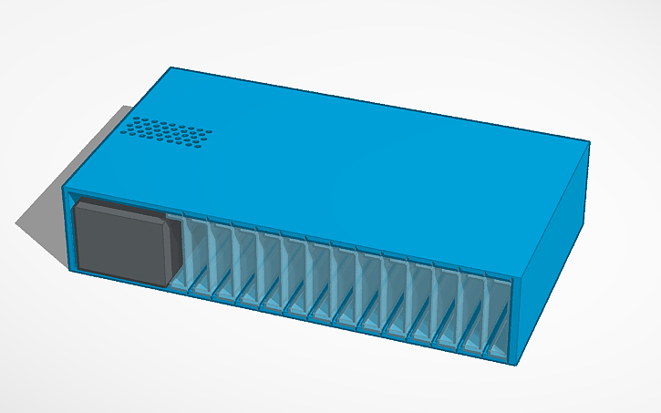
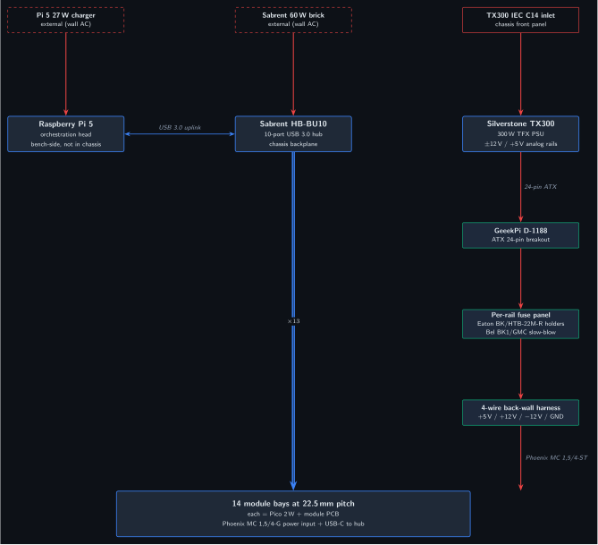
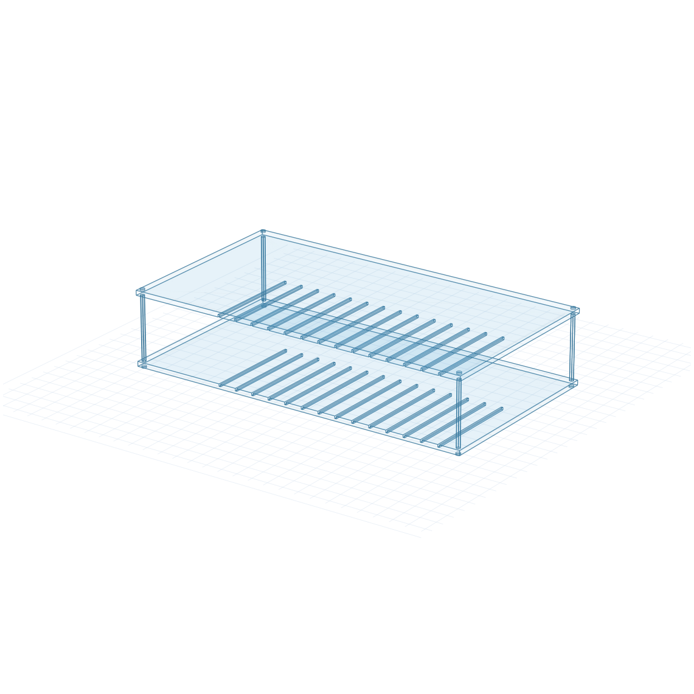
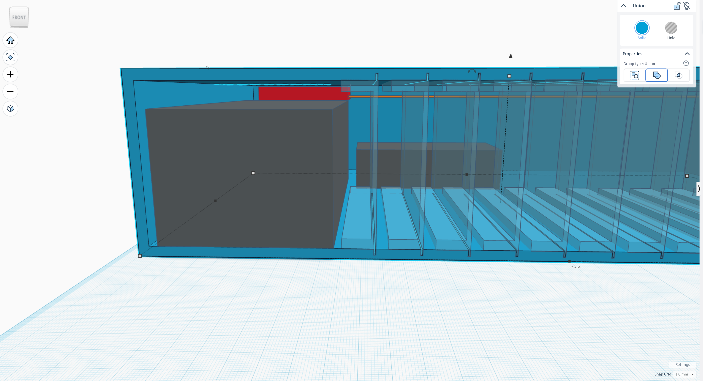
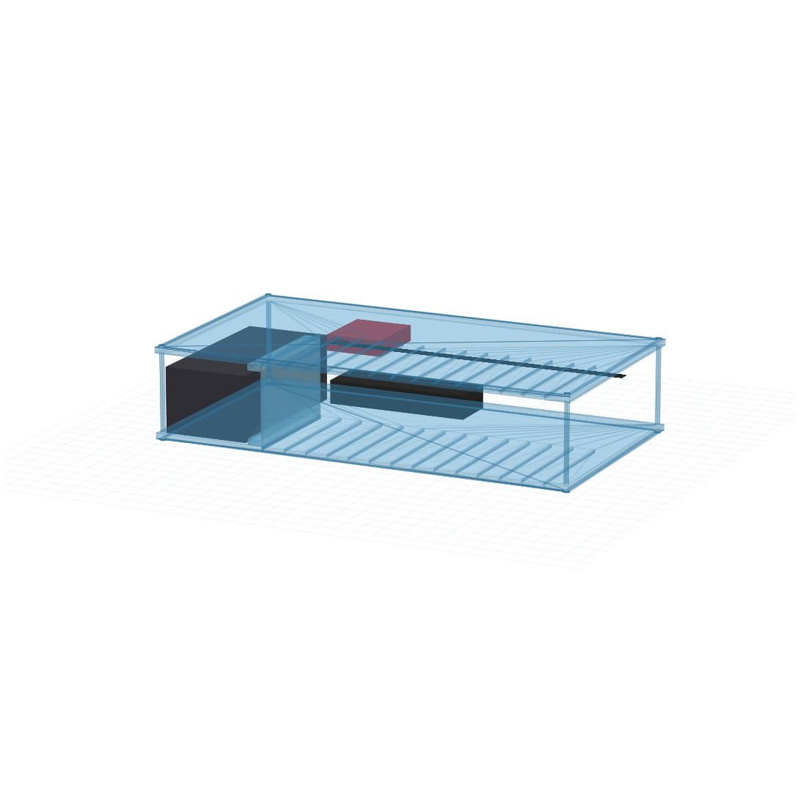
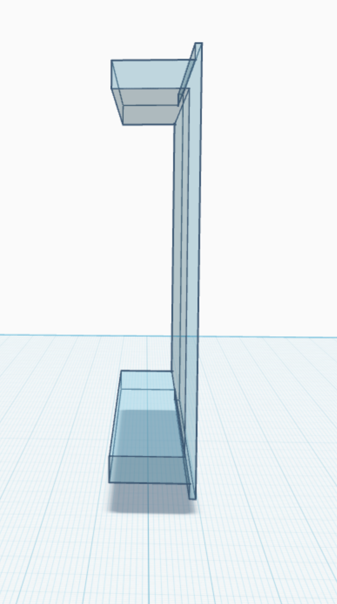
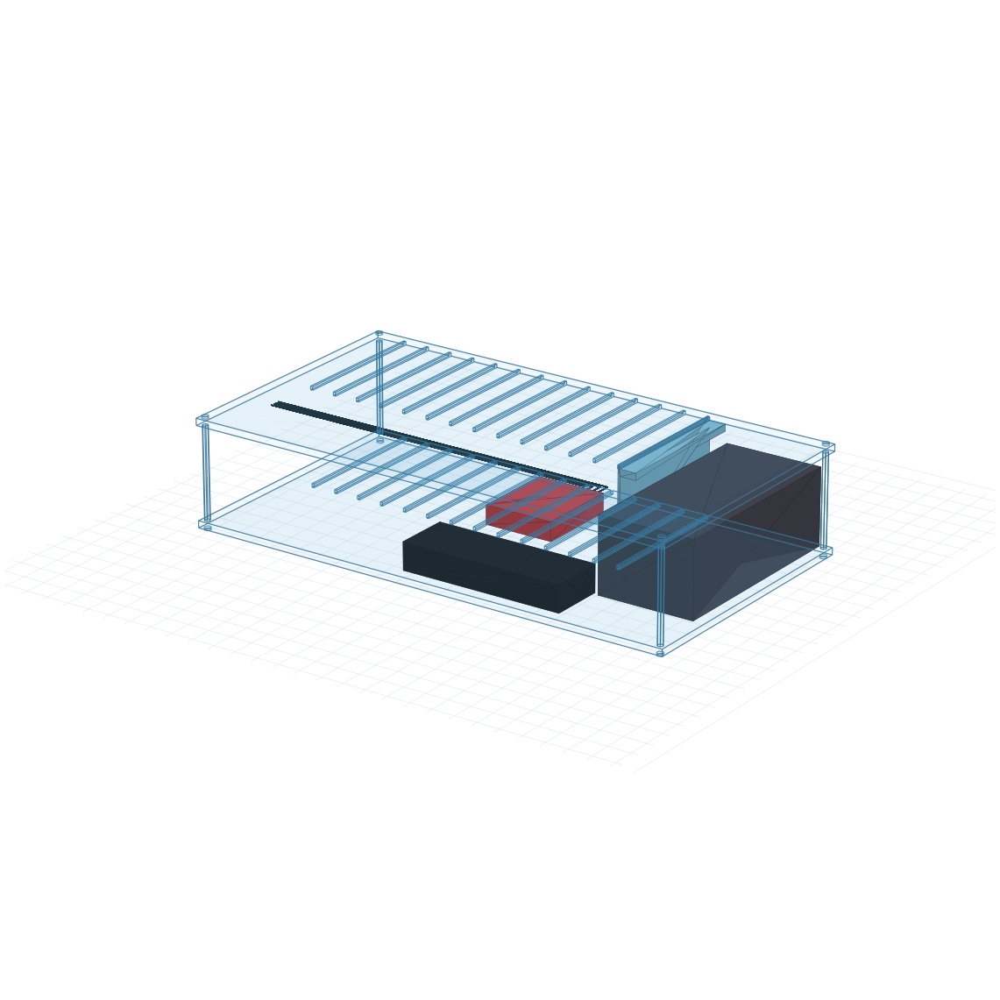

# Chassis Architecture and Power Distribution Design Document

## v1.0 (May 2026)

Companion to the [PMVB System Design Document section 11](../system-design/System_Design_Document.html#power-architecture). This document defines the mechanical and electrical design of the PMVB chassis: an open-frame card-cage acrylic enclosure (4 panels laser-cut from SendCutSend, clamped by 4 M3 corner standoffs) housing the Silverstone SST-TX300 PSU as an analog-rail backbone, a GeeekPi D-1188 ATX breakout, a Sabrent HB-BU10 USB 3.0 hub as the chassis-internal USB-TMC backplane, and 14 module slots arranged as parallel vertical blades.

**Architecture in one paragraph.** The chassis is the integrated mechanical-and-power subsystem that holds the entire bench instrument fabric in a single ~17.1" × 9.4" × 3.6" footprint. The TX300 PSU supplies analog ±12 V and +5 V *only* to instrument modules that need clean bipolar or higher-current rails (Module 1B VMU, Module 1D SMU Lite, Module 1E AWG, Module 1F HV diff probe, Module 1G current probe, Module 1H DMM, Module 2B precision DAQ, Module 2E digitizer); it does **not** power the Pi 5, the USB hub, or chassis-side Picos, each of which has its own external supply (Pi 5 uses its 27 W USB-C charger, the Sabrent hub runs from its own wall brick, and module Picos draw 5 V from USB downstream power). Modules are vertical blades (16.3 × 125 × 86 mm body, FDM PLA / PETG via 3D-print service) that slot into the chassis at 22.5 mm pitch, plug into a 4-rail back-wall power harness via Phoenix Contact MC 1,5/4 connectors, and present USB to the Sabrent hub for SCPI command and measurement-data transport.

**v1.0 is open-frame.** The chassis has a floor, a ceiling, and two internal divider plates (the bottom and top groove plates with the module-slot through-cuts), but no side walls, rear wall, or front panel. Walls were dropped because the four corner standoffs handle structural rigidity on their own, and adding walls re-introduces TX300 thermal-management constraints (intake/exhaust airflow, vent geometry) that warrant their own design pass. **The walled chassis with explicit ventilation geometry is the v1.1 future enhancement** described in [section 9](#future-enhancements). Until then, the bench operator gets unrestricted visual and physical access to all chassis internals — TX300, GeeekPi breakout, USB hub, harness, and modules — from any side.

*Figure 1: PMVB chassis fully populated with 14 module blades (open-frame v1.0 card cage). The TX300 PSU sits at the left end of the chassis floor; the GeeekPi D-1188 ATX breakout sits on top of the TX300's rear ~20 mm; the Sabrent USB hub sits at the rear-center of the floor; modules occupy the right ~309 mm of the chassis at 22.5 mm pitch. Side walls, rear wall, and front panel are deferred to v1.1.*

---

## Table of Contents

- [1. Design Philosophy](#design-philosophy)
- [2. Functional Block Diagram](#functional-block-diagram)
- [3. Mechanical Architecture](#mechanical-architecture)
  - [3.1 Outer Envelope and Form Factor](#outer-envelope-and-form-factor)
  - [3.2 Acrylic Frame and Cuts](#acrylic-frame-and-cuts)
  - [3.3 TX300 PSU Mounting](#tx300-psu-mounting)
  - [3.4 GeeekPi D-1188 Mounting](#geeekpi-d-1188-mounting)
  - [3.5 Sabrent HB-BU10 USB Hub Mounting](#sabrent-hb-bu10-usb-hub-mounting)
  - [3.6 Module Slot Geometry and Form Factor](#module-slot-geometry-and-form-factor)
  - [3.7 Diagnostic Strip (deferred to v1.1)](#diagnostic-strip-deferred-to-v11)
  - [3.8 TX300 Fan Ventilation (v1.0 open-frame)](#tx300-fan-ventilation-v10-open-frame)
- [4. Electrical Architecture](#electrical-architecture)
  - [4.1 Rail Sources from the TX300](#rail-sources-from-the-tx300)
  - [4.2 GeeekPi D-1188 ATX Breakout](#geeekpi-d-1188-atx-breakout)
  - [4.3 Per-Rail Fuse Panel](#per-rail-fuse-panel)
  - [4.4 4-Wire Back-Wall Harness](#4-wire-back-wall-harness)
  - [4.5 Per-Module Phoenix Pigtail](#per-module-phoenix-pigtail)
  - [4.6 Banana-Jack Diagnostic Test Points](#banana-jack-diagnostic-test-points)
  - [4.7 Front-Panel Indicator LEDs](#front-panel-indicator-leds)
- [5. USB-TMC Backplane](#usb-tmc-backplane)
- [6. Bill of Materials](#bill-of-materials)
- [7. Bring-Up Procedure](#bring-up-procedure)
- [8. Safety Procedures](#safety-procedures)
- [9. Future Enhancements](#future-enhancements)
- [10. References](#references)

---

## 1. Design Philosophy

The chassis is an integrated single-enclosure subsystem that consolidates the analog supply backbone, the USB-TMC backplane, and the module bay into one bench-friendly footprint. Three architectural decisions drive the design:

1. **The TX300 PSU is the *analog-rail backbone*, not the chassis-wide power source.** Its ±12 V and +5 V outputs feed only the instrument modules that need clean bipolar or higher-current rails. Bench infrastructure (Pi 5, USB hub, the Picos at the chassis level) runs from external supplies. This decoupling means the chassis interior is exclusively SELV (safety extra low voltage) once mains is contained inside the TX300's certified case, and the chassis itself does not need to be a safety boundary.

2. **Modules are vertical blades in a card-cage-style bay.** Each module is a 17 × 125 × 80 mm PCB that slides into a slot at 22.5 mm pitch, plugs into a back-wall power harness, connects USB to the Sabrent hub, and presents its module-specific I/O at the front face. This pattern follows the spirit of NI PXI / Eurocard subracks at hobbyist scale, with a custom laser-cut acrylic frame replacing the cost-prohibitive professional subrack hardware.

3. **The chassis is open-frame acrylic.** The TX300's certified IEC inlet handles AC safety; the acrylic frame is purely mechanical containment and does not need to be earth-bonded. Open construction makes the architecture self-documenting (you can see what's inside), simplifies cooling (TX300 fan exhausts through a 6 × 12 grid of vent holes in the chassis top), and keeps fabrication cost under $100 for the entire enclosure.

---

## 2. Functional Block Diagram

*Figure 2: Chassis architecture as two parallel fabrics, with modules split by rail consumption. The analog power fabric (right column, red edges) runs from the TX300 IEC inlet through the TX300 PSU, GeeekPi D-1188 ATX breakout, per-rail fuse panel, and 4-wire back-wall harness — terminating only at the analog module group (×8: 1B, 1D, 1E, 1F, 1G, 1H, 2B, 2E). The USB-TMC control fabric (left and center columns, blue edges) runs from the Raspberry Pi 5 (external, not in chassis) over USB 3.0 to the Sabrent HB-BU10 USB hub (chassis backplane), then fans out as USB-A to both module groups: ×5 to digital modules (1A, 1C, 2A, 2C, 2D, USB-only consumers) and ×8 to analog modules. Three external supplies (Pi 5 charger and Sabrent hub brick shown dashed; TX300 IEC inlet shown solid because it terminates inside the chassis) feed the three top-level subsystems independently. Front-panel diagnostic strip (banana jacks + LEDs) is documented separately in §3.7 and §4.6/4.7.*

---

## 3. Mechanical Architecture

### 3.1 Outer Envelope and Form Factor

The v1.0 chassis is an **open-frame card cage** with envelope dimensions **435 × 238 × 92 mm** (~17.1" × 9.4" × 3.6"). Material is **3 mm cast acrylic** throughout, laser-cut from SendCutSend with the parts list described in [section 3.2](#acrylic-frame-and-cuts). The bench footprint is comparable to a 1U–2U rack-mount instrument.

**v1.0 is intentionally open-frame: no side walls, no rear wall, no front panel.** Four acrylic panels (floor, bottom groove plate, top groove plate, ceiling) clamped together by four M3 corner standoffs make up the entire mechanical structure. Modules slide into the chassis from any open side and engage the lip-and-groove card guides cut into the divider plates. The TX300 PSU, GeeekPi D-1188 breakout, and Sabrent HB-BU10 USB hub sit on the chassis floor and are accessible from all open faces during bring-up.

Walls were considered and dropped for v1.0 because the standoffs handle structural rigidity on their own and adding walls re-introduces TX300 thermal-management constraints (intake/exhaust airflow path, vent geometry) that are out of scope for the first build. **A walled chassis with explicit ventilation geometry is the v1.1 future enhancement** described in [section 9](#future-enhancements).

*Figure 3: Empty chassis (4-panel open-frame card cage). The 14 module slot grooves are visible across the bottom and top divider plates. The leftmost 10 mm reserves clearance for the front-left M3 corner standoff; the TX300 zone occupies x = 10..96 (86 mm); module slots span x = 100..409 (309 mm) at 22.5 mm pitch. With no walls, the TX300, GeeekPi breakout, and USB hub are visible from any side.*

The internal coordinate system used throughout this document: X is the long axis (chassis length, slot-pitch direction), Y is the depth axis (front to back), Z is the vertical axis (floor to ceiling). For consistency with the parametric DXF generator at `tools/fabrication/generate_prototype_v10.py`, the origin is at the chassis bottom-left corner with X spanning 0 to 420, Y spanning 0 to 238, and Z spanning 0 to 92.

### 3.2 Acrylic Frame and Cuts

The v1.0 frame is **four laser-cut pieces of 3 mm cast acrylic** (down from the six pieces a fully walled chassis would need). Cuts are produced parametrically by `tools/fabrication/generate_prototype_v10.py` and exported as separate per-panel DXF files (one part per file, per SendCutSend's nesting guidelines).

| Piece | Dimensions (mm) | Quantity | Cuts/features |
|---|---|---|---|
| Solid plate (floor and ceiling) | 435 × 238 × 3 | 2 | Four 3.4 mm M3 clearance holes at corner positions (5, 5), (430, 5), (5, 233), (430, 233) for the M3 corner standoffs; plus four 2.7 mm M2.5 clearance holes at (110.1, 161.6), (162.9, 161.6), (110.1, 225.4), (162.9, 225.4) for the GeeekPi mounting standoffs. The two solid plates are interchangeable; one becomes floor, one becomes ceiling. Only the ceiling actually uses the M2.5 holes; the four matching holes on the floor are intentionally unused but kept on both plates so SendCutSend treats them as one design at qty 2 (saves ~$70 in setup fees vs. quoting them as two unique parts). |
| Groove plate (bottom and top divider) | 435 × 238 × 3 | 2 | Same four M3 corner clearance holes; **14 lip-engagement through-cuts** at 22.5 mm pitch starting at x = 100 mm (each 2 mm wide × 125 mm long, running front-to-back along Y), accepting the 1.5 mm wide × 3 mm tall rail lips on each module body. The 0.5 mm width difference gives sliding clearance to accommodate FDM PLA dimensional tolerance. Plus four 2.7 mm M2.5 clearance holes at the same X,Y positions as the solid plates — only the top groove plate's M2.5 holes are actually used (for the GeeekPi standoff to pass through), but the bottom groove plate carries the same holes for the same setup-fee reason. |

DXF files are at `tools/fabrication/out/panel_solid_plate.dxf` and `panel_groove_plate.dxf`. Each file contains a single closed outer outline plus interior cutouts (circles for the M3 and M2.5 holes, rectangles for the slot grooves) wound clockwise so SendCutSend's interpreter reads them as holes rather than nested parts.

**Frame assembly** uses just **four M3 hex aluminum standoffs** plus eight M3 button head cap screws — no acrylic tapping required, no glue:

- 4× corner stacks, each built from 3× M3 × 20 mm M-F standoffs threaded together (each internal joint Loctite-243-locked) plus 1× M3 × 20 mm F-F at the top so the ceiling screw threads into a clean female socket. Total assembled stack length: 80 mm ±0.3 mm. One stack at each chassis interior corner; stack spans Z = 3 to Z = 89 (between the inside-top of the floor plate and the inside-bottom of the ceiling plate). Source: Csdtylh M3 320-piece assortment kit, Amazon B06Y5TJXY1 (kit contains 20× of each length, well over the 12 M-F + 4 F-F needed).
- 8× M3 × 8 mm button head cap screws (included in the same HVAZI kit). Four thread up through the floor's corner clearance holes into the bottom of each stack; four thread down through the ceiling's corner clearance holes into the top of each stack. No threadlocker on these so the chassis can be disassembled for v1.1.
- Acrylic panels each carry only clearance holes — no tapped threads. The standoff stack is the thread-bearing component; the acrylic is just a stack of plates sandwiched between the standoff ends.

The two groove plates sit between the floor and ceiling, held in place by the floor and ceiling sandwiching them and by the M3 corner standoffs passing through their corner holes. The bottom groove plate sits at Z = 3..6 (top face flush with the cavity floor at Z = 6); the top groove plate sits at Z = 86..89 (bottom face flush with the cavity ceiling at Z = 86). Module bodies span Z = 3..89, with their bottom rail lip engaged in the bottom groove plate's cutouts (Z = 3..6) and their top lip engaged in the top groove plate's cutouts (Z = 86..89).

The lip-engagement cutouts in the two groove plates form the card guides for module insertion. Each module's body has a 1.5 mm wide × 3 mm tall rail lip running along the bottom-right and top-right corners; these lips slide into the chassis groove cutouts (2.0 mm wide × 3 mm deep) as the module is inserted from any open side. The 0.5 mm width difference between groove and lip gives sliding clearance — modules can be inserted and removed without binding under FDM print and laser-cut tolerance variation.

### 3.3 TX300 PSU Mounting

The TX300 sits at the **left end of the chassis floor**, X = −230 to −144 (86 mm wide), Y = −118 to +60 (178 mm deep), Z = 6 to 72 (66 mm tall). Orientation: the TX300's IEC C14 inlet faces the chassis **front** (Y = −118 face) so the AC cord plugs in from the front; the TX300's 24-pin ATX output cable exits from the chassis **back** (Y = +60 face) and terminates at the GeeekPi D-1188 mounted on top of the rear portion of the TX300; the 80 mm fan exhausts upward through the top vent grille (Z = 72 top face). The PSU mounts to the floor plate via four M3 standoffs threaded into the TX300's existing M3 mounting holes (standard TFX form factor pattern).

*Figure 4: Cutaway view of the TX300 PSU (gray) and the GeeekPi D-1188 ATX breakout (red, on top of the TX300's rear ~20 mm) inside the chassis. The TX300's full top surface from the front edge to ~20 mm forward of the rear is left exposed for the fan to exhaust upward through the chassis top vent grid.*

Internal AC routing is contained entirely within the TX300's certified enclosure; no external mains wiring exits the PSU body. The IEC inlet is exposed through a 35 × 28 mm rectangular cutout in the **front** panel at the TX300 IEC inlet position (occupying the leftmost ~90 mm of the front-panel face, separate from the diagnostic strip and module faceplate region).

### 3.4 GeeekPi D-1188 Mounting

The GeeekPi D-1188 ATX breakout (70 × 58.5 × 15.9 mm) **hangs from the chassis ceiling** above the rear-center of the chassis, with its mounting positions at X = 107..166, Y = 158.5..228.5, Z = 65..81. The breakout's component-side faces down (into the chassis interior) so the screw terminals point downward and the 24-pin ATX header is accessible from below for the cable run from the TX300. The breakout is rotated 90° from its as-marked orientation so the power-rail status LEDs face the chassis rear and the screw terminals face the chassis front.

The breakout mounts via four M2.5 × 6 mm female-female hex aluminum standoffs that hang from the underside of the top groove plate, with M2.5 × 8 mm button head cap screws coming from above the chassis ceiling, passing through the ceiling (3 mm) and the top groove plate (3 mm), threading into the standoff. The standoffs hold the GeeekPi PCB top face at Z = 80, with the underside of the top groove plate at Z = 86, giving 6 mm of clearance for solder bumps and the standoff body. Source: HVAZI M2.5 160-piece assortment kit, Amazon B01L06CUJG (kit's shortest length is 6 mm; the extra 1 mm vs the original 5 mm spec is harmless added clearance). The four mounting holes are at:

| Hole | X (mm) | Y (mm) |
|---|---|---|
| Front-left | 110.1 | 161.6 |
| Front-right | 162.9 | 161.6 |
| Rear-left | 110.1 | 225.4 |
| Rear-right | 162.9 | 225.4 |

These holes are cut as 2.7 mm clearance holes (M2.5 normal clearance) in both the ceiling plate and the top groove plate (see [section 3.2](#acrylic-frame-and-cuts) for the panel detail). The GeeekPi's own mounting holes are 2.5 mm and accept M2.5 screws directly (no drill-out needed).

This positioning gives the breakout's screw terminals a clean run forward and downward to the back-wall harness, and leaves the TX300 top entirely free for the fan to exhaust upward into the open chassis cavity.

*Figure 5: View of the chassis interior with the TX300 (left, gray), Sabrent USB hub (rear-center), GeeekPi D-1188 (rear-center, hanging from ceiling above the Sabrent hub), and 14 module blades slotted into the bay. The GeeekPi is rotated 90° so its screw-terminal blocks face the chassis front (where the back-wall harness lives) and its status LEDs face the chassis rear.*

### 3.5 Sabrent HB-BU10 USB Hub Mounting

The Sabrent HB-BU10 (144.8 × 48.3 × 23.9 mm) sits at the **rear-center of the chassis floor**, X = 102.6..247.4 (145 mm), Y = 175.4..223.7 (48 mm), Z = 6..29.9 (24 mm tall). The hub mounts to the floor plate via two M3 × 6 mm screws threaded into adhesive-backed standoffs (the hub doesn't have factory mounting holes; we attach standoffs with VHB tape to the hub bottom, then bolt those down). For the v1.0 prototype phase, the hub can be retained by a strip of 3M VHB tape directly to the chassis floor without standoffs.

The hub's 10 USB-A downstream ports face **forward** (toward Y = 0, the open front of the chassis) so each downstream port can run a short USB-C-to-USB-A cable rearward to the corresponding module's rear-edge Pico USB-C connector. The modules occupy Y = 0..125, the hub at Y = 175.4 sits 50 mm behind the rearmost module edge — easily handled by 100-150 mm pre-built USB-C-to-USB-A cables. The hub's uplink (USB 3.0 Type-A) and DC barrel input cables pass freely from the rear of the open-frame chassis since v1.0 has no rear wall.

### 3.6 Module Slot Geometry and Form Factor

The module bay occupies the right ~3/4 of the chassis floor: **14 slots at 22.5 mm pitch**, X centers at −132, −110, −87, −64, −42, −20, +3, +26, +48, +70, +93, +116, +138, +160.

*Figure 6: Side profile of a single module body. The C-shape cross-section is clearly visible: closed top and bottom shells, closed right wall, open left face. The two extensions at the top-right and bottom-right corners are the 1.5 mm × 3 mm rail lips that engage the chassis bottom and top groove plates (cut with 2.0 mm wide × 3 mm deep through-cuts, giving 0.5 mm sliding clearance). The host PCB mounts vertically against the cavity right wall and components extend leftward through the cavity and into the inter-module gap, giving 21.5 mm of stack budget per slot.*

**Module body envelope (v10).** Each module body is **16.3 × 125 × 86 mm** outer (lips included in the 86 mm height), fabricated as a single 3D-printed FDM PLA part with a C-shape cross-section:

- **6 mm thick top and bottom shells** running the full 125 mm depth. Body proper (between the two shells, excluding the rail lips) is 80 mm tall (Z = 3 to Z = 83 in module coordinates).
- **2.0 mm thick right wall** (closed) connecting top and bottom shells. This wall thickness meets JLCPCB's FDM minimum for the 100 × 100 mm wall-area class.
- **1.5 mm × 3 mm rail lips** at the top-right and bottom-right corners, extending the full 125 mm depth. The 1.5 mm width meets JLCPCB's ≥1.5 mm protrusion rule for FDM. These lips engage the chassis bottom and top groove-plate through-cuts (2.0 mm wide × 3 mm deep, giving 0.5 mm sliding clearance to accommodate FDM dimensional tolerance).
- **Open left face** — the module's left side has no shell. This is intentional and structural: it widens the effective component-stack budget per slot from 12 mm (a fully closed cavity) to 21.5 mm (cavity plus the 6 mm inter-module gap shared with the adjacent module's open face).

Each module's body sits at Y = 3 (front edge) to Y = 128 (rear edge), Z = 3 (bottom lip engages bottom groove plate from Z = 3 to Z = 6) to Z = 89 (top lip engages top groove plate from Z = 86 to Z = 89). In chassis coordinates the module body proper occupies Z = 6 to Z = 86 (the 80 mm cavity zone between the two groove plates), with the 3 mm lips above and below this range.

**Internal cavity** is 14.3 × 125 × 68 mm (cavity X = 0 to 14.3 inside the 2.0 mm right wall, Y = full 125 mm depth, Z = 9 to 77 in module coordinates between the 6 mm top and bottom shells).

**v10 module geometry was revised on 2026-05-09** from the earlier v9 spec (0.6 × 3 mm lips, 1.5 mm right wall, 0.4 mm sliding clearance) after JLCPCB's FDM design guidelines were verified. The v9 geometry violated four FDM rules at once: lip width below the 1.5 mm protrusion minimum, lip width below the 1.0 mm embossed-detail minimum, ±0.3 mm tolerance dwarfing the 0.6 mm feature size, and 0.4 mm sliding clearance under the 0.5 mm minimum for moving parts. v10 hits all four rules with margin.

**Component stack budget per module: 21.5 mm.** Because every module's left face is open and every module follows the same orientation (lip-on-the-right), components on each module's PCB can extend leftward from the module's own cavity right wall (x = +7) all the way to the adjacent module's right wall outer edge (x = neighbor + 8.2 = this − 14.3 mm). The 0.6 mm rail lip on the adjacent module is above and below the cavity Z range and does not reduce the middle-cavity X budget. This is why we can fit headered Pico stacks (14.2 mm) and direct-soldered Pico stacks (6.2 mm) plus analog circuitry on the same side of the host PCB.

**Module mount convention (mandatory across all modules):** each module's host PCB is mounted vertically against the cavity right wall (PCB plane parallel to the chassis YZ plane, PCB normal pointing leftward into the cavity). All components are placed on the cavity-facing (left-pointing) face of the PCB. No components on the back face of the PCB (which is pressed against the right wall). This convention is what makes the 21.5 mm stack budget achievable — without it, adjacent modules could collide in the inter-module gap.

**Connector positions on the host PCB:**

- **Pico USB-C:** rear edge of the PCB, pointing rearward (+Y direction). The Pico 2 W is mounted near the rear half of the PCB with its long axis running along Y so its USB-C connector lands on the rear PCB edge. A short USB-C-to-USB-A cable runs straight rearward to one of the Sabrent HB-BU10's downstream ports.
- **Phoenix MC 1,5/4-G (1803293):** top edge near the rear corner, pointing upward (+Z direction). When the module is fully seated, the chassis's per-slot Phoenix MC 1,5/4-ST plug from the back-wall harness drops down onto this header from above (the harness wires run at Z ≈ 76, just 5 mm above the top edge of the module body's top shell at Z = 86 minus 5 mm shell = effectively at the top of the cavity).
- **Faceplate connectors:** front edge, fitting within ~17 mm wide × 80 mm tall front-face real estate per slot.

### 3.7 Diagnostic Strip (deferred to v1.1)

**v1.0 ships without the chassis-level diagnostic strip.** With the open-frame chassis, the bench operator has direct unobstructed access to the fuse panel terminals on the chassis floor and can clip a DMM probe onto each rail there for spot-checks during bring-up. The fuse cap itself is also visible from above, providing an at-a-glance blown-fuse indicator that supplants the rail-status LEDs. The 4 banana jacks (Pomona 3760 color-coded) and 3 LED indicators (VCC 5102H rail status) that would have populated this strip are deferred to v1.1, where they migrate onto the actual front panel alongside the per-module faceplate cutouts (see §9.2).

**Module front-panel cutouts:** with no chassis front panel, each module's front-edge faceplate I/O sits exposed in v1.0. Each module body's front face (Y = 3 in chassis coordinates) carries the module-specific connectors directly. This is acceptable for bring-up and bench operation; v1.1 will add a chassis front panel with per-module cutouts to restore a finished look once each module's faceplate I/O converges.

### 3.8 TX300 Fan Ventilation (v1.0 open-frame)

The TX300's 80 mm fan exhausts upward (Z = +72 face, the top of the PSU). With no chassis ceiling above the TX300 in v1.0, the fan exhausts directly to room air through the open chassis top — no vent grid needed. (The ceiling plate covers the right portion of the chassis above the module zone, but the leftmost 86 mm of chassis width — the TX300 zone — has the ceiling plate optionally cut back or simply offset away from the TX300 footprint.)

The current fabrication has the ceiling plate spanning the full 435 × 238 mm footprint with no vent holes cut, on the assumption that with no side walls or rear wall to contain the airflow, the TX300 fan can pull intake air in from any open side and exhaust through the ~17 mm clearance between the TX300 top face (Z = 72) and the chassis ceiling underside (Z = 89). This vertical gap plus the open sides gives ample airflow path under v1.0.

**v1.1 will need explicit ventilation geometry** because adding side walls and a rear wall closes off the intake path. See [section 9 Future Enhancements](#future-enhancements).

---

## 4. Electrical Architecture

### 4.1 Rail Sources from the TX300

The TX300 provides the standard ATX rails at its 24-pin output: +3.3 V, +5 V, +12 V, −12 V, +5 V Standby, GND. PMVB uses only +5 V, +12 V, −12 V, and GND from this set; +3.3 V and +5 V Standby are not routed forward of the GeeekPi breakout. Per-rail current capacity (per the TX300 datasheet): +5 V at 14 A, +12 V at 22 A, −12 V at 0.3 A. The −12 V rail's 0.3 A budget bounds how many op-amps can be powered simultaneously across all modules; current planning expects worst-case ~150 mA combined across all v1.0 + v1.1 op-amp modules, comfortably within budget.

### 4.2 GeeekPi D-1188 ATX Breakout

The GeeekPi D-1188 (Amazon B08MC389FQ, ~$13) takes the TX300's 24-pin ATX cable as input and exposes each rail on a screw terminal. Features used:

- **PS_ON# slide switch** on the breakout PCB. This is the master enable for the TX300's main rails. With the switch off, only +5 V Standby is alive (which we don't use externally); with the switch on, all rails come up. There is no chassis-level master toggle; the GeeekPi's onboard switch is accessed through the open frame.
- **Per-rail status LEDs** on the breakout PCB. These show +5 V Standby, +3.3 V, +5 V, +12 V, −12 V, PS_ON, and PWROK status. The chassis also has separate front-panel LED indicators (section 4.7) for at-a-glance visibility, but the breakout's onboard LEDs are useful for diagnosing PSU faults during bring-up.
- **Screw terminals** for +5 V, +12 V, −12 V, GND. From these, short hookup wires carry the rails to the per-rail fuse panel. **Pre-fuse jumpers are sized for the TX300 source maximum, not the downstream fuse**: 12 AWG for +5 V (14 A source max) and +12 V (22 A source max); 22 AWG for −12 V (0.3 A source max). The fuse cannot protect the wire upstream of itself, so the pre-fuse wire must be rated for the worst case the source can deliver into a downstream short. Keep these jumpers as short as physically possible (50-100 mm) by mounting the fuse panel adjacent to the GeeekPi.

### 4.3 Per-Rail Fuse Panel

Each rail passes through a panel-mount glass-cartridge fuse before reaching the back-wall harness. Fuses provide a fast-failure path independent of the breakout's onboard polyfuses (which reset themselves and don't visibly indicate a fault). The fuse panel is a small perfboard or terminal-block strip mounted to the chassis floor directly in front of the GeeekPi (X ~= 107..167, Y ~= 110..155, Z floor) so the pre-fuse 12 AWG jumpers from the GeeekPi screw terminals stay under 100 mm.

**Fuse sizing rationale.** The fuse rating is set to the expected worst-case operating load with margin, **not** to the TX300's source capacity. A fuse exists to interrupt fault current (short circuit, runaway), so it must (a) pass normal operating current without nuisance-tripping and (b) trip quickly on fault current. Sizing at or near the source max would force a >10 A short before tripping; sizing just above the expected load lets even small downstream faults trip the fuse fast.

| Rail | TX300 source max | Expected PMVB load | Fuse rating | Headroom |
|---|---|---|---|---|
| +5 V | 14 A | ~2-3 A (8 analog modules, ADC refs and analog supplies at 200-300 mA each) | 5 A slow-blow | ~60% utilization |
| +12 V (combined +12V1 + +12V2) | 22 A | ~1-2 A (op-amp rails at 100-200 mA each across 8 analog modules, plus dynamic load for 1D SMU and 1E AWG drive) | 3 A slow-blow | ~50-70% utilization |
| −12 V | 0.3 A (limited at the source) | ~150-200 mA (~20 mA op-amp quiescent per rail per module) | 500 mA slow-blow | ~30-40% utilization |

The TX300 itself has internal ATX overcurrent protection that shuts down the entire PSU if any rail exceeds its rated max. The chassis-side fuses are additive protection that buys three things on top:

1. **Per-rail isolation.** A short on +12 V trips only the +12 V fuse; +5 V and −12 V stay alive so the bench keeps running for whatever else is on those rails. Without the chassis fuses, the TX300 OCP would shut down all rails together.
2. **Finer-grained fault detection.** A fault pulling ~5-10 A on +5 V trips the chassis fuse but is well under the TX300's 14 A OCP threshold and would otherwise persist. Smaller faults catch faster.
3. **Visible fault indication.** A blown cartridge is visible through the holder cap and the rail-status LED on the diagnostic strip goes dark, so the operator immediately knows which rail failed.

**Fuse selection details:**

| Rail | Fuse rating | Fuse holder | Fuse cartridge |
|---|---|---|---|
| +5 V | 5 A slow-blow | Eaton BK/HTB-22M-R | Bel BK1/GMC-5-R |
| +12 V | 3 A slow-blow | Eaton BK/HTB-22M-R | Bel BK1/GMC-3-R |
| −12 V | 500 mA slow-blow | Eaton BK/HTB-22M-R | Bel BK1/GMC-500MA-R (or equivalent) |

A blown fuse is visible through the holder cap and replaceable without disassembly; the holder accepts standard 5 x 20 mm cartridges.

**GND is not fused** — return paths are never fuse-protected. The GND wire runs directly from the GeeekPi GND terminal to the back-wall harness GND rail, bypassing the fuse panel.

**If bring-up reveals higher actual loads** than estimated above, the fuse rating can be bumped up. Section 7.2 step 10 ("verify rail voltages") is the natural point to also measure actual rail current with a clamp or shunt; if for example Module 1E AWG turns out to pull 4 A peak on +5 V during inrush, replace the 5 A cartridge with a 7 A or 10 A slow-blow. The 12 AWG pre-fuse and 14 AWG post-fuse wire is rated well above any fuse value you would realistically pick (12 AWG is 41 A free-air, 14 AWG is 32 A), so the fuse rating can grow without re-pulling the wire.

### 4.4 4-Wire Back-Wall Harness

After the fuse panel, each rail (+5 V, +12 V, −12 V, GND) runs as a 14 AWG stranded wire along the upper-rear region of the chassis interior, at approximately Z = 76 (10 mm below the chassis ceiling) and Y = 14 to 34 (35 mm forward of the back wall). The four wires run parallel along the X axis, ~303 mm long, spanning from just past the GeeekPi's screw terminals (X ≈ −142) to past the rightmost module slot (X ≈ +161). Post-fuse wire is sized for the fuse-limited current (5 A / 3 A / 0.5 A), not the TX300 source max, since a downstream short trips the fuse before the wire can overheat. 14 AWG is electrically overkill for the highest-fused rail (+5 V at 5 A) but is the dominant gauge for Wago 221-413 and Phoenix MC 1,5/4 compatibility, and its stiffness helps the harness hold shape across the back wall.

*Figure 7: View of the chassis from above-rear, showing the 4-wire back-wall harness (orange) running parallel across the upper-rear region of the chassis interior. The four wires originate at the GeeekPi D-1188 (red, far right, on top of the TX300) and run leftward across the entire module bay, with one Phoenix MC 1,5/4 plug per slot tapping into the rails at each module's X position. The translucent module bodies show the slot pitch and the open-left-face geometry that gives each module access to the harness.*

At each module slot's X position, the harness terminates at a Phoenix MC 1,5/4-ST plug (Phoenix 1803594, Digi-Key 277-1163-ND, ~$8.73 each). The four wires are screwed into the plug's terminals in fixed order: pin 1 = +5 V (red wire), pin 2 = +12 V (yellow), pin 3 = −12 V (blue), pin 4 = GND (black). Wire colors follow lab convention.

The plug clips downward onto the module's PCB-mounted Phoenix MC 1,5/4-G header (Phoenix 1803293, Digi-Key 277-1208-ND, ~$3.51 each), which sits on the top edge near the rear corner of the host PCB with its pins facing upward (+Z direction). With the harness wires at Z ≈ 76 and the module top edge at Z ≈ 80–86, the plug-to-header mating runs perpendicular to the PCB plane, making module insertion and removal a vertical-down + horizontal-back motion. Plug body height is ~12 mm; cable strain relief adds another ~10 mm of Z consumption above the harness wire position, both well within the chassis ceiling clearance.

### 4.5 Per-Module Phoenix Pigtail

Each populated slot uses one Phoenix MC 1,5/4-ST plug terminating a short pigtail of 4 stranded wires (~30 mm long) tapping into the back-wall harness. **For the v1.0 prototype phase, taps are made with Wago 221-413 3-port lever-nut connectors** (Mouser 651-221-413, ~$0.34 each, 4 per slot). For each rail at each tap point: bus IN goes into one Wago port, bus OUT goes into another, and a short pigtail to the Phoenix plug pin goes into the third. No stripping or crimping required for the bus wires; just trim the pigtail to length, push the lever, insert, close.

Empty slots (no module installed) skip the Wago entirely — the bus wire is one continuous run with no break. When a new module is added, the user cuts the bus at the slot's X position, inserts the cut ends and a fresh pigtail into a Wago, and continues.

**v1.1+ option:** replace the Wago lever-nuts with a custom **4-rail distribution PCB** mounted along the back wall. The PCB has one 4-pin Phoenix input header (from the GeeekPi feed) and 14 4-pin Phoenix output headers at 22.5 mm pitch matching the module slot pitch, with internal copper traces connecting all the same-rail pins. This eliminates the lever-nut bulk and gives a single-point harness attachment. JLCPCB fabrication is roughly $10 for 5 pieces in a 1-2 week turnaround. The distribution PCB is deferred from v1.0 because Wago lever-nuts let you re-route taps freely during chassis bring-up; once the layout is verified, the PCB locks it in.

### 4.6 Banana-Jack Diagnostic Test Points (deferred to v1.1)

**v1.0 does not include the banana-jack test points.** Section 3.7 explains the deferral rationale: the open-frame chassis gives direct access to the fuse-panel terminals for DMM spot-checks, so the dedicated test-point jacks are not load-bearing in v1.0. The design below is retained for the v1.1 rollout, where the jacks migrate onto the chassis front panel alongside the LED indicators in §4.7.

Four 4 mm panel-mount banana jacks (Pomona 3760 series) will be installed in the front-panel strip at the leftmost ~80 mm. Color mapping (verified against Digi-Key 2026-05-07):

| Color | Pomona P/N | Digi-Key | Rail |
|---|---|---|---|
| Black | Pomona 3760-0 | 501-1094-ND | GND |
| Red | Pomona 3760-2 | 501-1095-ND | +5 V |
| Yellow | Pomona 3760-4 | 501-1747-ND | +12 V |
| Blue | Pomona 3760-6 | 501-1650-ND | −12 V |

(Note: the Pomona 3760 color suffix mapping is opposite to what's intuitive — `3760-0` is **black**, not red. Verified by Digi-Key catalog lookup.)

Each jack ties to its rail via a short 22 AWG wire from the fuse panel output (after the fuse, before the harness). With the panel jacks fed post-fuse, a fault that blows a fuse will also remove voltage from the test-point jack, providing a cross-check on which rail failed.

### 4.7 Front-Panel Indicator LEDs (deferred to v1.1)

**v1.0 does not include the rail-status LED indicators.** As with the banana jacks in §4.6, the LEDs are part of the v1.1 diagnostic strip / front panel rollout. In v1.0, the fuse cartridge caps are visible from above in the open chassis, so a blown rail is visually obvious without needing a dedicated indicator LED. The design below is retained for v1.1.

Three panel-mount LED indicators (VCC 5102H series, integrated current-limiting resistor for the rated voltage) will sit in the front-panel strip just to the right of the banana jacks:

| Indicator | LED | VCC P/N | Digi-Key | Wired to |
|---|---|---|---|---|
| +5 V OK | Red, 5 V | 5102H1-5V | L10021-ND | +5 V rail (post-fuse) |
| +12 V OK | Red, 12 V | 5102H1-12V | 5102H1-12V-ND | +12 V rail (post-fuse) |
| −12 V OK | Green, 12 V | 5102H5-12V | 5102H5-12V-ND | −12 V rail (post-fuse, with current direction handled by the LED's polarity) |

A blown rail fuse causes the corresponding LED to extinguish, giving a visible at-a-glance fault indicator. The LEDs are wired post-fuse so they reflect the rail state actually delivered to the modules.

---

## 5. USB-TMC Backplane

The Sabrent HB-BU10 USB 3.0 hub serves as the chassis-internal USB-TMC backplane. It is **not on the chassis BOM as a power consumer** of the TX300 — the hub runs from its own 60 W external wall brick, reaching the back panel through a barrel-jack cutout — but it is bolted into the chassis for mechanical integration.

Each populated module's Pico 2 W presents a USB-C peripheral interface on the module's right edge. A short USB-C-to-USB-A cable (~150 mm typical) runs from the module's right-edge connector to one of the Sabrent's 10 downstream ports. From the hub's uplink port, a single USB 3.0 cable runs out the back panel to the Pi 5 host on the bench.

Per-port switches and per-port LEDs on the HB-BU10 are operationally useful: a misbehaving Pico can be power-cycled by toggling its hub port without affecting any other module, and the per-port LED quickly identifies which port a SCPI device-discovery query enumerated. The hub's 0.9 A per-port current (USB 3.0 spec minimum) is well above the Pico 2 W's ~80 mA peak draw.

The hub's 10 ports support the v1.0 + v1.1 module count (13 modules) with one port to spare for development gear (a bench USB-TMC scope or a debug Pico). If port count becomes a constraint in a future revision, the hub can be replaced with a higher-port variant (Sabrent HB-B7C3 or similar) without changing any other chassis component.

---

## 6. Bill of Materials

Verified against current sourcing as of 2026-05-07. Sourcing priority: Mouser → Digi-Key → Microcenter → Amazon. The TX300 PSU is on hand from prior projects ($0); replacement cost ~$50–$70 if buying new.

| Item | Manufacturer P/N | Source | Source P/N | Qty | Unit Price | Notes |
|---|---|---|---|---:|---:|---|
| **Power supply and breakout** | | | | | | |
| Silverstone TX300 TFX PSU (300 W) | Silverstone SST-TX300 | Amazon | (on hand) | 1 | $99.99 | Purchased $99.99; analog-rail backbone for ±12 V / +5 V instrument modules. |
| GeeekPi D-1188 ATX 24-pin breakout | GeeekPi D-1188 | Amazon | B08MC389FQ | 1 | $13 | All rails incl. −12 V; per-rail status LEDs; PS_ON# slide switch; verified 2026-05-07 |
| **Per-rail fuse panel** | | | | | | |
| Panel-mount fuse holder, 5×20 mm cartridge | Eaton BK/HTB-22M-R | Digi-Key | 283-3041-ND | 3 | $6.43 | One per active rail (+5 V, +12 V, −12 V) |
| Slow-blow glass fuse 5×20 mm 5 A | Bel BK1/GMC-5-R | Digi-Key | 283-BK1/GMC-5-R-ND | 2 | $1.49 | +5 V rail (1 in service + 1 spare) |
| Slow-blow glass fuse 5×20 mm 3 A | Bel BK1/GMC-3-R | Digi-Key | 283-BK1/GMC-3-R-ND | 2 | $1.63 | +12 V rail (1 in service + 1 spare) |
| Slow-blow glass fuse 5×20 mm 500 mA | Bel BK1/GMC-500-R | Digi-Key | 283-BK1/GMC-500-R-ND | 2 | $1.63 | -12 V rail (1 in service + 1 spare) |
| **Module power interconnect** | | | | | | |
| Phoenix MC 1,5/4-G-3,81 PCB header (chassis-side) | Phoenix Contact 1803293 | Digi-Key | 277-1208-ND | 2 (prototype) → 14 (full chassis) | $3.51 | One per active module slot, mounted on per-module PCB. v1.0 prototype orders 2 to match the 10-Wago lever-nut quantity (wires up 2 slots: shakedown + first Phase 1 module). Remaining 12 ordered as each subsequent module is built. |
| Phoenix MC 1,5/4-ST-3,81 cable plug (back-wall harness) | Phoenix Contact 1803594 | Digi-Key | 277-1163-ND | 2 (prototype) → 14 (full chassis) | $8.73 | One per active slot; pigtail from Wago tap to module's PCB header. Quantity tracks Phoenix header order. |
| Wago 221-413 3-port lever-nut connector | Wago 221-413 | Digi-Key | (bundled with Phoenix order) | 10 (slot-1 shakedown + spares) → 56 (full chassis) | $0.65 | Per-rail tap on back-wall harness — bus IN, bus OUT, branch to module pigtail. v1.0 prototype starts with 10 to validate the lever-nut approach at slot 1 before committing to bulk quantity. v1.1+ may replace lever-nuts with a custom 4-rail distribution PCB, in which case the Wago step is skipped entirely. |
| 12 AWG silicone hookup wire kit, 6 colors × 5 ft | Fermerry | Amazon | B089CJ65SC | 1 kit | $20.29 | Pre-fuse jumpers from GeeekPi screw terminals to fuse holder inputs, sized for TX300 +5 V (14 A) and +12 V (22 A) rail maxima. |
| 14 AWG silicone hookup wire kit, 6 colors × 10 ft | Fermerry | Amazon | (Fermerry 14 AWG-6C) | 1 kit | $20.96 | Post-fuse back-wall harness, fuse-limited to 5 A / 3 A / 0.5 A. |
| 22 AWG hookup wire, assorted | Generic | (on hand) | n/a | as needed | $0 | LED leads, banana-jack jumpers, indicator wiring. |
| **Front-panel diagnostic features** | | | | | | |
| Banana jacks ×4 color-coded (deferred to v1.1) | Pomona 3760-{0,2,4,6} | Digi-Key | 501-{1094,1095,1747,1650}-ND | 0 | $0 | v1.1 only; v1.0 uses direct fuse-panel terminal access |
| LED panel indicators ×3 (deferred to v1.1) | VCC 5102H series | Digi-Key | L10021-ND / 5102H1-12V-ND / 5102H5-12V-ND | 0 | $0 | v1.1 diagnostic strip only; fuse cartridge caps are visible from above in the open v1.0 chassis |
| **USB-TMC backplane** | | | | | | |
| Sabrent HB-BU10 USB 3.0 hub, 10-port, self-powered | Sabrent HB-BU10 | Amazon | B0797NZFYP | 1 | $47 | Verified 2026-05-07; uses own 60 W brick, not chassis PSU |
| USB-C to USB-A cable, 150 mm | Generic | Amazon | (any) | 14 | $2 | Per-module cable from Pico 2 W USB-C to hub USB-A |
| **Mechanical (acrylic frame, hardware)** | | | | | | |
| Custom laser-cut acrylic frame, 3 mm cast acrylic blue | n/a | SendCutSend | (DXFs: panel_solid_plate.dxf qty 2 + panel_groove_plate.dxf qty 2) | 1 set | ~$135 | 4 panels for v1.0 open-frame, fabricated as 2 unique designs at qty 2 each. Both solid plates carry the GeeekPi mounting holes (only the ceiling uses them); both groove plates carry the GeeekPi clearance holes (only the top divider uses them). This avoids ~$70 in SendCutSend per-unique-part setup fees. Side walls + rear wall + front panel deferred to v1.1. |
| Csdtylh M3 320-piece standoff/screw/nut assortment kit (M-F + F-F + screws + nuts) | Csdtylh | Amazon | B06Y5TJXY1 | 1 kit | $14.98 | Source for all M3 hardware. Per chassis: 12× M-F 20 mm + 4× F-F 20 mm stacked into 4 corner stacks of 80 mm each + 8× M3 × 8 mm screws. Kit holds 20 of each length, leaving plenty for spares and component mounting. |
| HVAZI M2.5 160-piece standoff/screw/nut assortment kit (M-F + F-F + screws + nuts) | HVAZI | Amazon | B01L06CUJG | 1 kit | $11.99 | Source for all M2.5 hardware. Per chassis: 4× M2.5 × 6 mm F-F + 4× M2.5 × 8 mm screws (bottom, through ceiling) + 4× M2.5 × 6 mm screws (top, through GeeekPi PCB). Kit's shortest length is 6 mm vs the original 5 mm spec; harmless 1 mm extra clearance. |
| ESKONKE blue 243 threadlocker, medium-strength removable, 50 mL (Loctite 243 equivalent) | ESKONKE | Amazon | B0CHM5QS3N | 1 | $9.99 | Applied to each of the 12 internal joints of the M3 corner stacks (3 joints per corner × 4 corners). Bare on the floor/ceiling screws so the chassis remains disassemblable for v1.1. |
| **On hand (no purchase)** | | | | | | |
| ElectroBits Thin Wall Heat Shrink Tubing, assorted | ElectroBits | n/a | n/a | 1 set | $0 | On hand; covers harness taps and solder joints |
| **Subtotal** | | | | | | |
| v1.0 (open-frame, no diagnostic strip) | | | | | **~$505 (all orders placed)** | 4-panel open-frame chassis with TX300, GeeekPi breakout, fuse panel, 4-wire harness, Wago lever-nuts, Sabrent hub, 2 modules wired (slot 1 + slot 2). Banana-jack test points and LED indicators deferred to v1.1. Excludes Pi 5 orchestration head (separate Phase 0 line). |

The chassis BOM is exclusive of the per-module BOMs, which are documented in each module's design doc.

---

## 7. Bring-Up Procedure

In order on first power-up, before any module is installed:

### 7.1 Mechanical assembly verification

1. **Visual inspection of the frame.** Confirm all four acrylic pieces (2 solid plates + 2 groove plates) are flat, free of cracks, and match the DXF dimensions. Confirm the 14 module-slot through-cuts on each groove plate are at 22.5 mm pitch starting at x = 100 mm, each measuring 2.0 mm wide × 125 mm long. Confirm the four M3 corner clearance holes (3.4 mm dia) are at the corner positions (5, 5), (430, 5), (5, 233), (430, 233) on every panel.
2. **Build the four corner standoff stacks.** For each corner: thread three M3 × 20 mm M-F standoffs together (with a small drop of Loctite 243 on each of the two internal joints), then thread an M3 × 20 mm F-F standoff onto the topmost M-F's male thread (Loctite 243 on that joint too). Set aside for ~30 minutes for the threadlocker to set. Verify each assembled stack is 80 mm ±0.3 mm long with calipers before proceeding.
3. **Dry-fit the frame** without electrical components. Stack floor + bottom groove plate + four M3 corner stacks + top groove plate + ceiling. Thread M3 × 8 mm screws through the four corner holes from below into the bottom of each stack; repeat from above through the ceiling into the top of each stack. Tighten until snug. Confirm panels stack square (groove cutouts in the bottom and top plates align in X and Y), no panel flexes more than ~1 mm under hand pressure, and no standoff or screw head protrudes into the module slot envelope.
4. **Slide-fit one module.** With the empty chassis assembled, insert one module body into any slot from any open side. Verify the lip slides smoothly along the groove cutout in both the bottom and top groove plates, the module seats fully (Y = 3 to Y = 128), and there is no binding or excessive play. Sliding clearance should feel like a good drawer fit: snug but free.

### 7.2 Electrical bring-up, no modules

5. **Mount the TX300** to the floor plate. Verify the IEC inlet aligns with the front-panel cutout (left end of the front panel) and the 24-pin ATX output cable exits toward the back of the chassis where the GeeekPi will mount.
6. **Mount the GeeekPi D-1188** to the TX300's top face. Connect the TX300's 24-pin ATX cable to the breakout's 24-pin input.
7. **Wire the per-rail fuse panel.** From the breakout's screw terminals, run +5 V, +12 V, and −12 V through their respective fuse holders (5 A, 3 A, 0.5 A) to short stub wires. Leave the stub wires unconnected for now.
8. **Verify continuity (mains disconnected)**: with the IEC cord unplugged, confirm no short between any two rails or between any rail and the GeeekPi's metal housing. Use a DMM at the breakout's screw terminals.
9. **Plug the IEC cord** into the front-panel cutout. Switch the GeeekPi's PS_ON# slide switch ON.
10. **Verify rail voltages** at the post-fuse stub wires: +5 V should read 4.95 to 5.05 V, +12 V should read 11.85 to 12.15 V, −12 V should read −11.7 to −12.3 V.
11. **Verify the front-panel LEDs light** (+5 V OK red, +12 V OK red, −12 V OK green). Verify the GeeekPi's onboard rail-status LEDs are also lit.
12. **Verify the banana-jack test points** read the correct rail voltage with a DMM.

### 7.3 Back-wall harness bring-up

11. **Wire the back-wall harness.** Run 4 × 14 AWG wires from the post-fuse rails along the chassis upper-rear region. v1.0 prototype wires only 2 slots (slot 1 + slot 2) since only 2 Phoenix plug+header pairs are ordered initially; remaining 12 slots get their Wago taps and Phoenix plugs added as modules come online phase-by-phase.
12. **Verify harness voltage** at each Phoenix plug: clip a DMM across pins 1-4 and 2-4 (or use a banana-tipped probe through the plug from the back); confirm +5 V, +12 V, −12 V are present at each plug.
13. **Switch PS_ON# OFF** and verify all rails fall to ~0 V within 5 seconds (TX300's bulk-cap discharge time is bounded by its internal bleed resistors).

### 7.4 USB hub bring-up

14. **Mount the Sabrent HB-BU10** to the floor plate at the rear-center position. Connect its DC barrel jack to the Sabrent's 60 W wall brick (external, runs out the back panel through a barrel cutout). Connect its uplink USB cable to the Pi 5.
15. **Verify the hub enumerates.** Run `lsusb` on the Pi 5 and confirm the Sabrent appears as a USB 3.0 hub device.
16. **Verify per-port switches and LEDs.** Toggle each of the 10 per-port switches OFF and ON; confirm the LED for that port follows.

### 7.5 First-module bring-up

17. **Install one module** into the leftmost slot (slot 1). Connect its USB-C cable to hub port 1. Connect the slot-1 Phoenix plug to the module's top-rear header.
18. **Switch PS_ON# ON** and verify the module's Pico boots (heartbeat LED on the Pico).
19. **Run `lsusb`** on the Pi 5 and confirm the module appears as a USB-TMC device.
20. **Run a smoke-test SCPI sequence** against the module (`*IDN?` query) and confirm a valid response.

### 7.6 Full population

21. **Repeat steps 17–20** for each module as it is built and bring-up tested. Each module follows the same procedure.

---

## 8. Safety Procedures

### 8.1 Daily operation

Power up: confirm the TX300's IEC cord is plugged in. Switch the GeeekPi's PS_ON# slide switch ON. Front-panel LEDs should illuminate.

Power down: switch PS_ON# OFF. The +5 V Standby rail remains alive but is not used by anything in the chassis. For complete disconnect, unplug the IEC cord.

### 8.2 Working inside the chassis

The DC zone (everything downstream of the GeeekPi) is SELV under all operating conditions and is touch-safe. The AC zone (TX300's primary side, IEC inlet) is contained inside the TX300's certified enclosure; mains never leaves the PSU body.

To work inside the chassis (e.g., adding a module, replacing a fuse, debugging a harness tap):

1. Switch PS_ON# OFF.
2. Unplug the IEC cord from the back panel (positive disconnect — never trust just the slide switch for safety).
3. Wait 10 seconds for the TX300's bulk capacitors to discharge through their internal bleed resistors.
4. With a DMM, verify zero voltage on all rails at the post-fuse test points before touching any wire.
5. Perform the work.
6. Reverse the procedure: re-seat all components, plug the IEC cord, switch PS_ON# ON, re-verify rail voltages.

### 8.3 Shared work / lockout-tagout

If anyone other than the operator is working in the chassis (e.g., a friend helping debug a module):

1. Unplug the IEC cord from the wall outlet.
2. Hang a tag on the cord saying "DO NOT PLUG IN — under maintenance."
3. Open the chassis as in section 8.2.
4. Verify zero voltage with a DMM before touching any conductor.

This is overkill for solo hobbyist work but matches industry practice and is worth practicing.

---

## 9. Future Enhancements

The v1.0 chassis is deliberately scoped to validate the architectural decisions (open-frame card cage, lip-and-groove module mating, TX300 as analog-rail backbone, Wago lever-nut harness taps, prototype-first 2-slot population) before committing to anything that is expensive or hard to change. The items below are explicitly deferred to v1.1 and beyond.

### 9.1 v1.1 walled chassis with explicit ventilation geometry

v1.0 is intentionally open-frame to defer the thermal-management problem. The four corner standoffs handle structural rigidity on their own, so side walls, rear wall, and front panel are not load-bearing in v1.0 and were dropped to avoid prematurely freezing intake/exhaust airflow geometry around the TX300 fan.

v1.1 must re-introduce these walls as a single combined design problem with ventilation. Constraints to resolve simultaneously:

- **TX300 fan exhaust path.** The TX300's 80 mm fan exhausts upward through the top of the PSU body at Z = 72. With the chassis ceiling at Z = 86 in v1.0, the fan has 14 mm of vertical clearance to push hot air upward and out. v1.1 must either (a) cut a vent grid in the chassis ceiling directly above the TX300 exhaust face, or (b) route the exhaust through a vent in the rear wall above the TX300.
- **Module passive convection.** Modules dissipate up to about 4 W each at sustained workloads (Tier 2 modules with active FPGAs). With 14 modules at full power and a sealed enclosure, the chassis interior could reach 15-20 C above ambient. Vent geometry on both the front panel (intake) and rear or top (exhaust) is needed to set up a convection current across the module bay.
- **Sabrent HB-BU10 thermal.** The hub's wall brick is external, but the hub itself dissipates a few watts and is positioned in the rear-center of the chassis floor. Its top face needs vertical clearance to the chassis ceiling and shouldn't sit directly downstream of the TX300 exhaust.
- **EMI considerations.** Open-mesh vents (rather than louvered slots) constrain RFI shielding effectiveness. v1.0 is open-frame so this is moot; v1.1 vent design should consider whether the bench needs the chassis to act as a Faraday cage for low-level analog measurements (probably not for audio-bandwidth Tier 1 measurements; possibly yes for Module 2E digitizer bring-up).

Vent geometry will be parameterized in `tools/fabrication/` and the v1.1 panel set will include rear-wall, side-wall, and front-panel DXFs alongside the v1.0 floor/ceiling/groove plates. The four M3 corner stacks remain unchanged; v1.1 walls bolt to the same corner positions via additional through-holes in their corner regions.

### 9.2 Front panel with per-module faceplate cutouts and diagnostic strip

The v1.0 front panel is not in the BOM. v1.1 adds a 435 by 92 mm front panel with:

- **Per-module faceplate cutouts.** A region 100 to 409 mm in X (the module-bay X range) is divided into 14 rectangular cutouts at 22.5 mm pitch, each roughly 16.5 by 60 mm, exposing the front face of each module body for its labels, indicator LEDs, and any module-specific I/O (BNC jacks on Module 1E AWG, banana jacks on Module 1F HV probe, and so on).
- **Chassis-level diagnostic strip.** The leftmost approximately 90 mm of the front panel (corresponding to the TX300 X zone) carries the chassis-level diagnostics: 4 Pomona 3760 banana jacks (color-coded for +5 V / +12 V / -12 V / GND) and 3 VCC 5102H LED rail-status indicators. The IEC inlet cutout (35 by 28 mm) for the TX300's AC entry also sits in this zone.

The diagnostic strip is functionally optional. The same test points can be reached with a DMM directly at the fuse panel, but the strip is a quality-of-life upgrade for bench-side diagnostics that costs about $25 in additional parts.

### 9.3 Custom 4-rail distribution PCB

v1.0 uses Wago 221-413 lever-nut connectors at each module slot to tap the 4-rail back-wall harness (one Wago per rail per slot, three conductors: bus IN, bus OUT, branch to module pigtail). 56 Wagos at full 14-slot population is mechanically dense and not the cleanest implementation.

v1.1 alternative: a single PCB the full length of the module bay (309 by 25 mm) with:

- Four copper traces running parallel along the long axis for the rails (sized for 5 A / 3 A / 0.5 A respectively per the v1.0 fuse spec)
- One Phoenix MC 1,5/4 right-angle PCB header per slot at 22.5 mm pitch
- Input terminal at one end for the post-fuse harness from the GeeekPi and fuse panel
- M2.5 mounting holes aligned with the back-wall standoff positions

The PCB replaces 56 Wagos with a single roughly $10-15 fabricated PCB plus 14 Phoenix headers. Wire dressing becomes a single 4-conductor cable from the fuse panel to the PCB's input terminal, rather than a 14-tap harness. The Wago approach in v1.0 is the prototype-validation step before committing to this PCB layout.

### 9.4 v2.0 chassis form factor

v2.0 is reserved for after the module catalog stabilizes (post-Phase 3, all v1.0 + v1.1 modules built and validated). Candidate form factors:

- **DIN-rail mount.** Modules become DIN-rail clip-on housings, suitable for permanent lab installations or rack-mount industrial use.
- **3U Eurocard.** Modules become standard 3U cards mating to a passive backplane. This is closest to the NI PXIe paradigm that PMVB is consciously modeled after.

The architectural rule (per SDD 11.1) is that no module electrical redesign is permitted to fit a future enclosure. Modules must remain electrically identical to v1.0; only the mechanical housing changes between v1.0 / v1.1 (FDM-printed blade) and v2.0 (DIN-rail clip or 3U Eurocard front panel + backplane edge connector).

### 9.5 Chassis LAN switch

Reserved for Phase 4 (Tier 3 modules), when per-module Pi Zero 2 W streaming sidecars are introduced and need their own LAN network distinct from the bench Ethernet. Specified at SDD 11.3 as a 5-8 port unmanaged gigabit switch (TP-Link TL-SG108 representative). Not on the v1.0 + v1.1 critical path.

---

## 10. References

- [PMVB System Design Document](../system-design/System_Design_Document.html) - canonical architecture and module catalog.
- [Module 1E Design Document](../modules/Module_1E_Design_Document.html) - first module to fully populate, drives the chassis bring-up.
- Silverstone TX300 datasheet (300 W TFX 80+ Bronze).
- GeeekPi D-1188 ATX 24-pin breakout product page (Amazon B08MC389FQ).
- Sabrent HB-BU10 USB 3.0 10-port hub product page (Amazon B0797NZFYP).
- SendCutSend laser-cut acrylic service: dimensional rules and material datasheet.
- JLCPCB FDM 3D printing service: design rules for module body fabrication.
- Wago 221-413 datasheet: 3-conductor compact splicing connector, 12-24 AWG.
- Phoenix Contact MC 1,5/4-G-3,81 and MC 1,5/4-ST-3,81 datasheets: pluggable PCB header and cable plug pair.
