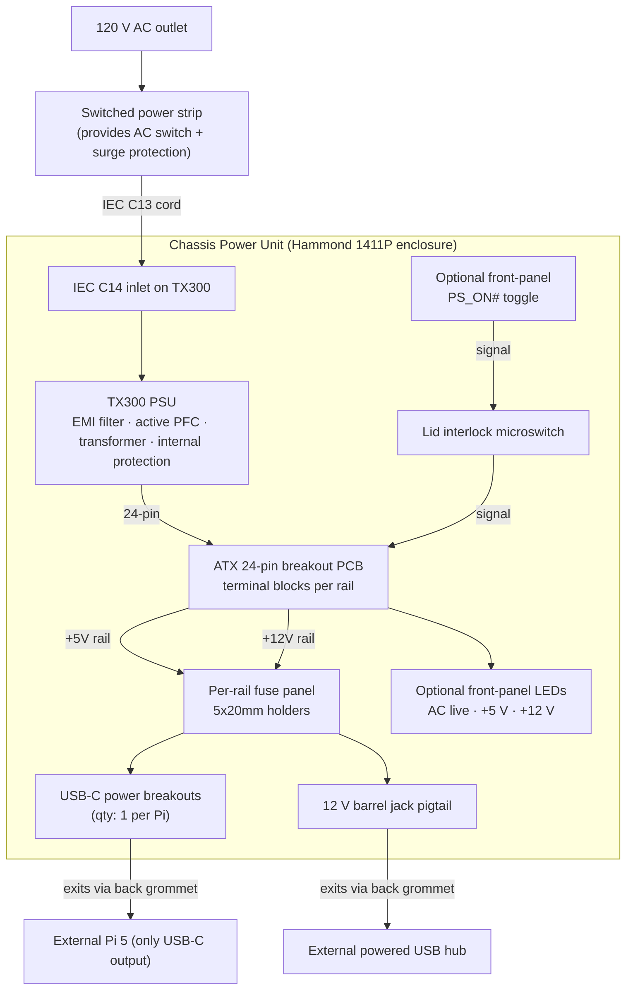

# Chassis Power Distribution Design Document

## v1.0 (May 2026)

Companion to the [PMVB System Design Document section 11.5](../system-design/System_Design_Document.html#power-architecture). Documents the mechanical and electrical design for the Chassis Power Unit (CPU): a single integrated enclosure built around the Silverstone SST-TX300 PSU that supplies +5 V to the Pi 5, +12 V to the powered USB hub, and -12 V to the Module 1E op-amp output stage. The Pi 5, USB hub, and instrument modules sit on the bench external to this chassis and connect via DC cables that exit the chassis back panel. (A chassis LAN switch is not part of the v1.0 baseline; the Pi 5 connects to the bench network directly via its onboard wired Ethernet port.)

Tier 1 modules are USB-bus-powered (5 V at ~100 mA per Pico) through the chassis USB hub. Tier 2 modules add a Tang Primer 25K FPGA powered from the Pico's GPIO header. The chassis power unit therefore supplies one USB-C output (for the Pi 5) and one 12 V barrel output (for the powered USB hub).

---

## 1. Design Philosophy and Topology

### 1.1 Single-Enclosure Chassis Power Unit

The chassis power system is a **single integrated enclosure** containing the TX300 PSU, the ATX breakout PCB, per-rail fuses, USB-C power breakouts, and (optionally) front-panel toggle and indicator LEDs. The Pi 5, USB hub, and modules sit external to this enclosure and connect through DC cables that exit a back-panel grommet.

```
                              External (on bench, low voltage):
                              +-------------------------------------+
                              |                                     |
                              |  Pi 5 16 GB --- USB hub --- modules |
                              |    |              |                 |
                              |   USB-C        12 V barrel          |
                              |                                     |
                              +-------------+-----------------------+
                                            |
                                            | Cables exit
                                            | through grommet
+-- Hammond 1411P enclosure (Chassis -------|--------------+
|   Power Unit)                             |              |
|                                           |              |
|  +-- AC Zone ----+    +-- DC Zone ----+   |              |
|  | TX300 PSU     |    | ATX breakout  |   |              |
|  |  (mains-volt) |    | Per-rail      |---+ 1x USB-C     |
|  |  IEC inlet    |====| fuses         |     pigtail (Pi 5)|
|  |  primary cap  |24p | 1x USB-C      |     1x 12V barrel |
|  |  EMI filter   |    | breakout      |     pigtail (hub) |
|  |  transformer  |    | (optional     |                   |
|  |  earth-bonded |    |  toggle/LEDs) |                   |
|  +---------------+    +---------------+                   |
|       |                                                    |
|   IEC inlet exposed via end-plate cutout                   |
|                                                            |
|   Lid interlock microswitch on main lid                    |
+--- Plug into switched power strip via standard IEC C13 ----+
```

The "AC Zone" and "DC Zone" are not separate physical compartments — they are zones of the same enclosure, separated by physical distance and routed cabling. The AC Zone holds mains-voltage parts (TX300's primary side, IEC inlet, internal AC wiring); the DC Zone holds the post-transformer rails (5 V, 12 V, etc.) and their distribution hardware. The TX300's transformer provides 1800 Vac of galvanic isolation between the two zones (per its datasheet hi-pot spec).

### 1.2 What the TX300 Already Provides

The TX300 is a complete, certified AC power module. Per its manual:

- IEC C14 input inlet integrated on the unit.
- EMI input filter: X2 safety capacitor across L-N, dual Y-capacitors L-and-N to chassis earth, common-mode choke (CLC pi-filter topology).
- Active PFC stage (>0.90 PF at full load).
- 1800 Vac primary-to-secondary hi-pot isolation.
- Internal protection: OPP foldback at 360-480 W, OVP latch-off, short-circuit latch-off.
- Earth-bonded chassis via IEC inlet ground pin.
- Compliance: UL60950, EN60950, IEC60950, CE, CCC, FCC Class B, CISPR 22 Class B, IEC61000-3-2.

We do not add external AC-side EMI filtering, fusing, or earth bonding — all of that is internal to the TX300. The chassis enclosure's job is mechanical containment, lid interlock for safety, and physical separation of AC-zone wiring from DC-zone wiring.

### 1.3 The Lid Interlock

A microswitch on the main lid sits in series with the **low-voltage PS_ON# wire** (pin 16 of the 24-pin ATX, green wire, active-low to enable rails).

- Lid closed → microswitch closed → PS_ON# can be pulled to GND → TX300 enables main rails (+3.3, +5, +12, -12 V).
- Lid open → microswitch open → PS_ON# floats high → TX300 disables main rails. The +5VSB standby rail stays alive.

The interlock interrupts a logic-level signal, not the mains line. Mains is still hot inside the chassis whenever the cord is plugged in. Bulk capacitors on the TX300's primary side hold dangerous DC voltage for 30 to 60 seconds after AC disconnect. Always observe the safety procedure in section 8 before opening the chassis lid.

## 2. Functional Block Diagram



## 3. Chassis Mechanical Design

### 3.1 Enclosure Selection

**Hammond 1411P** aluminum chassis with two removable steel end plates.

- Internal dimensions: approximately 254 × 152 × 76 mm (10 × 6 × 3 inches)
- Mouser: 546-1411P
- Digi-Key: HM3046-ND
- Approximately $30

Why this enclosure:
- Aluminum body provides natural earth bonding when wired to the TX300 chassis ground.
- Removable end plates simplify the mechanical work — the IEC inlet cutout and the fan grille cutout are made on flat plates, much easier than drilling the wraparound chassis.
- Comfortable internal volume: TX300 (175 × 85 × 65 mm) and the ATX breakout PCB (about 70 × 50 mm) fit side-by-side with room for cable routing, fuse holders, and USB-C breakouts.

### 3.2 Required Mechanical Modifications

Three cuts are required for v1.0; everything else is optional polish.

**Cut 1: IEC inlet cutout (AC end plate).** A rectangular cutout 35 × 28 mm on one end plate, sized to expose the TX300's IEC C14 inlet for an external IEC C13 plug.

How to make this cut, novice-friendly:

1. Mark the rectangle on the end plate with a permanent marker. Center the rectangle horizontally; vertically, position it to align with the TX300's IEC inlet height once the PSU is mounted on its standoffs (typically about 25 mm above the chassis floor).
2. Drill a 6 mm pilot hole inside one corner of the rectangle.
3. Use a hand jigsaw with a metal-cutting blade (Bosch T118A or equivalent, Mouser doesn't carry these; Home Depot or any hardware store) to cut along the marked lines. Take it slow; aluminum cuts cleanly at low speed.
4. File the cut edges smooth with a flat mill file. Deburr any sharp corners.
5. Test-fit: an IEC C13 plug should slide in and out of the TX300's inlet without binding on the cutout.

Time estimate for a novice: about 30 minutes.

**Cut 2: Fan grille hole (opposite end plate).** An 80 mm circular cutout on the end plate opposite the IEC inlet, sized to clear the TX300's exhaust fan and accept a standard 80 mm fan grille.

1. Mark the center on the end plate at the position aligned with the TX300's fan center (typically centered on the plate when the TX300 is mounted on its bottom standoffs).
2. Use a step bit (Irwin 10503BX or equivalent) to incrementally enlarge a pilot hole up to 80 mm. The Irwin step bit's largest step is 1-3/8" (~35 mm), so for 80 mm you'll need either a hole saw or to enlarge with a coping saw and file. Alternative: use a Greenlee 80 mm chassis punch (~$80, more expensive but produces a clean cut).
3. Drill four M3 mounting holes around the opening at the Hammond 1430-PFG fan grille's hole pattern (54 × 54 mm centers; the grille datasheet has the dimensions).
4. Mount the grille with M3 × 6 mm screws and nuts.

Hammond 1430-PFG fan grille:
- Mouser: 546-1430-PFG
- Digi-Key: HM3094-ND
- Approximately $3

**Cut 3: Cable exit grommet (back face or one side wall).** A 16 mm round hole for a cable strain-relief bushing.

1. Drill a 16 mm hole using a step bit.
2. Install a Heyco 1300-X strain relief bushing (Mouser 800-1300-X, ~$2). It snaps into the hole without screws.
3. The DC output cables (USB-C pigtail for Pi 5, 12 V barrel pigtail for USB hub) pass through this grommet.

### 3.3 Optional Mechanical Modifications (v1.0 polish)

These add convenience but are not required for the chassis to function safely.

**Front-panel features:** drill round holes on one of the long side walls for a panel-mount toggle switch (12 mm hole) and three indicator LEDs (6 mm holes each). Toggle and LEDs are wired as described in section 4.

**Cool-air intake:** drill a 6×6 grid of 6 mm holes on the chassis bottom (or one side wall) to provide intake airflow for the TX300's fan. Total open area should be at least 50% of the fan's 80 mm inlet area (~5000 mm²; a 6×6 grid of 6 mm holes gives ~1000 mm² which is too small — use either an 8×8 grid of 6 mm holes or replace with a second 80 mm fan grille on the opposite end plate).

**Lid interlock mounting:** drill two M3 holes through the chassis side wall at a position where the lid edge will press against the microswitch lever when the lid is closed. The Omron D2F-01F-T microswitch mounts via two M3 screws.

### 3.4 TX300 Mounting

The TX300 has four M3 threaded mounting holes on its bottom plate (standard TFX form factor, 175 × 85 mm). Mount the TX300 to the Hammond chassis floor with M3 × 6 mm screws threaded into 5 mm aluminum standoffs, leaving a small air gap underneath for cable routing.

Orientation:
- IEC inlet face → toward the AC end plate (Cut 1).
- 80 mm fan exhaust → toward the opposite end plate (Cut 2).
- 24-pin ATX output cable → exits toward the DC zone (the half of the chassis opposite the IEC inlet).

### 3.5 ATX Breakout Mounting

The Adafruit 1466 ATX breakout PCB mounts to the chassis floor in the DC zone (opposite half from the TX300). Use four M3 standoffs (10 mm tall) with M3 × 6 mm screws on each end, securing the PCB to the chassis floor with a small air gap.

Adafruit ATX 24-pin breakout (P/N 1466):
- Mouser: 485-1466
- Digi-Key: 1528-1466-ND
- Approximately $20

### 3.6 Earth Bonding

The TX300's metal chassis is internally bonded to AC mains earth via the IEC inlet's ground pin. To extend this bond to the Hammond 1411P aluminum chassis:

1. Run a 14 AWG green-yellow wire from one of the TX300's mounting screw points (a screw threaded into a TX300 mounting hole) to a tapped M3 hole on the Hammond chassis floor.
2. Use a star washer between the wire's ring terminal and the chassis to ensure low-impedance contact.
3. Verify continuity with a DMM: chassis-to-IEC-earth-pin should read less than 0.1 Ω.

This bonds the entire Hammond chassis to AC earth, so any fault current flows safely to earth instead of energizing the chassis surface.

## 4. Internal Layout and Wiring

### 4.1 AC Zone

Contains:
- TX300 PSU (mains-voltage internal parts).
- Internal IEC C13 cord stub if needed (not required if the TX300's existing cord-side connector is exposed directly through the end-plate cutout).
- Earth bonding wire from TX300 chassis to Hammond chassis.
- Unused TX300 output cables (EPS, PCI-E 6-pin, SATA, Molex, Floppy) bundled and tied off (see section 4.5).

### 4.2 DC Zone

Contains:
- Adafruit ATX 1466 breakout PCB receiving the 24-pin from TX300.
- Per-rail fuse panel (5×20 mm fuse holders mounted to the chassis floor or a small mounting bracket).
- USB-C power breakout PCB (single, for Pi 5 only).
- 12 V barrel-jack pigtail for USB hub feed.
- Optional front-panel toggle, LEDs, and test-point banana jacks.

### 4.3 Per-Rail Fuse Panel

The breakout PCB has built-in polyfuses, but they are slow-acting and reset themselves. Adding discrete glass fuses gives faster failure response and a clearly visible blown-fuse indicator.

Per-rail recommended values:

- +5 V rail: T5A slow-blow (5×20 mm)
- +12 V rail: T3A slow-blow
- +3.3 V rail (if used): T3A
- -12 V rail (if used): T0.5A

Bel BK1/S506-5-R panel-mount 5×20 mm fuse holders:
- Mouser: 530-S506-5-R
- Digi-Key: F2402-ND
- Approximately $3 each

Slow-blow glass fuses 5×20 mm (Bel BK series, various ratings):
- Mouser: 530-GMC-5-R (5 A), 530-GMC-3-R (3 A), 530-GMC-500MA-R (500 mA)
- Approximately $1 each
- Buy a couple of spares per rail.

Wire each rail's positive output from the breakout's screw terminals through its fuse holder before reaching the USB-C breakouts or the 12 V barrel pigtail.

### 4.4 PS_ON# Control Circuit

The lid microswitch is the only mandatory element for chassis safety. The optional front-panel toggle adds operator convenience.

Minimum-viable wiring (lid interlock only, no front-panel toggle):

```
Breakout PS_ON# header  --> wire --> Lid microswitch COM
                                           |
Breakout GND header     --> wire --> Lid microswitch NO
```

When lid closed, COM-NO conducts → PS_ON# pulled to GND → rails enabled.
When lid open, COM-NO open → PS_ON# floats → rails disabled.

With the optional front-panel toggle, both the toggle and the lid switch must be conductive for the rails to enable:

```
Breakout PS_ON# header --> Toggle COM
                            |
                         Toggle other --> Lid COM
                                            |
                         Breakout GND <-- Lid NO
```

Front-panel toggle (NKK SPDT, 3 A rated):
- NKK M2012SS1W01
- Mouser: 633-M2012SS1W01
- Digi-Key: 360-3208-ND
- Approximately $5

Lid microswitch (Omron SPDT with hinge lever, 3 A rated):
- Omron D2F-01F-T
- Mouser: 653-D2F-01F-T
- Digi-Key: Z3068-ND
- Approximately $3

### 4.5 Unused TX300 Cables

The TX300 ships with five additional cables besides the 24-pin ATX (4+4 EPS, PCI-E 6-pin, SATA, Molex, Floppy). Phase 0 doesn't use any of them. Don't cut them off — they may be useful for v2.0 expansion.

Two reasonable management approaches:

1. **Bundle and tie:** group the unused connectors with a velcro tie or zip tie and secure the bundle to the AC-zone side of the chassis. Heat-shrink each connector individually only if any pins face outward in a way that could short against the chassis.
2. **Heat-shrink each connector:** slip a 25 mm length of 1" heat-shrink tubing over each unused connector and shrink it down. Bundle and secure as above.

Heat-shrink tubing kit: SparkFun KIT-15583 or equivalent assortment, Mouser 474-KIT-15583, ~$10. Velcro tie strap: any hardware store, ~$3.

### 4.6 USB-C Power Breakouts

A single USB-C breakout PCB sits between the +5 V fused rail and the Pi 5's USB-C input. Tier 1 and Tier 2 modules are USB-bus-powered through the chassis USB hub (itself fed from the +12 V rail) and do not need separate USB-C power feeds.

Adafruit USB-C plug breakout (P/N 4090, with 5.1 kΩ CC resistors that signal "5 V capable" to USB-C downstream):
- Mouser: 485-4090
- Digi-Key: 1528-4090-ND
- Approximately $3

Wiring: solder a short pigtail (16 AWG, since the Pi 5 can pull 5 A peak) from the breakout's V_BUS and GND pads to the +5 V fuse output and chassis GND respectively. The USB-C plug at the breakout's other end runs out through the back-panel grommet to the Pi 5.

### 4.7 USB Hub 12 V Feed

The powered USB hub takes 12 V via a barrel jack (typically 5.5 × 2.1 mm center-positive; verify the specific hub model before ordering pigtails).

Adafruit 5.5 × 2.1 mm DC plug pigtail (P/N 369):
- Mouser: 485-369
- Digi-Key: 1528-1235-ND
- Approximately $2

Wire the pigtail's red and black leads to the +12 V fuse output and chassis GND. The barrel plug at the other end runs out through the back-panel grommet to the USB hub.

### 4.8 Optional Front-Panel Indicators

Three LEDs show chassis state:

- **AC LIVE** (yellow): driven from the +5VSB rail (always on when AC is plugged in).
- **+5 V OK** (green): driven from the +5 V rail (on when main rails are enabled).
- **+12 V OK** (blue): driven from the +12 V rail (on when main rails are enabled).

VCC 1043H1 series panel-mount LED indicators (with internal current-limiting resistor):
- 5 V variant (for AC LIVE and +5 V OK): Mouser 593-1043H1-5V
- 12 V variant (for +12 V OK): Mouser 593-1043H1-12V
- Approximately $2 each

The 1043H1 housing has a 6 mm shaft and integrated wires. Drill a 6 mm hole in the front panel for each, push through, secure with the included nut, wire the leads to the appropriate rail and chassis GND.

## 5. Tools List for Novice Assembly

If you're starting fresh on the mechanical work, here's a minimum tool list. Most can be borrowed or are common workshop tools you may already have. Mouser/Digi-Key don't stock most of these (mechanical hand tools); use Home Depot, Lowes, or a hardware store.

| Tool | Purpose | Recommended | Approx Cost |
|---|---|---|---|
| Cordless drill | Pilot holes, mounting screws | DEWALT DCD771C2 or any 12-20 V drill | $80 |
| Step-bit set (1/4" to 1-3/8") | Round holes in metal/plastic up to 35 mm | Irwin 10503BX (Home Depot) | $30 |
| Drill bit set (M3 thru 1/4") | Pilot holes, hardware clearance | Standard set | $20 |
| Hand jigsaw | Rectangular cutouts (IEC inlet) | Black & Decker JS660 | $40 |
| Metal-cutting jigsaw blades | Fits the jigsaw | Bosch T118A 5-pack (Home Depot) | $10 |
| Flat mill file | Deburring jigsaw cuts | Standard 8" | $10 |
| Round file | Cleaning round holes | 6 mm rat-tail | $5 |
| Phillips and flat screwdrivers | Hardware | Klein 32500 (11-in-1) | $20 |
| Wire stripper / crimper | Hookup wire and crimp ferrules | Klein 11061 | $25 |
| Multimeter | Continuity, voltage check | Already have a Fluke 87V | — |
| Ferrule kit | Strain-relief on stranded wire ends | Wago 206-150 + crimp tool | $40 |

Total tool budget if starting from scratch: approximately $280.

For the 80 mm circular fan grille hole, the Irwin step bit's largest step (1-3/8" / 35 mm) is too small. Three options for the 80 mm cut:

1. **Hole saw + arbor**: $20-30, takes minutes, leaves a clean cut. Recommended.
2. **Greenlee 80 mm chassis punch**: $80, professional-grade, very clean cut.
3. **Coping saw + file**: slow but no special tools beyond what's already on the list. Acceptable for one-off.

## 6. Bill of Materials

Cross-referenced to Mouser primary, with Digi-Key alternates where available. Pricing approximate as of May 2026; verify before ordering.

| Item | Manufacturer P/N | Mouser P/N | Digi-Key P/N | Qty | Unit Cost | Notes |
|---|---|---|---|---|---|---|
| **Enclosure and mechanical** | | | | | | |
| Hammond 1411P aluminum chassis | Hammond Manufacturing 1411P | 546-1411P | HM3046-ND | 1 | $30 | 254 × 152 × 76 mm |
| Hammond 1430-PFG fan grille | Hammond 1430-PFG | 546-1430-PFG | HM3094-ND | 1 | $3 | 80 mm |
| Heyco 1300-X strain relief | Heyco 1300-X | 800-1300-X | n/a | 1 | $2 | Cable exit grommet |
| M3 × 6 mm screws (qty 20) | various | n/a | n/a | 1 pack | $5 | Mounting hardware |
| M3 × 10 mm aluminum standoffs (qty 8) | various | n/a | n/a | 1 pack | $5 | TX300 + breakout mounting |
| M3 hex nuts (qty 20) | various | n/a | n/a | 1 pack | $3 | |
| **AC and interlock** | | | | | | |
| Silverstone TX300 PSU | Silverstone SST-TX300 | n/a | n/a | 1 | $0 | On hand |
| IEC C13 to NEMA 5-15 power cord | various | 562-176-1500 | Q105-ND | 1 | $5 | 1.5 m, 14 AWG |
| Omron lid microswitch | Omron D2F-01F-T | 653-D2F-01F-T | Z3068-ND | 1 | $3 | SPDT, hinge lever |
| 14 AWG green-yellow earth wire | various | n/a | n/a | 0.5 m | $1 | Earth bond |
| **DC distribution** | | | | | | |
| Adafruit ATX breakout PCB | Adafruit 1466 | 485-1466 | 1528-1466-ND | 1 | $20 | 24-pin to terminal blocks |
| Bel panel-mount fuse holder 5×20 mm | Bel Fuse BK1/S506-5-R | 530-S506-5-R | F2402-ND | 4 | $3 | One per protected rail |
| Slow-blow fuse T5A 5×20 mm | Bel BK1/GMC-5-R | 530-GMC-5-R | F2440-ND | 5 | $1 | +5 V rail; pack with spares |
| Slow-blow fuse T3A 5×20 mm | Bel BK1/GMC-3-R | 530-GMC-3-R | F2438-ND | 5 | $1 | +12 V rail; pack with spares |
| Adafruit USB-C plug breakout | Adafruit 4090 | 485-4090 | 1528-4090-ND | 1 | $3 | Pi 5 only |
| Adafruit 5.5 × 2.1 mm DC plug pigtail | Adafruit 369 | 485-369 | 1528-1235-ND | 1 | $2 | USB hub power feed |
| 16 AWG stranded hookup wire (red, black) | Alpha 3050 series | 602-3050-2-RD/BK | n/a | 5 m | $5 | DC distribution |
| 22 AWG stranded hookup wire (assorted colors) | Alpha 3050 series | 602-3050-* | n/a | 30 m | $20 | Signal and low-current |
| **Optional front panel** | | | | | | |
| NKK panel-mount toggle switch | NKK M2012SS1W01 | 633-M2012SS1W01 | 360-3208-ND | 1 | $5 | PS_ON# control |
| VCC LED indicator 5 V | VCC 1043H1-5V | 593-1043H1-5V | 67-1043H1-5V-ND | 2 | $2 | AC LIVE and +5 V OK |
| VCC LED indicator 12 V | VCC 1043H1-12V | 593-1043H1-12V | 67-1043H1-ND | 1 | $2 | +12 V OK |
| Pomona panel-mount banana jack (qty 4 if used) | Pomona 3760 | 565-3760-* | 501-1041-ND | 4 | $5 | Test points |
| **Cable management** | | | | | | |
| Heat-shrink tubing kit | SparkFun KIT-15583 | 474-KIT-15583 | 1568-1078-ND | 1 | $10 | Insulate unused TX300 connectors |
| Velcro cable ties | various | n/a | n/a | 1 pack | $3 | Bundle unused cables |
| **Subtotals** | | | | | | |
| Required (no front panel, no test points) | | | | | **~$101** | minimum-viable build |
| With front-panel toggle and 3 LEDs | | | | | **~$112** | better operator UX |
| Full BOM with banana-jack test points | | | | | **~$131** | full-featured build |

The chassis power BOM here supersedes any earlier per-line estimates in the SDD Phase 0 BOM.
## 7. Bring-Up Procedure

Do not plug AC into the chassis until you have completed steps 1 through 5. Steps 6 onward require AC; observe the safety procedures in section 8 throughout.

### 7.1 Unpowered continuity tests

1. Confirm the lid microswitch operates correctly: with the lid closed, COM-to-NO should read less than 1 Ω; with the lid open, COM-to-NO should read open circuit (typically more than 1 MΩ).
2. Confirm the front-panel toggle (if installed) is wired correctly: with the toggle off, COM-to-the-other-pole should read open circuit; with the toggle on, COM-to-the-other-pole should read less than 1 Ω.
3. Confirm earth-bond continuity from the IEC inlet's earth pin (visible on the TX300) to the Hammond chassis: less than 0.1 Ω.
4. Confirm no short between any two of: +5 V output, +12 V output, +3.3 V output, GND. All pairs should read open circuit.
5. Confirm no short between earth and any DC rail. All pairs should read open circuit (TX300's primary side is isolated from secondary by the transformer).

### 7.2 Mains-only test (no DC load)

6. Disconnect any modules from the DC outputs. Plug the chassis into a switched power strip.
7. Switch the power strip ON. The AC LIVE LED on the front panel should illuminate (driven from +5VSB).
8. Confirm the TX300 fan does NOT spin (PS_ON# is floating; TX300 is in standby).
9. Confirm no DC voltage is present on the +5 V or +12 V rails (DMM check at the breakout terminal blocks).

### 7.3 DC at no load

10. With the chassis lid closed, switch the front-panel toggle ON (or, if no toggle is installed, simply close the lid which engages the interlock). The TX300 fan should spin up; the +5 V and +12 V LEDs should illuminate.
11. Measure rail voltages at the breakout terminal blocks: +5 V should read 4.95 to 5.05 V; +12 V should read 11.85 to 12.15 V; -12 V should read -11.7 to -12.3 V.
12. Open the chassis lid (with the toggle still on, if applicable). The +5 V and +12 V LEDs should immediately extinguish, and the TX300 fan should spin down. AC LIVE LED stays on.
13. Close the lid. Rails should re-enable.
14. Switch the toggle OFF (if installed) or otherwise disengage PS_ON# to confirm the toggle path also disables rails. Rails should disable (LEDs off, fan stops). AC LIVE LED stays on.

### 7.4 DC under Pi 5 only

15. Connect the Pi 5's USB-C breakout to the +5 V fused output. Do not connect any other module.
16. Toggle on. The Pi 5 should boot normally.
17. Verify +5 V at the Pi 5's USB-C input under load: should be no less than 4.85 V.

### 7.5 DC at full chassis (Phase 1+)

18. Once Phase 1 modules are built, repeat steps 15-17 with all modules connected via the USB hub. (Modules are USB-bus-powered and do not require dedicated USB-C feeds from this chassis.)

## 8. Safety Procedures

### 8.1 Daily on/off

- **Power up:** confirm the chassis lid is fully closed. Plug chassis into power strip. Switch power strip ON. (Switch front-panel toggle ON if installed.)
- **Power down:** switch front-panel toggle OFF (if installed). Switch power strip OFF for full disconnect.

### 8.2 Opening the chassis lid

Required after any of:
- Modifying internal wiring or connections.
- Replacing fuses or LEDs.
- Inspecting the lid interlock.
- Replacing the TX300.

Procedure:

1. Switch the front-panel toggle OFF (if installed).
2. Switch the power strip OFF.
3. Unplug the IEC C13 cord from the chassis (positive disconnect, in case the power strip switch is faulty).
4. Wait 60 seconds for the TX300's primary-side bulk capacitors to discharge through their internal bleed resistors.
5. Verify zero voltage on the IEC inlet pins with a DMM (line-to-neutral and line-to-earth should both read 0 V).
6. Open the lid.

### 8.3 Working in the chassis with lid open

The DC zone is non-hazardous to touch (5 V, 12 V are safe), but the AC zone (TX300's primary side, IEC inlet wiring) is potentially hot whenever the cord is plugged in. With the lid open and the AC cord connected, the lid interlock has disabled the DC outputs but mains is still present at the IEC inlet, the bulk caps may still hold charge, and any work in the AC zone is dangerous.

Rule: never work in the AC zone with the cord plugged in. The DC zone (breakout, fuses, USB-C breakouts, front-panel hardware) is safe to modify with the cord plugged in but the toggle off.

### 8.4 Lockout-tagout for shared work

If the chassis needs maintenance involving anyone other than the operator (e.g., a friend helping debug):

1. Unplug the chassis IEC cord from the wall outlet.
2. Hang a tag on the cord saying "DO NOT PLUG IN — under maintenance."
3. Open the chassis as in section 8.2.
4. Verify zero voltage with a DMM before touching any conductor.

This is overkill for solo hobbyist work but matches the practice used in a professional setting and is worth practicing.

## 9. Future Enhancements (v2.0 and beyond)

- Add panel-mount switched IEC inlet to the chassis end plate (replacing the external power strip), with integrated dual fuse holders. Current external-power-strip arrangement is safe but less polished.
- Add inrush current limiter (NTC thermistor in series with the line) on the AC side if multiple TX300s end up in the system later.
- Add per-rail current monitoring (INA226 or similar I²C current sense ICs) for telemetry during measurement runs.
- Tier 3 module buildout adds per-module Pi Zero 2 W streaming sidecars and a chassis LAN switch; the +5 V rail has the headroom for them on the existing TX300 (~9 A spare).
- Move from plywood mounting to a dedicated rack-mount or DIN-rail enclosure system once module count and form-factor are stabilized.

## 10. References

- Silverstone SST-TX300 manual (uploaded copy with electrical and mechanical specs).
- [PMVB SDD section 11.5 (Power Architecture)](../system-design/System_Design_Document.html#power-architecture) — high-level architecture context.
- [PMVB Phase 0 Orchestration Setup](../setup/Phase_0_Orchestration_Setup.md) — references this document for Step 7.
- [Adafruit ATX breakout 1466 product page](https://www.adafruit.com/product/1466)
- [Hammond 1411P enclosure datasheet](https://www.hammfg.com/electronics/small-case/1411)
- ATX 24-pin connector pinout: Intel ATX Specification (publicly documented).
