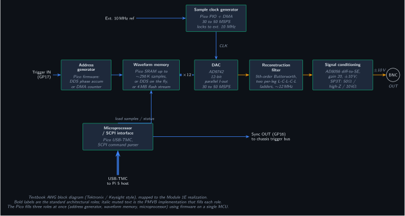
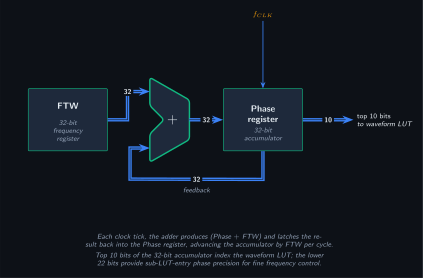
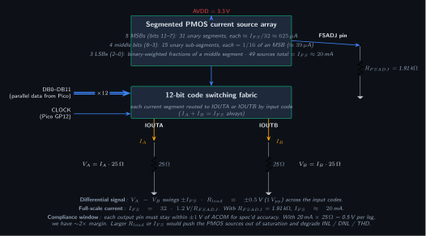
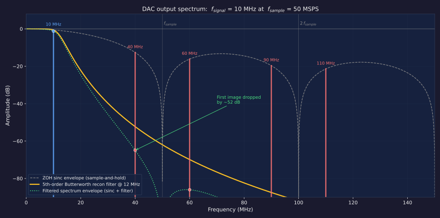
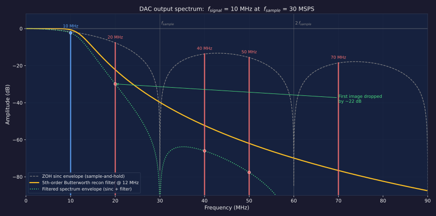
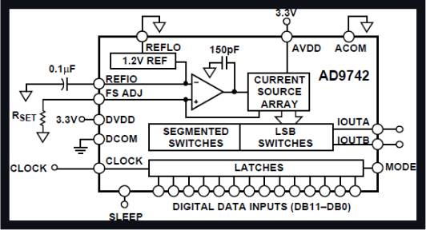
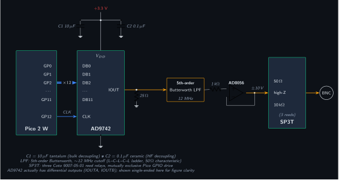

# Module 1E: Function Generator / Arbitrary Waveform Generator

## Module Design Document

**Version:** 1.7 (June 2026, reconstruction filter values from completed D2 singly-terminated Butterworth synthesis in sections 1.5 / 4 / 8; AVDD/DVDD ferrite beads FB1/FB2 added to BOM per D4)
**Module ID:** 1E
**Tier:** 1
**Status:** In Design
**Parent SDD section:** 7.5.5 of the [PMVB System Design Document](../system-design/System_Design_Document.html#module-1e-function-generator-arbitrary-waveform-generator)

---

## Table of Contents

- [1. Theory of Operation](#theory-of-operation)
  - [1.1 Overview and signal-flow architecture](#overview-and-signal-flow-architecture)
  - [1.2 Sample clock generator](#sample-clock-generator)
  - [1.3 Address generator and waveform memory](#address-generator-and-waveform-memory)
  - [1.4 DAC stage: current-mode operation](#dac-stage-current-mode-operation)
  - [1.5 Reconstruction filter](#reconstruction-filter)
  - [1.6 Op-amp output stage](#op-amp-output-stage)
  - [1.7 Output impedance switching](#output-impedance-switching)
  - [1.8 Synchronization and trigger](#synchronization-and-trigger)
- [2. Architectural choices](#architectural-choices)
  - [2.1 Parallel data interface (vs SPI)](#parallel-data-interface-vs-spi)
  - [2.2 Current-mode output (vs voltage-mode)](#current-mode-output-vs-voltage-mode)
  - [2.3 Why AD9742 specifically](#why-ad9742-specifically)
- [3. Functional figures](#functional-figures)
- [4. Schematic Notes (high-level; full schematic in KiCad)](#schematic-notes-high-level-full-schematic-in-kicad)
  - [DAC output stage and current-to-voltage conversion](#dac-output-stage-and-current-to-voltage-conversion)
  - [Reconstruction filter](#reconstruction-filter)
  - [Op-amp differential-to-single-ended converter](#op-amp-differential-to-single-ended-converter)
  - [Op-amp supply](#op-amp-supply)
  - [Impedance switching](#impedance-switching)
  - [Decoupling](#decoupling)
- [5. Pin Assignments](#pin-assignments)
  - [Pico 2 W parallel data + clock to AD9742](#pico-2-w-parallel-data-clock-to-ad9742)
  - [Pico 2 W relay control](#pico-2-w-relay-control)
  - [Pico 2 W trigger I/O](#pico-2-w-trigger-io)
  - [Pico 2 W power](#pico-2-w-power)
  - [AD9742 pinout summary](#ad9742-pinout-summary)
  - [AD8056 op-amp output stage](#ad8056-op-amp-output-stage)
- [6. Specifications (matching SDD Table 7-27)](#specifications-matching-sdd-table-7-27)
- [7. Sample Applications](#sample-applications)
  - [7.1 Single-tone sine generation](#single-tone-sine-generation)
  - [7.2 Swept sine for THD measurement (paired with Module 2E)](#swept-sine-for-thd-measurement-paired-with-module-2e)
  - [7.3 Multitone for IMD (intermodulation distortion)](#multitone-for-imd-intermodulation-distortion)
  - [7.4 White noise for noise-floor characterization](#white-noise-for-noise-floor-characterization)
  - [7.5 Clock generation for digital characterization](#clock-generation-for-digital-characterization)
  - [7.6 Bias-mode voltage injection](#bias-mode-voltage-injection)
- [8. Bill of Materials](#bill-of-materials)
- [9. Calibration Procedure](#calibration-procedure)
  - [9.1 DC offset calibration](#dc-offset-calibration)
  - [9.2 Gain calibration](#gain-calibration)
  - [9.3 Frequency calibration](#frequency-calibration)
  - [9.4 Reconstruction filter passband flatness](#reconstruction-filter-passband-flatness)
- [10. Bring-Up Checklist](#bring-up-checklist)
- [11. Known Issues and Future Work](#known-issues-and-future-work)
- [12. References](#references)

---

## 1. Theory of Operation

Module 1E generates analog stimulus waveforms for amplifier characterization, in-ear monitor and headset testing, consumer tube audio gear measurement, clock generation for digital interfaces, and any test recipe that needs a controlled signal driven into a DUT. Single-channel BNC output, DC to 10 MHz, ±10 V into high-impedance loads.

The architecture follows the textbook arbitrary-waveform-generator block diagram (Tektronix / Keysight style): a sample clock generator drives an address generator that walks a waveform memory, which feeds samples into a DAC at the update rate; the DAC's output passes through a reconstruction filter to remove sampling images, then through a signal-conditioning stage (gain, impedance switching) to a front-panel output. Module 1E maps that architecture onto Pico 2 W firmware (the address generator + waveform memory + microprocessor roles all live in a single MCU), an Analog Devices AD9742 12-bit parallel current-output DAC, a 5th-order Butterworth reconstruction filter, an AD8056 high-speed difference amplifier, and a three-position SP3T impedance switch. The eight subsections below describe each block in detail. Section 2 covers the architectural choices (DAC selection, parallel vs SPI interface, current-mode vs voltage-mode) that led to this particular set of parts.

### 1.1 Overview and signal-flow architecture

Figure 1E-1 below maps the textbook AWG architecture onto the Module 1E realization. Bold labels in each block are the standard architectural roles; italic muted text is the part or firmware that fills each role on this board.

**Figure 1E-1: Module 1E AWG functional architecture**



The signal flows left to right through the main chain (address generator → waveform memory → DAC → reconstruction filter → signal conditioning → BNC). The sample clock generator sits above the chain and drives the address generator, stepping it through waveform memory at the configured sample rate; the DAC latches whatever sample is presented on each clock edge, so in the physical implementation the same clock wire also reaches the DAC's CLOCK pin. The microprocessor / SCPI interface sits below the chain and handles host communication plus loading samples into the waveform memory. Trigger I/O ties to the chassis trigger bus for cross-module synchronization. The Pico fills three textbook roles at once (address generator, waveform memory, microprocessor) using firmware on a single MCU; the DAC, filter, and op-amp are discrete external parts.

### 1.2 Sample clock generator

The DAC's update rate is the foundation of the whole signal chain. It sets the achievable output bandwidth (half the sample rate, per Nyquist) and the position of the first reconstruction image (at f_sample − f_signal). Module 1E targets 30 to 50 MSPS sustained, which gives an output bandwidth ceiling of 10 MHz with comfortable headroom against the reconstruction filter's transition band.

Three real-world effects pull this ceiling well below the Nyquist limit. First, the reconstruction filter has a finite transition band. The first DAC image lands at f_sample − f_signal, and the filter has to be in passband for f_signal but in stopband for the image; the wider that gap, the more attenuation the 5th-order Butterworth provides. At 50 MSPS with a 10 MHz signal the image lands at 40 MHz and gets knocked down by roughly 52 dB, but at 30 MSPS the image is at 20 MHz and only sees about 22 dB of rejection. Second, the AD9742's zero-order-hold output applies a sinc(πf/f_sample) amplitude envelope that droops as you approach Nyquist: -0.58 dB at 10 MHz / 50 MSPS, -1.65 dB at 10 MHz / 30 MSPS, and -3.92 dB at f_sample/2 itself. Third, industry practice for AWG analog-bandwidth specifications is f_sample/3 to f_sample/5 rather than the theoretical Nyquist limit (NI's PXIe-5413 specs 20 MHz on 100 MSPS, Tek's AFG31000 specs 50 MHz on 250 MSPS). Module 1E follows the same convention: 10 MHz / 30 MSPS = f_sample/3 (the worst-case floor) and 10 MHz / 50 MSPS = f_sample/5 (the comfortable burst case).

The clock comes from the Pico 2 W's RP2350 internal 150 MHz system clock, divided down by a PIO state machine. The state machine drives the address generator at the configured sample rate, advancing through waveform memory and presenting each new 12-bit sample on the DAC's data pins; the same clock edge is wired to the DAC's CLOCK input, so the DAC latches the new value in lockstep. Using PIO (not a hardware timer or PWM peripheral) is what makes this work: a timer-and-ISR approach can't sustain 50 MHz determinism on the M33 cores, and a PWM peripheral can only toggle one pin per cycle, not the 12 data pins plus the clock pin in phase. The whole stream runs with deterministic single-cycle timing, off the CPU entirely.

Two clock-accuracy modes are available:

- **Standalone.** The RP2350 crystal alone, ±20 ppm tolerance. At 10 MHz output that is ±200 Hz absolute accuracy. Fine for most characterization work.
- **Locked to external 10 MHz reference.** The chassis trigger bus distributes a 10 MHz GPSDO or TCXO reference (sourced from Module 2C if populated). Pico firmware can phase-lock to this reference for ±2 ppm accuracy (±20 Hz at 10 MHz output).

Sustained update rate caps out around 50 MSPS for short bursts but drops to 30 to 40 MSPS for continuous operation, because the Pico's PIO + DMA needs roughly 75 MB/s of SRAM-to-PIO-FIFO throughput at the upper limit, which is at the edge of what RP2350 can do reliably without preemption from other firmware tasks. This 30 MSPS floor is what drives the conservative 10 MHz bandwidth ceiling specified above: a long sustained run will settle into the 30 to 40 MSPS regime, so the host has to plan for the worst-case droop and image rejection numbers, not the burst-case ones. Module 1E firmware reports the achieved update rate as a SCPI status query so the host always knows which regime it's operating in and can either accept the working conditions or pause concurrent activity to recover burst-rate headroom.

### 1.3 Address generator and waveform memory

Two operating modes share the same DAC streaming path: DDS mode for parametric waveforms (sines, sweeps, multitones, squares, triangles, ramps) and ARB mode for arbitrary sample tables. The mode is selected by SCPI command (`SOUR:FUNC SIN` selects DDS-sine, `SOUR:DATA <samples>` loads ARB).

**DDS mode (Numerically Controlled Oscillator).** No waveform table of the output signal exists; instead, Pico Core 1 runs a Numerically Controlled Oscillator (NCO) in firmware that synthesizes samples on the fly. The NCO has three pieces:

1. A **phase accumulator**, a 32-bit `uint32_t` register in Pico SRAM advanced by a constant value (the **frequency tuning word**, FTW) on every sample tick. It wraps at 2^32, which is the digital equivalent of phase going from 0 to 2π and back. Figure 1E-2 shows the textbook NCO internals: an FTW register feeds an adder whose output latches into the phase register, with the phase register output feeding back to the adder via a 32-bit bus.
2. A **waveform lookup table**, a 1024-entry × 12-bit array of precomputed amplitude values for the selected shape (sine, triangle, square, or ramp). The top 10 bits of the phase accumulator index this table.
3. The downstream **PIO + DMA → DAC chain** from section 1.2, which clocks the LUT output out to the AD9742 at the sustained sample rate.

**Figure 1E-2: Phase accumulator (textbook DDS view)**



The output frequency is set by the FTW: f_out = FTW × f_sample / 2^32, inverted as FTW = round(f_out × 2^32 / f_sample). At 50 MSPS, the smallest FTW change of 1 LSB corresponds to a frequency step of f_sample / 2^32 ≈ 11.6 mHz, so any target frequency is hit within ±5.8 mHz of the request. This is where the "microhertz-class frequency resolution" claim comes from.

The reason for the 32-bit accumulator (rather than indexing the LUT directly with a 10-bit counter) is exactly that resolution. A 10-bit phase counter alone would only reach 1024 discrete output frequencies; the 22-bit fractional part below the LUT-index bits gives a smooth phase ramp between table entries even though those finer bits are thrown away at lookup time. The discarded precision shows up as a small spurious tone called **phase truncation noise** at roughly 6 × M dB below carrier (where M is the number of bits kept). At M = 10 that's about 60 dB spur-free dynamic range, which sits below the 12-bit DAC's quantization floor of 74 dB, so phase truncation doesn't dominate the spectrum.

Core 0 sits outside the NCO loop, parsing incoming SCPI commands (`SOUR:FREQ`, `SOUR:FUNC`, `OUTP`) and writing updated FTW or LUT-pointer values to shared SRAM locations. Core 1 picks up those values on the next sample tick. This lets the host change frequency, waveform shape, or amplitude without halting the sample stream, which enables continuous frequency sweeps and parameter modulation.

**Arbitrary waveform (ARB) mode**: the waveform sample table sits in Pico SRAM (520 KB total, of which up to ~256K 16-bit samples can be a single waveform), and the address generator is a DMA channel walking the table in a loop. Played-out duration at 50 MSPS is about 5 ms per loop iteration. For waveforms longer than SRAM, the firmware can stream from the Pico's 4 MB external flash via XIP DMA (caps at roughly 2 M 16-bit samples = ~40 ms at 50 MSPS), with the trade that flash bandwidth is the new ceiling and continuous flash reads compete with code execution.

The same firmware can also generate noise (linear-feedback PRNG) and modulated carriers (DDS + envelope) without a sample table. Together these cover the workloads in section 7 (Sample Applications) without needing the host to push data over USB-TMC mid-stream.

### 1.4 DAC stage: current-mode operation

The AD9742 is a 12-bit current-output DAC. Internally it is an array of segmented PMOS current sources whose total sums to the full-scale current I_FS. The 12-bit input code routes each segment to either of two output pins (IOUTA or IOUTB), with the constraint that the sum I_A + I_B always equals I_FS. The difference I_A − I_B varies linearly with the input code, and that is where the signal lives.

**Figure 1E-3: AD9742 current-mode DAC operation (simplified)**



The "segmented" part of segmented PMOS current sources deserves a closer look, because it's why the AD9742 can hit its dynamic-performance specs. Rather than building 12 binary-weighted current sources (where the MSB is 2048 times the LSB), the AD9742 splits the 12 bits across three tiers: the 5 MSBs are 31 unary-decoded segments at I_FS/32 each (~625 µA), the 4 middle bits are 15 unary-decoded sub-segments at 1/16 of an MSB segment each (~39 µA), and the 3 LSBs are binary-weighted fractions of a middle-bit segment. That's 49 nominal current sources for 12 bits of resolution. The reason for the complexity is glitch performance at the MSB transition. A pure binary-weighted DAC has to turn one giant current source ON while turning many small ones OFF when the code rolls from 0x7FF to 0x800, and any mismatch shows up as a code-correlated voltage glitch that's visible on a spectrum analyzer as harmonic distortion. Unary segmentation makes the transition monotonic by construction: code N+1 just turns on one additional sub-current of the same nominal value as all the others. The bottom 3 LSBs stay binary-weighted because the glitch penalty at that magnitude is below the part's noise floor.

Four parameters set the operating point:

- **I_FS** is set by the external FSADJ resistor: I_FS = 32 × 1.2 V / R_FSADJ. We use R_FSADJ = 1.91 kΩ for I_FS ≈ 20 mA. Valid I_FS range per the AD9742 datasheet is roughly 2 mA to 20 mA for spec'd performance; below 2 mA the current sources lose matching, above 20 mA the part is outside characterized operating conditions.
- **R_load** converts each leg's current to voltage. We use 25 Ω from each of IOUTA, IOUTB to AGND. V per leg = I_leg × R_load, so at full-scale on one leg the voltage is 0.5 V.
- **Compliance voltage** is the range in which each output pin's voltage can sit while the PMOS current sources stay in saturation. AD9742 datasheet: −1.0 V to +1.25 V from ACOM. With 20 mA × 25 Ω = 0.5 V per leg, we have ~2× margin. Exceeding compliance does not damage the chip but causes current droop and degrades INL / DNL / THD.
- **MODE pin** is a data-format strap: tied to DCOM (GND) selects straight binary, tied to DVDD selects twos complement. This module ties MODE to GND, so Pico firmware emits straight-binary sample codes. NOT a parallel/serial mode select.

The differential voltage at the filter input swings ±I_FS × R_load = ±0.5 V (1 V peak-to-peak) across the full 12-bit code range. That 1 V_pp differential signal is what the downstream filter and difference amp scale to the final ±10 V single-ended output.

Concrete code-to-output mapping for the worst-case extremes: code 0x000 routes all 20 mA to IOUTB (V_A = 0 V, V_B = 0.5 V, differential = -0.5 V); code 0xFFF routes all to IOUTA (differential = +0.5 V); code 0x800 (midscale) splits the current evenly across the segments (V_A = V_B = 0.25 V, differential = 0 V). Bipolar AWG signals are written in straight binary with midscale at 0x800 so the zero-crossing of a sine corresponds to that code, peaks of the sine correspond to 0x000 and 0xFFF, and the differential output naturally swings symmetrically around 0 V. The 0.25 V common-mode bias on each leg gets rejected by the AD8056 difference amplifier's CMRR (section 1.6).

### 1.5 Reconstruction filter

Sampling theory says that converting a discrete sample sequence back to a continuous signal is the dual of the ADC anti-alias problem. On the ADC side you place an anti-alias filter BEFORE the sampler to keep above-Nyquist content from folding into the band. On the DAC side you place a reconstruction filter AFTER the DAC to remove the sampling IMAGES that appear at multiples of the sample frequency.

Two phenomena combine to create the output spectrum:

1. **Sampling** copies the baseband spectrum to every multiple of f_sample (positive and negative). For a 10 MHz tone at f_sample = 50 MSPS, the spectrum contains the original 10 MHz plus images at 40 MHz, 60 MHz, 90 MHz, 110 MHz, and so on. These are not harmonics from any nonlinearity — they are a mathematical consequence of sampling.
2. **Sample-and-hold (ZOH)** at the DAC output multiplies the spectrum by a sinc envelope (sin(πf/f_s) / (πf/f_s)). This naturally attenuates the higher images, but not enough on its own to clean up the output.

**Figure 1E-4: DAC output spectrum at 50 MSPS burst-rate (best case)**



The reconstruction filter does the rest of the work. Module 1E uses a 5th-order Butterworth lowpass with ~12 MHz cutoff, implemented as two per-leg L-C-L-C-L ladders (one on the IOUTA path, one on IOUTB). For the 50 MSPS burst-rate case (Figure 1E-4 above), the worst-case 10 MHz output has its first image at 40 MHz, attenuated by ~52 dB after the filter (the dot in the green post-filter envelope). At lower output frequencies the first image moves further into the stop band, so image rejection improves to 60–80 dB.

**Figure 1E-5: DAC output spectrum at 30 MSPS sustained-rate floor (worst case)**



Figure 1E-5 shows the same configuration at the 30 MSPS continuous-operation floor. The first image now lands at 20 MHz instead of 40 MHz (much closer to the 12 MHz filter cutoff), so the Butterworth only knocks it down by ~22 dB instead of ~52 dB. The ZOH sinc envelope also droops harder, -1.65 dB at the 10 MHz output instead of -0.58 dB, since the signal is now 1/3 of f_sample rather than 1/5. This is the regime to plan for under any sustained-run condition where the firmware can't hold the 50 MSPS burst rate; the SCPI status query in section 1.2 lets the host see which regime it's currently operating in.

The filter cutoff is the upper-bandwidth limit of the module. Pushing it higher would let the output reach beyond 10 MHz but at the cost of less attenuation of the first image (which would sit closer to the cutoff). The 5th-order Butterworth + 12 MHz cutoff is sized so that 10 MHz output is at the -3 dB point and the first image is comfortably in the stop band.

**Images vs harmonics.** Images live at f_sample ± f_signal and its multiples (sampling artifacts; the recon filter removes them). Harmonics live at 2 × f_signal, 3 × f_signal, etc. (nonlinearity artifacts from the DAC's INL/DNL, op-amp THD; the recon filter does not remove them when they fall in the passband). At high output frequencies the filter does double duty, killing images AND knocking down out-of-band harmonics; at low output frequencies (audio band), harmonics in the passband are governed entirely by the linearity of the DAC and op-amp.

Component values come from a completed 5th-order Butterworth synthesis (PCB design package finding D2), run as a singly-terminated design for the actual per-leg impedances: a 25 Ω DAC source termination driving the op-amp's high-impedance (≈1 kΩ) input. That 40:1 source/load ratio rules out a doubly-terminated ladder, so each leg uses a singly-terminated L-C-L-C-L Butterworth with series inductors 0.22 µH / 0.68 µH / 0.22 µH and shunt capacitors 820 pF. Simulated response is -3 dB at ≈11 MHz with ≈51 dB image rejection at 40 MHz (50 MSPS) and ≈26 dB at 20 MHz (30 MSPS); the ≈1.5 dB passband droop to 10 MHz is removed by the stored frequency-response calibration of section 9.4.

### 1.6 Op-amp output stage

The AD8056 is a dual high-speed voltage-feedback op-amp (300 MHz GBW, 1400 V/µs slew rate). Channel A operates as a difference amplifier; channel B is unused and terminated to prevent oscillation (+IN to GND, -IN tied to its own output).

The difference-amp topology is the classic four-resistor configuration:

- The filtered IOUTA signal feeds the +IN pin through R_in1 = 1 kΩ
- The filtered IOUTB signal feeds the -IN pin through R_in2 = 1 kΩ
- A feedback resistor R_fb = 20 kΩ closes the loop from output to -IN
- A reference resistor R_ref = 20 kΩ ties +IN to GND for CMRR balance

The differential gain is R_fb / R_in = 20. With the 1 V_pp differential signal from the filter, the single-ended output is 20 V_pp = ±10 V peak (into a high-impedance load).

**Slew-rate budget.** For a ±10 V output sine at 10 MHz, the required peak slew is 2π × 10 MHz × 10 V = 628 V/µs. The AD8056's 1400 V/µs gives ~2.2× margin, so slew limiting does not contribute to distortion within the spec band.

**Bandwidth budget.** The AD8056's 300 MHz gain-bandwidth product divided by the closed-loop gain of 20 gives ~15 MHz closed-loop bandwidth. That sits just above the recon filter's 12 MHz cutoff, so the op-amp is not the dominant bandwidth limit (the recon filter is).

**Output current and load.** The AD8056 sources up to about 60 mA continuous. Into a 50 Ω terminated scope load (so 50 Ω back-termination + 50 Ω scope termination = 100 Ω effective), the output is clamped to ~±6 V op-amp swing (60 mA × 100 Ω), which becomes ~±3 V at the scope after the back-termination divider. Into a 1 MΩ high-Z load, the full ±10 V op-amp swing reaches the BNC. See section 6 Specifications for the full by-load amplitude breakdown.

### 1.7 Output impedance switching

The output stage selects one of three source impedances via three SPST reed relays gated by Pico GPIOs. Firmware enforces one-relay-at-a-time so the BNC sees exactly one source impedance.

- **50 Ω (back-terminated)** for oscilloscope inputs at 50 Ω, RF gear, transmission lines that need source-termination to prevent reflections. Effective output amplitude is ~±3 V at a 50 Ω terminated scope, or ~±5 V at the scope under proper double termination.
- **High-Z (low-impedance source)** for 1 MΩ scope inputs, consumer audio gear with 47-100 kΩ line inputs (including hybrid and tube headphone amps such as the Bravo Audio Ocean), or general high-impedance test points. The op-amp drives the BNC directly through a relay with no series back-termination resistor, so the source impedance is the op-amp's sub-ohm closed-loop output. The full ±10 V swing is available into high-impedance loads.
- **10 kΩ (current-limited bias)** for safely injecting a known voltage onto an unknown DUT node (a digital pin, a sensor input, a calibration test point). The 10 kΩ series resistor caps fault current at V/R: at ±10 V into a short, that is ±1 mA absolute worst case, well below the clamp-diode rating of any 3.3 V or 5 V CMOS input. This is the safe-bias mode for poking at hardware where you do not fully trust the state of every node.

### 1.8 Synchronization and trigger

Two GPIOs on the Pico expose the module's relationship with the chassis trigger bus:

- **SYNC_OUT (GP16)** can be configured as a one-cycle pulse at the start of each waveform period (for synchronizing scope captures to AWG output) or as a continuous gate (for protocol-level handshaking). It ties to the chassis-wide trigger bus, so other modules on that bus (especially Module 2E for FFT-based capture) can lock their captures to Module 1E's output without software-arming jitter.
- **TRIG_IN (GP17)** accepts an external trigger from the chassis trigger bus, allowing the AWG to start its waveform on an external event (a digital edge from another module, a button press routed through the chassis, an external instrument's trigger output).

The trigger bus also distributes the 10 MHz reference clock used for the cross-module sample-rate locking described in section 1.2.

## 2. Architectural choices

The hardware platform (Pico 2 W) and the DAC (AD9742) were selected together to hit the bandwidth, resolution, cost, and hand-solderability targets for a hobbyist-budget AWG. The three subsections below cover the DAC interface choice (parallel vs serial), the output topology choice (current-mode vs voltage-mode), and why the AD9742 specifically over the family alternatives.

### 2.1 Parallel data interface (vs SPI)

The AD9742 uses a parallel data interface: 12 data bits plus a clock pin. The Pico drives all 13 lines simultaneously from a PIO state machine + DMA. This trades two things for two others, compared to a SPI-driven DAC:

- **Trade 1 (positive)**: parallel lets the DAC update at the Pico's full PIO clock rate (up to 150 MHz on RP2350). 50+ MSPS sample rate is reachable, giving analog output bandwidth into the 10s of MHz. SPI on the Pico maxes around 30–50 MHz, which after the 16-bit-per-sample transfer overhead caps a SPI DAC at ~2–3 MSPS — audio band only.
- **Trade 2 (positive)**: 28-TSSOP package, 0.65 mm pitch, hand-solderable with a fine-tip iron and flux. Compare to AD9106 (32-LFCSP, 0.4 mm pitch QFN with thermal pad) which needs hot-air rework. The SDD's hand-solderability constraint puts TSSOP in scope without special equipment.
- **Trade 3 (negative)**: parallel uses 13 GPIOs vs SPI's 4. Pico has 40 GPIOs and plenty to spare, so this is a non-issue in practice.
- **Trade 4 (negative)**: the Pico has to stream samples in real time — there is no internal pattern memory or DDS engine on the AD9742. At 50 MSPS this requires ~75 MB/s sustained SRAM-to-PIO-FIFO throughput, which is at the edge of RP2350 capability. In practice the module runs 30–50 MSPS depending on waveform complexity. This is the constraint that puts long arbitrary-waveform replay as the deferred future capability (a Tier 2 evolution would put the Tang Primer 25K between Pico and DAC to absorb the streaming load).

For the typical AWG workload (DDS-generated sines, sweeps, multitone, noise, square / triangle / ramp, and ARB waveforms up to ~256K samples), the parallel choice is correct.

### 2.2 Current-mode output (vs voltage-mode)

The AD9742's output is a complementary differential current pair (IOUTA + IOUTB summing to I_FS). External load resistors convert the currents to voltages. This contrasts with voltage-output DACs (MCP4922, DAC8512, and similar) which have an internal op-amp buffering the output to a voltage directly.

Four reasons current-mode is the standard for AWG-class parts:

- **Speed.** Voltage-output DACs have an internal op-amp bounding their settling time (typically microseconds for 12-bit at this resolution class). Current-output skips that op-amp entirely; settling is set by the external R-C, which we control. At our 25 Ω termination and a few pF of stray capacitance, settling is under 10 ns. That is the difference between a 1 MHz AWG and a 10 MHz AWG.
- **Differential output for free.** Because IOUTA and IOUTB are complementary by construction, using both legs gives 6 dB of dynamic range (the difference is twice each leg's swing), common-mode noise rejection (clock feedthrough, supply noise, code-correlated glitches cancel), and a DC-offset-free differential signal. Voltage-output DACs at this resolution are almost all single-ended; you give up all three benefits.
- **Distortion is transparent.** The AD9742's INL/DNL spec describes the current-source array directly. With voltage-output DACs, the published spec is the array, but what you measure at the output also includes the internal buffer's THD, which usually dominates at MHz frequencies.
- **External I-to-V is yours to shape.** The 25 Ω termination + recon filter + AD8056 difference-amp split is a deliberate design. Each stage is independently tunable. With voltage-output that whole path is fused inside the chip and inaccessible.

The cost is BOM complexity (more external parts) and the compliance-voltage constraint discussed in section 1.4.

### 2.3 Why AD9742 specifically

Within the 12-bit, ~200 MSPS, parallel current-output category, the AD9742 won on three axes:

- **Package.** 28-TSSOP fits the SDD's hand-solderability constraint. The next step up in capability (AD9106 with on-chip pattern memory + DDS engine) is 32-LFCSP, which is in scope per SDD constraint 2 but requires hot-air rework.
- **Cost.** ~$14.80 single-quantity at Digi-Key. AD9744 (14-bit, same package family) is similar; AD9106 is ~$20-30.
- **Family pin compatibility.** AD9740 (10-bit), AD9742 (12-bit), AD9744 (14-bit) are pin-compatible. The board can be upgraded to 14-bit resolution without a PCB respin if the downstream analog chain ever justifies it.

Two near-misses considered and dropped: AD9106 (would solve the Pico-streaming bandwidth pressure entirely with on-chip 4096-sample pattern memory + DDS, but the LFCSP package and higher cost moved it out of scope for the v1.0 hobbyist build); MCP4922 (12-bit SPI dual, trivial to drive, but caps at audio-band sample rates).

See the PCB design package (`hardware/modules/1E/Module_1E_PCB_Design_Package.md`) section 2 for the engineering decisions (D1 through D7) that further refine the as-built design within the AD9742-based architecture.

## 3. Functional figures

The AD9742's internal block diagram (from the datasheet) and a typical-application schematic showing the full Pico-to-BNC signal chain. Figure 1E-1 (AWG functional architecture) is in section 1.1; Figure 1E-2 (phase accumulator) is in section 1.3; Figure 1E-3 (current-mode DAC operation) is in section 1.4; Figures 1E-4 and 1E-5 (DAC output spectrum at 50 MSPS and 30 MSPS) are in section 1.5.

**Figure 1E-6: AD9742 internal functional block diagram**



*Source: AD9742 datasheet (Rev. C), page 1. Analog Devices Inc. Used under fair-use citation for technical reference.*

**Figure 1E-7: Module 1E typical application schematic**



*Schematic shows the parallel data interface from Pico to AD9742, the differential current outputs through 25 Ω termination resistors and the 5th-order Butterworth reconstruction filter, the AD8056 differential-to-single-ended op-amp converter with gain to ±10 V, and the three-position SP3T impedance-switching network feeding the BNC output.*

## 4. Schematic Notes (high-level; full schematic in KiCad)

### DAC output stage and current-to-voltage conversion

The AD9742 produces complementary differential currents at IOUTA and IOUTB. Full-scale current is set by an external precision resistor at the FSADJ pin (per the AD9742 datasheet section "Reference Operation"); we use a 1.91 kΩ ±0.1% resistor to set FS_CUR ≈ 20 mA. Each output drives a 25 Ω 0.1% precision termination resistor to AGND. The differential voltage swing at the op-amp input is therefore ±0.5 V peak across each 25 Ω resistor (depending on the digital input code), giving a 1 V differential signal that the op-amp scales to the final ±10 V single-ended output.

### Reconstruction filter

A 5th-order Butterworth low-pass filter sits between the DAC's differential output and the op-amp input. It is synthesized as two identical per-leg ladders (one per differential leg), singly-terminated for the 25 Ω per-leg DAC termination into the op-amp's high-impedance (≈1 kΩ) input, -3 dB at ≈11 MHz (PCB design package finding D2). Standard ladder topology (L–C–L–C–L) with the values:

- Series inductors L1 = L5 ≈ 0.22 µH and L3 ≈ 0.68 µH, 0805 wirewound (e.g. Coilcraft 0805 family; confirm exact P/N)
- Shunt capacitors C2 = C4 ≈ 820 pF, C0G 0603 ±5 % (e.g. Murata GCM/GRM C0G; confirm exact P/N)

Tabulated normalized Butterworth values are in the Analog Devices DAC application note AN-282 and equivalents; tolerances on these passives directly affect passband ripple, so 5 % C0G capacitors and ±5 % wirewound chip inductors are the minimum specifications. Better tolerances (1 % caps, 2 % inductors) produce flatter passband response if budget permits.

### Op-amp differential-to-single-ended converter

The AD8056 channel A is configured as a difference amplifier:

- IN+ receives the filtered IOUTA signal through R_in1 (1 kΩ)
- IN− receives the filtered IOUTB signal through R_in2 (1 kΩ)
- Feedback resistor R_fb (20 kΩ) sets the differential gain to 20
- Reference resistor R_ref (20 kΩ) at IN+ to ground sets the common-mode rejection

The differential gain R_fb / R_in = 20 takes the 1 V_pp differential filter output to 20 V_pp = ±10 V single-ended, matching the module output spec. Scaling the R_fb / R_in ratio shifts the output range.

### Op-amp supply

The AD8056 is rated for ±5 V to ±13.5 V supply (refer to the datasheet Absolute Maximum Ratings). We power it from the chassis TX300 PSU's +12 V and -12 V rails, giving comfortable headroom for the ±10 V output swing. The op-amp's 1400 V/µs slew rate provides about 2.2× margin for the worst-case full-amplitude 10 MHz sine (which needs 628 V/µs), so harmonic distortion from slew limiting is negligible.

### Impedance switching

Three Coto 9007-05-01 SPST-NO reed relays (5 V coils, signal-grade) sit between the op-amp output and the three output modes:

- Relay 1 → 50 Ω 1% resistor → BNC center (50 Ω back-terminated mode)
- Relay 2 → BNC center **directly, no series resistor** (high-Z low-source-impedance mode)
- Relay 3 → 10 kΩ 1% resistor → BNC center (current-limited bias mode)

Pico GPIO drives each relay through a 2N3904 transistor and a 1N4148 flyback diode across the coil. The Pico firmware enforces "only one relay energized at a time" so the BNC sees exactly one source impedance. Reed relays were chosen over solid-state analog switches because their on-resistance is essentially zero (no series error added to the 50 Ω termination), they have signal-grade isolation in the off state, and they handle bidirectional signals cleanly.

### Decoupling

Every IC supply pin gets a 0.1 µF X7R 0603 ceramic placed within 4 mm of the pin. The AD9742 additionally gets a 10 µF 10 V X5R bulk cap at the supply entry per the datasheet section "Power Supply Bypassing." AVDD and DVDD pins are decoupled separately with their own 0.1 µF caps to avoid digital noise coupling into the analog reference. The op-amp gets two 0.1 µF caps (one per supply rail, V+ and V−) plus a shared 10 µF bulk cap.

## 5. Pin Assignments

### Pico 2 W parallel data + clock to AD9742

The Pico's PIO state machine drives 12 contiguous GPIOs as the parallel data bus, plus one GPIO for the DAC clock. Using GP0–GP11 for data keeps the PIO instruction simple (single shift register output to a contiguous pin range).

| Pico Pin | GP | Function | AD9742 Pin | Notes |
|---|---|---|---|---|
| 1 | GP0 | DB0 (LSB) | 12 | parallel data bit 0 |
| 2 | GP1 | DB1 | 11 | parallel data bit 1 |
| 4 | GP2 | DB2 | 10 | parallel data bit 2 |
| 5 | GP3 | DB3 | 9 | parallel data bit 3 |
| 6 | GP4 | DB4 | 8 | parallel data bit 4 |
| 7 | GP5 | DB5 | 7 | parallel data bit 5 |
| 9 | GP6 | DB6 | 6 | parallel data bit 6 |
| 10 | GP7 | DB7 | 5 | parallel data bit 7 |
| 11 | GP8 | DB8 | 4 | parallel data bit 8 |
| 12 | GP9 | DB9 | 3 | parallel data bit 9 |
| 14 | GP10 | DB10 | 2 | parallel data bit 10 |
| 15 | GP11 | DB11 (MSB) | 1 | parallel data bit 11 |
| 16 | GP12 | CLOCK | 17 | DAC sample clock from Pico PIO |

### Pico 2 W relay control

| Pico Pin | GP | Function | Notes |
|---|---|---|---|
| 17 | GP13 | RELAY_50 | drives 2N3904 base for 50 Ω relay coil |
| 19 | GP14 | RELAY_HIZ | drives 2N3904 base for high-Z (no-series-R) relay coil |
| 20 | GP15 | RELAY_10K | drives 2N3904 base for 10 kΩ relay coil |

Firmware enforces mutually exclusive relay energizing.

### Pico 2 W trigger I/O

| Pico Pin | GP | Function | Notes |
|---|---|---|---|
| 21 | GP16 | SYNC_OUT | sync pulse to chassis trigger bus (configurable as period sync or continuous gate) |
| 22 | GP17 | TRIG_IN | trigger input from chassis bus, for synchronized stimulus start |

### Pico 2 W power

| Pico Pin | Function | Notes |
|---|---|---|
| 39 | VSYS | 5 V from chassis (USB-bus-powered via Pi 5 USB hub) |
| 38 | GND | shared chassis ground |
| 36 | 3V3_OUT | for AD9742 AVDD/DVDD (after local LC filtering) |

### AD9742 pinout summary

| AD9742 Pin | Function | Connects to |
|---|---|---|
| 1–12 | DB11–DB0 (parallel data, MSB to LSB) | Pico GP11–GP0 |
| 13, 14 | NC | leave unconnected |
| 15 | SLEEP | tied to GND for normal operation (internal pull-down) |
| 16 | REFLO | tied to AGND for internal-reference mode |
| 17 | REFIO | internal reference output; 0.1 µF decoupling to AGND |
| 18 | FS ADJ | 1.91 kΩ ±0.1 % to AGND, sets full-scale current ≈ 20 mA |
| 19 | NC | leave unconnected |
| 20 | ACOM | analog ground |
| 21 | IOUTB | 25 Ω termination to AGND; reconstruction filter leg B input |
| 22 | IOUTA | 25 Ω termination to AGND; reconstruction filter leg A input |
| 23 | RESERVED | **leave unconnected** (per AD9742 datasheet Rev. C, do not tie to common or supply) |
| 24 | AVDD | +3.3 V from Pico (through ferrite bead filter to AVDD) |
| 25 | MODE | data-format strap: tie to DCOM for straight binary (this module), or to DVDD for twos complement. NOT a parallel/serial mode select. |
| 26 | DCOM | digital ground |
| 27 | DVDD | +3.3 V from Pico (through separate ferrite bead filter to DVDD) |
| 28 | CLOCK | Pico GP12, sample clock latched on rising edge |

**Pinout source:** AD9742 datasheet Rev. C, Table 6 (28-Lead SOIC/TSSOP). The previous v1.1 of this table had pins 13–28 mis-assigned and listed pin 25 MODE as "tied to GND for parallel mode," which was a misreading; MODE is a data-format strap. See the PCB design package finding D5 (`hardware/modules/1E/Module_1E_PCB_Design_Package.md`) for the correction history.

### AD8056 op-amp output stage

| AD8056 Pin | Function | Connects to |
|---|---|---|
| 1 | OUT (channel A) | reconstruction filter output → impedance-switching relay matrix |
| 2 | IN− (channel A) | filter IOUTB output through R_in2 (1 kΩ) and feedback R_fb (20 kΩ) |
| 3 | IN+ (channel A) | filter IOUTA output through R_in1 (1 kΩ); R_ref (20 kΩ) to GND for CMRR |
| 4 | V− | −12 V from chassis TX300 |
| 5 | IN+ (channel B) | unused; tied to GND |
| 6 | IN− (channel B) | unused; tied to OUT (channel B) |
| 7 | OUT (channel B) | unused (channel B reserved for v1.1 stereo or differential output) |
| 8 | V+ | +12 V from chassis TX300 |

## 6. Specifications (matching SDD Table 7-27)

| Parameter | Value |
|---|---|
| DAC | AD9742, 12-bit, 210 MSPS-capable |
| DAC update rate (operating) | 30–50 MSPS via Pico PIO + DMA |
| Channels | 1 single-ended output (channel B reserved for v1.1) |
| Standard waveforms | sine (DDS), square, triangle, ramp, noise, multitone, arbitrary |
| Arbitrary waveform depth | up to ~256 K samples (limited by Pico SRAM) |
| Output range | ±10 V into high-Z load; ~±3 V into 50 Ω terminated (AD8056 output-current limit; see PCB design package §3) |
| Output impedance (selectable) | 50 Ω / high-Z / 10 kΩ via SPST reed relays |
| Frequency range | DC to 10 MHz |
| Frequency accuracy | ±20 ppm crystal; ±2 ppm with external 10 MHz reference via chassis trigger bus |
| Amplitude resolution | 12-bit (~5 mV at 20 V FS span) |
| Slew rate | 1400 V/µs (AD8056-limited) |
| THD (typical, audio band) | < 0.1 % (limited by DAC INL/DNL) |
| Reconstruction filter | 5th-order Butterworth, ~12 MHz cutoff, ~50 dB image rejection at 40 MHz |

## 7. Sample Applications

### 7.1 Single-tone sine generation

```python
import pyvisa
rm = pyvisa.ResourceManager('@py')
awg = rm.open_resource('USB::0xCAFE::0x4001::PMVB1E::INSTR')
awg.write('OUTP:IMP 50')             # select 50 Ω output impedance
awg.write('SOUR:FUNC SIN')
awg.write('SOUR:FREQ 1000')
awg.write('SOUR:VOLT 1.0')           # 1 V peak-to-peak
awg.write('OUTP ON')
input('Press Enter to stop...')
awg.write('OUTP OFF')
awg.close()
```

### 7.2 Swept sine for THD measurement (paired with Module 2E)

```python
import numpy as np
from scipy.fft import rfft, rfftfreq

awg = open_module('1E')
scope = open_module('2E')

awg.write('OUTP:IMP 50')
frequencies = np.logspace(np.log10(20), np.log10(20000), 31)
results = []

for f in frequencies:
    awg.write(f'SOUR:FUNC SIN; SOUR:FREQ {f}; SOUR:VOLT 1.0; OUTP ON')
    scope.write('DIG:CONF 0, 5.0, AC; DIG:RATE 1000000; DIG:DEPTH 100000; DIG:ARM')
    samples = np.array(scope.query_binary_values('DIG:DATA? 0', datatype='f'))
    spectrum = np.abs(rfft(samples))
    freqs = rfftfreq(len(samples), 1/1e6)
    fund_bin = np.argmin(np.abs(freqs - f))
    fund = spectrum[fund_bin]
    harms = [spectrum[np.argmin(np.abs(freqs - f*n))] for n in range(2, 6)]
    thd = np.sqrt(sum(h**2 for h in harms)) / fund
    results.append((f, thd))
    awg.write('OUTP OFF')

for f, thd in results:
    print(f'{f:8.1f} Hz: THD = {thd*100:.3f}%')
```

### 7.3 Multitone for IMD (intermodulation distortion)

```python
awg.write('OUTP:IMP 50')
awg.write('SOUR:MULT:UPLD [1000, 1100], [0.5, 0.5]')   # SMPTE-style 60/7 ratio variant
awg.write('SOUR:VOLT 1.0; OUTP ON')
# Capture and FFT-analyze for sum/difference products near 100 Hz, 2.0 kHz, etc.
```

### 7.4 White noise for noise-floor characterization

```python
awg.write('OUTP:IMP 50')
awg.write('SOUR:FUNC NOIS')
awg.write('SOUR:VOLT 0.5; OUTP ON')
# Capture, integrate over band, compute spectral density
```

### 7.5 Clock generation for digital characterization

A square wave at 1–10 MHz is useful for clocking external digital interfaces during characterization, or as a stimulus to a clock-recovery circuit for jitter measurement.

```python
awg.write('OUTP:IMP 50')              # 50 Ω back-termination for digital signal integrity
awg.write('SOUR:FUNC SQU')
awg.write('SOUR:FREQ 5000000')        # 5 MHz
awg.write('SOUR:VOLT 3.3')            # 3.3 V swing for CMOS receivers
awg.write('OUTP ON')
```

### 7.6 Bias-mode voltage injection

For applying a controlled voltage to a digital pin or high-impedance test point without risk of frying the DUT, switch to 10 kΩ output impedance and set a DC level. Fault current at any short is capped at V/10kΩ (e.g., 1 mA at 10 V), well below the input clamp-diode rating of any 3.3 V or 5 V CMOS digital input.

```python
awg.write('OUTP:IMP 10K')             # 10 kΩ current-limited mode
awg.write('SOUR:FUNC DC')
awg.write('SOUR:VOLT 2.5')            # 2.5 V DC bias
awg.write('OUTP ON')
```

## 8. Bill of Materials

Cross-referenced to Digi-Key (primary; Mouser was not accessible during this audit), with Microcenter for the Pico 2 W. Last verified May 2026.

| Item | Manufacturer P/N | Supplier | Supplier P/N | Qty | Unit Cost | Notes |
|---|---|---|---|---|---|---|
| Raspberry Pi Pico 2 W | Raspberry Pi SC1633 | Microcenter | SKU 687384 | 1 | $5.99 | RP2350 host MCU; Microcenter sale price |
| 12-bit 210 MSPS DAC | Analog Devices AD9742ARUZ | Digi-Key | AD9742ARUZ | 1 | $14.80 | 28-TSSOP, hand-solderable |
| Dual VFB op-amp 1400 V/µs | Analog Devices AD8056ARZ | Digi-Key | AD8056ARZ-ND | 1 | $6.27 | SOIC-8, channel A used; channel B reserved |
| Reed relay SPST-NO 5 V coil | Coto Technology 9007-05-01 | Digi-Key | 306-1004-ND (or current equivalent) | 3 | $2.09 | three for SP3T impedance switching |
| 2N3904 NPN BJT (relay driver) | onsemi 2N3904BU | Digi-Key | 2N3904FS-ND | 3 | $0.10 | TO-92, one per relay |
| 1N4148 small-signal diode (relay flyback) | onsemi 1N4148 | Digi-Key | 1N4148FSCT-ND | 3 | $0.05 | DO-35, one per relay |
| Precision resistor 25.0 Ω 0.1 % 0805 (DAC term) | Vishay PTN0805E25R0BST1 | Digi-Key | PTN0805E25R0BST1 | 2 | (verify direct) | 25 Ω matched pair across IOUTA/IOUTB |
| Precision resistor 50 Ω 1 % 0805 | Yageo RC0805FR-0750RL | Digi-Key | (verify direct) | 1 | ~$0.10 | 50 Ω output Z |
| Precision resistor 10 kΩ 1 % 0805 | Yageo RC0805FR-0710KL | Digi-Key | RC0805FR-0710KL | 1 | ~$0.10 | 10 kΩ output Z |
| FSADJ resistor 1.91 kΩ 0.1 % 0805 | Vishay TNPW08051K91BEEA | Digi-Key | (verify direct) | 1 | (verify direct) | sets AD9742 full-scale current |
| Reconstruction filter inductor 0.22 µH 0805 (L1/L5 per leg) | 0805 wirewound, Coilcraft 0805 family | Digi-Key | (search direct) | 4 | (verify direct) | singly-terminated Butterworth (finding D2) |
| Reconstruction filter inductor 0.68 µH 0805 (L3 per leg) | 0805 wirewound, Coilcraft 0805 family | Digi-Key | (search direct) | 2 | (verify direct) | singly-terminated Butterworth (finding D2) |
| Reconstruction filter cap 820 pF C0G 0603 ±5 % | Murata GCM/GRM C0G 0603 | Digi-Key | (search direct) | 4 | (verify direct) | two per leg (finding D2) |
| Op-amp gain network resistors 1 % 0805 | Yageo RC0805FR-07 series | Digi-Key | (verify direct) | 4 | ~$0.10 | R_in1, R_in2, R_fb, R_ref |
| Bypass cap 0.1 µF X7R 0603 50 V | Yageo CC0603KRX7R9BB104 | Digi-Key | 311-1366-1-ND (or equiv) | 10 | $0.08 | per IC supply pin |
| Bulk cap 10 µF X5R 0805 10 V | Yageo CC0805KKX5R8BB106 (or Murata GRM21BR71A106KA73L) | Digi-Key | (search direct) | 4 | (verify direct) | DAC, op-amp, +12V, -12V supply rails |
| Ferrite bead 0805 ~600 Ω @ 100 MHz (FB1, FB2) | 0805 ferrite bead | Digi-Key | (search direct) | 2 | (verify direct) | AVDD/DVDD supply filtering from Pico 3V3 (finding D4) |
| BNC panel-mount jack 50 Ω | Amphenol RF 031-5538 | Digi-Key | 031-5538 | 1 | (verify direct) | front-panel output |
| 3D-printed enclosure | n/a | n/a | n/a | 1 | ~$1 | PETG print, ~10 g |
| Hookup wire, headers, perfboard or custom PCB | various | various | various | n/a | TBD | full schematic in KiCad; PCB fab quote pending |
| **Module BOM total (verified portions, single-quantity Digi-Key/Microcenter)** | | | | | **~$53** | excludes PCB fab and items still pending direct verification |

Items marked "(verify direct)" are commodity passives and connectors whose prices were not extracted from Digi-Key's JS-rendered pages during the BOM audit. They are in stock at Digi-Key and individually cost less than $5; total impact on the module BOM is under $15.

## 9. Calibration Procedure

After module assembly, calibrate against a Fluke 87V (or equivalent calibrated DMM) and a 10 MHz GPSDO reference (or external function generator's calibrated output) using the following procedure.

### 9.1 DC offset calibration

1. Configure: `OUTP:IMP 50; SOUR:FUNC DC; SOUR:VOLT 0.0; OUTP ON`.
2. Wait for output to settle (1 s).
3. Measure the DC level on the output BNC with the Fluke 87V.
4. Adjust the op-amp's CMRR-trim resistor until the measured DC level reads within ±5 mV of 0 V (or store the offset as a software calibration constant).
5. Record via SCPI: `CALC:CAL:OFFS 0, <millivolts>`.

### 9.2 Gain calibration

1. Configure: `OUTP:IMP 50; SOUR:FUNC SIN; SOUR:FREQ 1000; SOUR:VOLT 10.0` (peak-to-peak).
2. Connect the output through a known-good 50 Ω terminator to a calibrated scope or Fluke and measure the actual peak-to-peak voltage.
3. Compute the gain error: `gain_correction = 10.0 / measured_pk_pk`.
4. Store: `CALC:CAL:GAIN 0, <gain_correction>`.

### 9.3 Frequency calibration

If the chassis trigger bus carries an external 10 MHz GPSDO reference, the firmware can phase-lock against it and update the frequency-divider constant accordingly. Without an external reference, the Pico's crystal is rated ±20 ppm, which is ±200 Hz at 10 MHz; for most characterization work this is below the tolerance of the DUT under test.

### 9.4 Reconstruction filter passband flatness

1. Sweep `SOUR:FREQ` from 1 kHz to 10 MHz at constant `SOUR:VOLT 1.0`.
2. Capture the peak-to-peak amplitude with Module 2E (or external scope) at each frequency.
3. Plot the magnitude response. The 5th-order Butterworth should show ≤ ±0.5 dB ripple across DC to ~10 MHz.
4. If the response shows excessive ripple (component tolerance issue), trim the filter inductors or substitute tighter-tolerance caps. Record the calibrated frequency response in the Pico flash so frequency-dependent corrections can be applied per the SCPI gain command.

## 10. Bring-Up Checklist

In order, on first power-up:

1. **Visual inspection.** Check polarity of every electrolytic and tantalum cap. Check op-amp orientation (notch toward pin 1). Check AD9742 pin 1 orientation. Check relay coil polarity. Verify no shorts between the parallel data bus and adjacent traces.
2. **Power-on without DUT.** Apply +5 V (Pico) and +12 V/−12 V (op-amp). Measure current draw: should be ~50 mA total at idle (Pico ~30 mA, AD9742 ~30 mA digital + 20 mA analog, AD8056 ~10 mA). If higher, pull power and find the short.
3. **Pico boots.** Watch the onboard LED; it should heartbeat. Pico USB enumerates as USB-TMC: `lsusb` on the host should show the PMVB device.
4. **DAC midscale test.** Send `SOUR:FUNC DC; SOUR:VOLT 0.0; OUTP ON`. With the Pico writing midscale codes (0x800) to the AD9742, IOUTA and IOUTB should each carry ~10 mA (half of FS_CUR ≈ 20 mA), giving a differential voltage of ≈ 0 V across the 25 Ω terminations. At the op-amp output, the reading should be 0 V ± 50 mV.
5. **Full-scale test.** Send `SOUR:FUNC DC; SOUR:VOLT 10.0; OUTP ON`. Pico drives the DAC to all-ones (0xFFF). Op-amp output should be near +10 V.
6. **Sweep test (audio band).** `OUTP:IMP 50; SOUR:FUNC SIN; SOUR:FREQ 1000; SOUR:VOLT 5.0; OUTP ON`. Output should be a 5 Vpp sine at 1 kHz on a scope, no visible distortion.
7. **Sweep test (HF band).** Repeat at 1 MHz and 10 MHz. Verify amplitude is within ±0.5 dB of the audio reading.
8. **Frequency response.** Sweep 20 Hz to 10 MHz and verify amplitude flatness within ±0.5 dB across the band.
9. **THD (audio band).** At 1 kHz, 1 Vrms output, capture with Module 2E and verify THD < 0.1 %.
10. **Spectral purity (HF band).** At 5 MHz, 1 Vrms output, capture with Module 2E and verify the first-image rejection is ≥ 40 dB. The first image should appear near the DAC update rate minus 5 MHz.
11. **Impedance switch test.** Cycle through `OUTP:IMP 50`, `OUTP:IMP HIZ`, `OUTP:IMP 10K`. For each, drive the DUT with a known voltage and measure source impedance with a known load.
12. **Calibration.** Run section 9 procedures. Save calibration constants to Pico flash.
13. **PyVISA-sim parity check.** Run the same SCPI command sequence against the simulator backend and verify behavior matches.

## 11. Known Issues and Future Work

(To be populated as the module is built.)

- The Pico's PIO + DMA can sustain 50 MSPS DAC update rate for short bursts, but sustained operation may require dropping to 30–40 MSPS. Characterize Pico bandwidth ceiling early in firmware bring-up; document the achievable update rate as a v1.0 specification.
- The AD9742 produces a small mid-scale glitch (datasheet specifies < 5 pV·s typical) at code transitions. For low-distortion audio work below 100 kHz this is well below the noise floor; for HF work it manifests as a small spurious tone at the DAC update rate. Mitigation is a careful reconstruction filter design.
- AD8056 channel B is unused in v1.0. A v1.1 enhancement could repurpose it as a stereo output (using a second AD9742) or as a buffered sync signal.
- The 5th-order Butterworth reconstruction filter component tolerances directly affect passband flatness. Initial builds may need tightened tolerance (1 % caps, 2 % inductors) on critical positions if the as-built ripple exceeds ±0.5 dB.
- A Tier 2 (FPGA-driven) variant of this module could push bandwidth to 50 MHz by replacing the AD9742 with a faster parallel DAC (AD9744 at 14-bit 210 MSPS) clocked from the Tang Primer 25K. That's a separate future module, not a v1.x evolution of this one.

## 12. References

- [Analog Devices AD9742 datasheet](https://www.analog.com/en/products/ad9742.html)
- [Analog Devices AD8056 datasheet](https://www.analog.com/en/products/ad8056.html)
- [Coto Technology 9007 series reed relay datasheet](https://www.cotorelay.com/product/9007-series/)
- [Raspberry Pi Pico 2 W datasheet](https://datasheets.raspberrypi.com/picow/pico-2-w-datasheet.pdf)
- [Analog Devices Application Note AN-282 (DAC reconstruction filters)](https://www.analog.com/en/resources/app-notes/an-282.html)
- [PMVB System Design Document, section 7.5.5](../system-design/System_Design_Document.html#module-1e-function-generator-arbitrary-waveform-generator)
