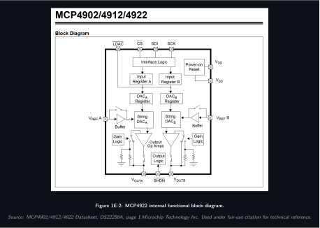

# Module 1E: Function Generator / Arbitrary Waveform Generator

## Module Design Document

**Version:** 1.0 (May 2026)
**Module ID:** 1E
**Tier:** 1
**Status:** In Design
**Parent SDD section:** 7.5.5 of the [PMVB System Design Document](../system-design/System_Design_Document.html#module-1e-function-generator-arbitrary-waveform-generator)

---

## 1. Theory of Operation

Module 1E generates audio-band analog waveforms for amplifier characterization, in-ear monitor testing, and any test sequence that needs a controlled stimulus into a DUT. The module is built on a single Pico 2 W presenting as a USB-TMC instrument to the Pi 5 host; calibration constants live in the Pico's onboard 4 MB flash. Per the v1.0 Path A architecture decision, no per-module Pi Zero 2 W sidecar is included. The design is a Pico-MCU-driven dual DAC + op-amp output buffer in the simplest possible topology that still hits the target performance envelope (DC to ~50 kHz, ±10 V into 600 Ω, 12-bit amplitude resolution).

### Signal generation chain

A precomputed waveform sample table sits in the Pico's flash. The Pico's DMA engine streams samples from this table to the Microchip MCP4922 dual 12-bit DAC over SPI at up to 1 MSPS (per channel). The MCP4922 outputs are voltage-mode (range 0 to 4.096 V using its internal reference) and feed an op-amp output stage that level-shifts and amplifies the DAC signal to ±10 V single-ended, with selectable output impedance (50 Ω or 600 Ω) at a front-panel BNC connector.

For a 1 kHz sine wave at 1 MSPS DAC update rate, the waveform has 1000 samples per cycle, far above the Nyquist requirement, and the resulting total harmonic distortion is dominated by the DAC's INL/DNL and the op-amp's distortion (both well under 0.1% across the audio band). The 50 kHz upper limit is a margin call: at 50 kHz the cycle has 20 samples, producing a stair-step output that the output low-pass filter (in the op-amp stage) smooths to within 1% THD.

### Why MCP4922 instead of a higher-rate DAC

The MCP4922 is a deliberately conservative choice. It has no internal output amplifier (so we use external op-amp), modest SPI rate (max 20 MHz, comfortably driven by Pico SPI), and a well-characterized 12-bit linearity. An AD9744 (14-bit, 165 MSPS) would push module bandwidth into the MHz range but at substantially higher cost, more complex layout, and capability that isn't needed for audio characterization. The MCP4922 is the right part for the bandwidth target.

### Output impedance switching

The output stage can present two source impedances:

- **50 Ω**: for connection to oscilloscope inputs, function generator inputs on other lab gear, or any 50 Ω-input device.
- **600 Ω**: the historical audio industry standard, useful for connection to balanced audio inputs or high-impedance loads where 50 Ω back-termination is not required.

Switching is via a single SPDT reed relay that selects which series resistor sits between the op-amp output and the BNC.

### Synchronization and trigger

The module exposes one auxiliary digital output that can be configured as a sync pulse (rising edge at the start of each waveform period) or a continuous gate. This output ties to the chassis-wide trigger bus (see SDD section 11.4) so that captures on Module 2E can be synchronized to AWG output without software-arming jitter.

## 2. Functional Block Diagram

Module 1E is documented across three figures: a system-level view showing where the module sits in the PMVB chassis, a redrawn datasheet figure for the MCP4922 internals, and a typical-application schematic showing the SPI bus, bypass network, and output buffer stage.

**Figure 1E-1: Module 1E system context (system block diagram)**


**Figure 1E-2: MCP4922 internal functional block diagram**



*Source: MCP4902/4912/4922 Datasheet, DS22250A, page 1. Microchip Technology Inc. Used under fair-use citation for technical reference.*

**Figure 1E-3: Module 1E typical application schematic**


*Schematic shows the SPI command path, the V_DD bypass network per DS22250A §6.2, and a unity-gain buffer stage. The full ±10 V output topology with TL072 level-shift and gain stage is documented in section 3 below.*

## 3. Schematic Notes (high-level; full schematic in KiCad)

### Output stage

The op-amp is configured as an inverting summing amplifier. Two inputs:

1. **Signal input** from MCP4922 channel A (0 to 4.096 V), summed with gain such that 2.048 V centers the output at 0 V.
2. **Bias offset** from a precision divider on the +12 V rail providing 2.048 V (referenced to GND), summed at the same gain to provide the output midpoint.

Resulting transfer function:

```
V_out = -G × (V_DAC - 2.048)
```

With G = 5 (set by feedback resistor and input resistor), V_out swings from -10.24 V (when V_DAC = 0) to +10.24 V (when V_DAC = 4.096), giving the full ±10 V output range.

### Op-amp supply

The MCP6232 is rated for +1.8 V to +6.0 V single-supply, but for ±10 V output we need ±12 V dual supply. **The MCP6232 is not the right part for this**; we should instead use a rail-to-rail op-amp rated for ±15 V supply such as the **OP07** (precision, ±18 V) or **TL072** (audio, ±18 V). Update the schematic to use TL072 with the +12 V and -12 V rails from the chassis TX300 PSU.

(SDD section 7.5.5 specified MCP6232 for output buffering; this design doc supersedes that for the op-amp choice. The SDD will be updated in v1.1 to match.)

### Output filter

An RC low-pass filter at the op-amp output rolls off above ~80 kHz to suppress DAC stair-step quantization noise without affecting the audio band. R = 10 Ω, C = 200 nF gives a corner near 80 kHz. The filter sits before the impedance-switching relay.

### Impedance switching

A **Coto 9007 reed relay** (12 V coil, 1 A contact, SPDT) selects between two series resistors:
- 50 Ω: a Vishay PER-50 precision metal-film 50 Ω 0.1% resistor
- 600 Ω: a Vishay PER-600 precision metal-film 600 Ω 0.1% resistor

The relay is driven by a Pico GPIO through a 2N3904 transistor and a flyback diode (1N4148) across the coil.

### Decoupling

Every IC gets a 0.1 µF X7R ceramic right at the supply pin, plus a shared 10 µF tantalum bulk cap at the supply entry to the module.

## 4. Pin Assignments

### Pico 2 W to MCP4922

| Pico Pin | GP | Function | MCP4922 Pin | Notes |
|---|---|---|---|---|
| 4 | GP2 | SPI0_SCK | 3 (SCK) | up to 20 MHz |
| 5 | GP3 | SPI0_TX (MOSI) | 4 (SDI) | DAC data in |
| 7 | GP5 | CS_DAC | 2 (CS̄) | active low |
| 11 | GP8 | LDAC | 5 (LDAC̄) | tied low for synchronous update, or pulsed for deferred update |

### Pico 2 W to op-amp / output stage

| Pico Pin | GP | Function | Notes |
|---|---|---|---|
| 14 | GP10 | RELAY_DRIVE | drives 2N3904 base for impedance switching relay |
| 16 | GP12 | SYNC_OUT | sync pulse to chassis trigger bus |
| 17 | GP13 | TRIG_IN | optional trigger input from chassis bus (for synchronized stimulus start) |

### Pico 2 W power

| Pico Pin | Function | Notes |
|---|---|---|
| 39 | VSYS | 5 V from chassis (USB-bus-powered via Pi 5 USB hub) |
| 38 | GND | shared chassis ground |
| 40 | 3V3_OUT | for MCP4922 VDD and op-amp Vref divider |

### MCP4922 to op-amp summing junction

| MCP4922 Pin | Function | Connects to |
|---|---|---|
| 14 (VOUTA) | DAC channel A output | input resistor R_in1 to op-amp summing node |
| 12 (VOUTB) | DAC channel B output | reserved for second AWG channel (future) |
| 1 (VDD) | +3.3 V supply | from Pico 3V3_OUT |
| 13 (VSS) | GND | chassis GND |
| 8 (VREFA) | reference for channel A | tied to VDD for internal Vref of 4.096 V |
| 9 (VREFB) | reference for channel B | tied to VDD |

### TL072 op-amp output stage

| TL072 Pin | Function | Connects to |
|---|---|---|
| 1 | OUT (channel A) | output filter and impedance-switching relay |
| 2 | IN- (channel A) | summing junction (R_in1 from DAC, R_in2 from bias divider, R_fb to OUT) |
| 3 | IN+ (channel A) | tied to GND |
| 4 | V- | -12 V from TX300 |
| 5 | IN+ (channel B) | unused; tied to GND |
| 6 | IN- (channel B) | unused; tied to OUT (channel B) |
| 7 | OUT (channel B) | unused |
| 8 | V+ | +12 V from TX300 |

## 5. Specifications (matching SDD Table 7-27)

| Parameter | Value |
|---|---|
| DAC | MCP4922 dual 12-bit SPI |
| Channels | 2 (1 primary output, 1 sync or secondary) |
| Sample rate (DAC update) | up to 1 MSPS via Pico DMA |
| Standard waveforms | Sine, square, triangle, ramp, noise, multitone |
| Arbitrary waveform depth | up to 32 K samples (16-bit) |
| Output range | ±10 V into 600 Ω (op-amp buffered) |
| Output impedance | 50 Ω or 600 Ω, switchable via reed relay |
| Frequency range | DC to ~50 kHz |
| Frequency accuracy | ±20 ppm crystal; ±2 ppm with external 10 MHz reference |
| Amplitude resolution | 12-bit (~5 mV at 10 V FS) |
| Output low-pass filter | RC at ~80 kHz |

## 6. Sample Applications

### 6.1 Single-tone sine generation

```python
import pyvisa
rm = pyvisa.ResourceManager('@py')
awg = rm.open_resource('USB::0xCAFE::0x4001::PMVB1E::INSTR')
awg.write('SOUR:FUNC SIN')
awg.write('SOUR:FREQ 1000')
awg.write('SOUR:VOLT 1.0')           # 1 V peak-to-peak
awg.write('OUTP ON')
input('Press Enter to stop...')
awg.write('OUTP OFF')
awg.close()
```

### 6.2 Swept sine for THD measurement (paired with Module 2E)

```python
import numpy as np
from scipy.fft import rfft, rfftfreq

awg = open_module('1E')
scope = open_module('2E')

frequencies = np.logspace(np.log10(20), np.log10(20000), 31)  # 20 Hz to 20 kHz, log-spaced
results = []

for f in frequencies:
    awg.write(f'SOUR:FUNC SIN; SOUR:FREQ {f}; SOUR:VOLT 1.0; OUTP ON')
    scope.write('DIG:CONF 0, 5.0, AC; DIG:RATE 1000000; DIG:DEPTH 100000; DIG:ARM')
    samples = np.array(scope.query_binary_values('DIG:DATA? 0', datatype='f'))
    spectrum = np.abs(rfft(samples))
    freqs = rfftfreq(len(samples), 1/1e6)
    fund_bin = np.argmin(np.abs(freqs - f))
    fund = spectrum[fund_bin]
    harms = [spectrum[np.argmin(np.abs(freqs - f*n))] for n in range(2, 6)]
    thd = np.sqrt(sum(h**2 for h in harms)) / fund
    results.append((f, thd))
    awg.write('OUTP OFF')

for f, thd in results:
    print(f'{f:8.1f} Hz: THD = {thd*100:.3f}%')
```

### 6.3 Multitone for IMD (intermodulation distortion)

```python
awg.write('SOUR:MULT:UPLD [1000, 1100], [0.5, 0.5]')   # SMPTE-style 60/7 ratio variant
awg.write('SOUR:VOLT 1.0; OUTP ON')
# Capture and FFT-analyze for sum/difference products near 100 Hz, 2.0 kHz, etc.
```

### 6.4 White noise for noise-floor characterization

```python
awg.write('SOUR:FUNC NOIS')
awg.write('SOUR:VOLT 0.5; OUTP ON')
# Capture, integrate over band, compute spectral density
```

## 7. Bill of Materials

Cross-referenced to Mouser primary, with Digi-Key alternate part numbers where available. Last verified May 2026; check stock and pricing before ordering.

| Item | Manufacturer P/N | Mouser P/N | Digi-Key P/N | Qty | Unit Cost | Notes |
|---|---|---|---|---|---|---|
| Raspberry Pi Pico 2 W | Raspberry Pi SC1632 | 358-SC1632 | 2648-SC1632-ND | 1 | $7 | RP2350 host MCU |
| MCP4922 dual 12-bit DAC | Microchip MCP4922-E/P | 579-MCP4922-E/P | MCP4922-E/P-ND | 1 | $4 | DIP-14, easy hand-solder |
| TL072 op-amp (precision, audio) | Texas Instruments TL072IP | 595-TL072IP | 296-1775-5-ND | 1 | $0.80 | DIP-8 |
| 2N3904 NPN BJT (relay driver) | onsemi 2N3904BU | 863-2N3904BU | 2N3904FS-ND | 1 | $0.10 | TO-92 |
| 1N4148 small-signal diode (relay flyback) | onsemi 1N4148 | 512-1N4148 | 1N4148FSCT-ND | 1 | $0.05 | DO-35 |
| Reed relay, 12 V coil, SPDT, 1 A | Coto 9007-12-01 | 906-9007-12-01 | 306-1004-ND | 1 | $4 | output Z switching |
| Precision resistor 50 Ω 0.1% 1/4 W | Vishay PER50R000B | 71-PER50R000B | PER50R000BCT-ND | 1 | $1 | 50 Ω output Z |
| Precision resistor 600 Ω 0.1% 1/4 W | Vishay CMF55600R00BHEB | 71-CMF55600R00BHEB | n/a | 1 | $1 | 600 Ω output Z |
| Output filter R: 10 Ω 1% 1/4 W | Yageo MFR-25FBF52-10R | 603-MFR-25FBF5210R | n/a | 1 | $0.10 | RC LP filter |
| Output filter C: 200 nF X7R 50 V | Kemet C320C204K5R5TA | 80-C320C204K5R5TA | 399-9839-ND | 1 | $0.30 | RC LP filter |
| Decoupling cap 0.1 µF X7R 50 V (qty 4) | Kemet C320C104K5R5TA | 80-C320C104K5R5TA | 399-9837-ND | 4 | $0.20 ea | per IC supply pin |
| Bulk cap 10 µF tantalum 25 V | Kemet T350E106K025AT | 80-T350E106K025AT | 399-3540-ND | 1 | $0.50 | module supply entry |
| Op-amp summing/feedback resistors 1% 1/4 W (R_in1, R_in2, R_fb) | Vishay MFR-25FBF52 series | 603-MFR-25FBF52* | n/a | 3 | $0.10 ea | gain network |
| Bias divider resistors 1% 1/4 W | Yageo MFR-25FBF52 series | 603-MFR-25FBF52* | n/a | 2 | $0.10 ea | 2.048 V reference from +12 V |
| BNC panel-mount jack | Amphenol 31-220-1 | 523-31-220-1 | ACX1244-ND | 1 | $4 | front-panel output |
| 3D-printed enclosure | n/a | n/a | n/a | 1 | $1 | PETG, ~10 g print |
| Pin headers, hookup wire | various | various | various | n/a | $2 | |
| Perfboard | Adafruit 1609 (or eq.) | 485-1609 | 1528-1609-ND | 1 | $3 | hand-build substrate |
| **Total module BOM** | | | | | **~$18** | |

(BOM total matches SDD Table 7-28 with the TL072 substitution noted in section 3 and the v1.0 Path A architecture decision that removes the Pi Zero per-module sidecar.)

## 8. Calibration Procedure

After module assembly, calibrate against a Fluke 87V (or equivalent calibrated DMM) and a 10 MHz GPSDO reference (or external function generator's calibrated output) using the following procedure:

### 8.1 DC offset calibration

1. Configure: `SOUR:FUNC SIN; SOUR:FREQ 1; SOUR:VOLT 0; OUTP ON`
2. Wait for output to settle (10 s).
3. Measure the DC level on the output BNC with the Fluke 87V.
4. Adjust the bias divider trim until the measured DC level reads within ±5 mV of 0 V.
5. Record the calibration constant and store via SCPI: `CALC:CAL:OFFS 0, <millivolts>`.

### 8.2 Gain calibration

1. Configure: `SOUR:FUNC SIN; SOUR:FREQ 1000; SOUR:VOLT 10.0` (peak-to-peak).
2. Connect the output to a calibrated Fluke (or external scope) and measure the peak-to-peak voltage.
3. Compute the gain error: `gain_correction = 10.0 / measured_pk_pk`.
4. Store the calibration: `CALC:CAL:GAIN 0, <gain_correction>`.

### 8.3 Frequency calibration

If your module includes the optional external 10 MHz reference input (chassis trigger bus), feed a 10 MHz GPSDO into the reference port and compare against the on-Pico crystal. Update the firmware's frequency-divider constant accordingly. Without an external reference, the Pico's crystal is rated ±20 ppm, which is ±20 Hz at 1 kHz; for audio characterization this is below the threshold of audibility and rarely matters.

## 9. Bring-Up Checklist

In order, on first power-up:

1. **Visual inspection.** Check polarity of every electrolytic and tantalum cap. Check op-amp orientation (notch toward pin 1). Check relay coil polarity.
2. **Power-on without load.** Apply +5 V (Pico) and +12 V/-12 V (op-amp). Measure current draw: should be <50 mA total at idle. If higher, pull power and find the short.
3. **Pico boots.** Watch the onboard LED; it should heartbeat. Pico USB enumerates as USB-TMC: `lsusb` on the host should show the PMVB device.
4. **DAC SPI write test.** Send `SOUR:VOLT 0.0` and verify MCP4922 VOUTA reads 2.048 V on a DMM (DAC midpoint).
5. **Op-amp output test.** With SOUR:VOLT 0.0, output BNC should read 0 V ± 10 mV. If not, debug the bias network.
6. **Sweep test.** `SOUR:FUNC SIN; SOUR:FREQ 1000; SOUR:VOLT 5.0; OUTP ON`. Output should be 5 Vpp sine at 1 kHz on a scope.
7. **Frequency response.** Sweep 20 Hz to 50 kHz and verify amplitude is flat to within ±0.5 dB across the band.
8. **THD.** At 1 kHz, 1 Vrms output, capture with Module 2E and verify THD < 0.1%.
9. **Impedance switch test.** Toggle between 50 Ω and 600 Ω modes; measure output impedance with a known load and verify both ranges.
10. **Calibration.** Run section 8 procedure. Save calibration constants to Pico flash.
11. **PyVISA-sim parity check.** Run the same SCPI command sequence against the simulator backend and verify behavior matches.

## 10. Known Issues and Future Work

(To be populated as the module is built.)

- The current schematic uses a TL072 op-amp instead of the MCP6232 specified in SDD section 7.5.5. The SDD will be updated in v1.1 to match this design document.
- The 50 kHz upper-frequency limit is conservative; with a careful output filter design, we could push to 100 kHz, but the marginal benefit for audio characterization is small.
- A second-channel variant (using MCP4922 channel B with a duplicate output stage) is a v1.1 enhancement for stereo or multi-tone work.

## 11. References

- [Microchip MCP4922 datasheet](https://www.microchip.com/en-us/product/MCP4922)
- [Texas Instruments TL072 datasheet](https://www.ti.com/product/TL072)
- [Coto 9007 series reed relay datasheet](https://www.cotorelay.com/product/9007-series/)
- [Raspberry Pi Pico 2 W datasheet](https://datasheets.raspberrypi.com/picow/pico-2-w-datasheet.pdf)
- [PMVB System Design Document, section 7.5.5](../system-design/System_Design_Document.html#module-1e-function-generator-arbitrary-waveform-generator)
- [PMVB Phase 0 Orchestration Setup](../setup/Phase_0_Orchestration_Setup.md)
