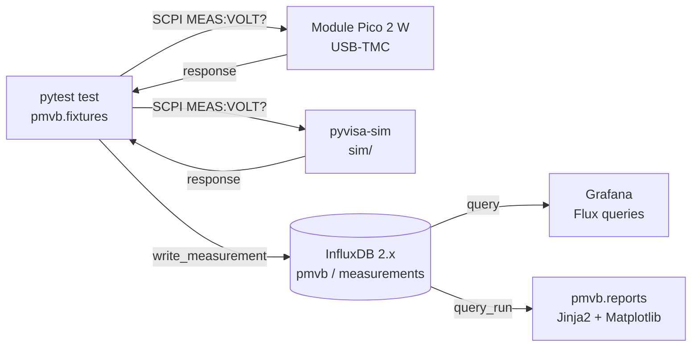

# Phase 0 Orchestration Layer Setup

Step-by-step bring-up of the PMVB orchestration head: the Raspberry Pi 5 16 GB hosting the Python test framework, the time-series database, the dashboard server, the MCP gateway, and the report generator. Phase 0 closes when an end-to-end test exercises the full SCPI -> InfluxDB -> Grafana -> Jinja2 report pipeline against both a `pyvisa-sim` simulator and a real Pico 2 W over USB-TMC, with hot-plug-by-serial reidentification verified across multiple chassis hub ports.

Architecture detail lives in the [System Design Document](../system-design/System_Design_Document.html) and the [Chassis Architecture and Power Distribution](../chassis/Chassis_Architecture_and_Power_Distribution.html) doc; this is both the architectural reference and the install / bring-up cookbook for the orchestration layer.

---

## Scope

Phase 0 brings up the orchestration layer with no instrument modules attached. The Pi 5's hosted services plus a powered USB hub plus five bare Pico 2 W boards running a throwaway USB-TMC stub firmware are sufficient to prove every architectural claim of the platform short of actual measurement front-ends.

Phase 0 verification milestone (per [SDD §13.1](../system-design/System_Design_Document.html#phase-0-orchestration-bring-up)):

1. Pi 5 boots from NVMe, reaches the bench network, the chassis hub enumerates as USB 3.0 with all five Picos visible.
2. An end-to-end pytest exercises both a `pyvisa-sim` placeholder and a real Pico 2 W over USB-TMC. Both records write to InfluxDB with the SDD §10.2 tag taxonomy. Both records appear in a Grafana panel. A Jinja2 report queries InfluxDB and emits HTML+PDF referencing both.
3. Hot-plug-by-serial reidentification is verified across at least three port-swap permutations on the chassis hub.

---

## Architecture

The PMVB orchestration layer is a single Raspberry Pi 5 16 GB hosting the full Python test framework, time-series database, dashboard server, MCP gateway, and report generator. The Pi carries no instrument hardware of its own; it is a pure software orchestrator and data sink that talks to instrument modules over USB-TMC and exposes their SCPI surface as both PyVISA resources (for headless test sequencing) and MCP tools (for agent-orchestrated bench sessions).

### Two-plane architecture

Every module presents two control planes over the same USB-TMC transport, both consuming the same per-module YAML command schema (per SDD §7.3):

1. **VISA/SCPI plane** -- vendor-portable, deterministic, the path used by pytest sequences and any test code that wants to drive instruments programmatically. The orchestrator opens a module as a PyVISA resource (`USB::0xVID::0xPID::SERIAL::INSTR`), writes SCPI commands, and parses responses. Resource identity is keyed off the USB serial number (derived from the Pico 2 W's unique 64-bit chip ID), so hot-plugging a module across different chassis hub ports preserves its logical identity (per SDD §10.1).
2. **MCP plane** -- exposes the same per-module command surface as LLM-callable tools. The MCP gateway (`pmvb.mcp_gateway.server`) is a `FastMCP` server that the Anthropic API talks to. Per-module MCP tools come online with each module's Phase; Phase 0 only scaffolds the gateway with a single health-check tool.

Both planes share the per-module YAML command schema. Firmware parsers and PyVISA-sim simulation backends are generated mechanically from the YAML, eliminating the failure mode where the simulator drifts from the real instrument.

### Software stack components

| Component | Role | Source |
|-----------|------|--------|
| **PyVISA + pyvisa-py** | SCPI dispatch over USB-TMC, GPIB, serial. The pyvisa-py backend is pure-Python; no NI runtime required. | `pip` |
| **PyVISA-sim** | Simulator backend. Each module's simulation lives at `sim/<id>/responses.yaml` and is consumed by PyVISA-sim's stub session. | `pip`, schemas in `sim/` |
| **pytest** | Test runner with parametric fixtures. Tests marked `@pytest.mark.module('1B')` are parameterized across all 1B-class modules attached to the chassis. | `pip` |
| **influxdb-client** | Python client for InfluxDB 2.x. Wrapped by `pmvb.influx` to enforce the SDD §10.2 tag taxonomy. | `pip` |
| **InfluxDB 2.x** | Time-series database. Stores every measurement with the standard tag taxonomy. | `apt` (system service) |
| **Grafana** | Live dashboards. Reads from InfluxDB on every panel refresh. | `apt` (system service) |
| **Jinja2 + Matplotlib** | Automated report generation. Renders HTML and PDF from InfluxDB queries by run identifier. | `pip` |
| **mcp + anthropic** | MCP gateway server framework plus the Anthropic API SDK for any orchestrator code that drives the bench via Claude. | `pip` |
| **pyusb + pyserial** | Low-level USB and serial access for non-PyVISA paths (Pico flash tooling, raw USB queries). | `pip` |

### Data flow

A pytest test in the orchestrator opens a module (real Pico or simulator), issues a SCPI query, captures the response, writes it to InfluxDB tagged per SDD §10.2, and Grafana renders the new record on its next panel refresh. A separate report generator queries InfluxDB by run identifier and emits a Jinja2 + Matplotlib HTML report.



### `pmvb` Python package layout

The orchestration code lives on the Pi 5 as a single Python package called `pmvb`, installed in editable mode from the cloned repo:

```
pmvb/                              # Python package root (installed editable)
├── __init__.py
├── influx.py                      # InfluxDB I/O helpers enforcing SDD §10.2 tag taxonomy
├── fixtures.py                    # pytest fixtures: run_id, dut, record
├── mcp_gateway/
│   ├── __init__.py
│   └── server.py                  # FastMCP scaffold + health_check tool
└── reports/
    ├── __init__.py
    ├── render.py                  # InfluxDB -> Matplotlib -> Jinja2 -> HTML
    └── templates/
        └── basic_report.html.j2   # default report template

sim/                               # PyVISA-sim YAML schemas (one per module)
└── placeholder/
    └── responses.yaml             # Phase 0 placeholder instrument

tests/                             # pytest tests
├── __init__.py
└── test_smoke.py                  # dependency import smoke tests
```

Per-module SCPI command tables, simulator schemas, and module-specific design docs live outside the `pmvb` package: at `modules/<id>/commands.yaml`, `sim/<id>/responses.yaml`, and `docs/modules/Module_<id>_Design_Document.md` respectively (per SDD §10.1).

---

## Hardware Prerequisites

The orchestration layer is hardware-agnostic by design. The PMVB software stack runs on any 64-bit Linux-capable host with sufficient resources: a Raspberry Pi 5 is the v1.0 reference build, but equivalent ARM SBCs, x86 thin clients, mini-PCs, repurposed laptops, or PowerPC hosts running a recent Linux distribution all work. The orchestration role is pure software (test framework, time-series database, dashboard, MCP gateway, report generator) and has no hardware-specific bindings beyond a USB host port for the module hub.

**Orchestration host** (capabilities, not specific parts):

- 64-bit Linux-capable host with at least 8 GB RAM (16 GB recommended to absorb concurrent Grafana, InfluxDB, MCP, and report-generation workloads without contention)
- A root filesystem on SSD or NVMe (avoid SD-only root for write endurance; if booting from removable media is unavoidable, migrate root to SSD before production use)
- Gigabit Ethernet or 802.11ac+ Wi-Fi for the bench network
- Boot media appropriate to the host (microSD for Raspberry Pi-class boards; USB stick or SSD for x86 systems)

**Bench periphery:**

- Powered USB 3.0 hub with at least 5 downstream ports (the Sabrent HB-BU10 10-port hub is the v1.0 reference)
- Pico 2 W boards (one per instrument module slot you intend to populate)
- Storage for migrating the root filesystem off boot media (NVMe SSD via M.2 HAT+ is the v1.0 reference on the Raspberry Pi 5)

---

## Workstation Prerequisites

A separate workstation (Windows, macOS, or Linux) for SSH access to the orchestration host, browser access to the Grafana UI, and any local development work on the orchestration code.

- An SSH client (built into Windows 10/11, macOS, and most Linux distributions)
- A modern browser for the Grafana UI
- `git` installed if you plan to edit the orchestration code locally and push to GitHub
- An imaging tool appropriate to your chosen orchestration host (for example, [Raspberry Pi Imager](https://www.raspberrypi.com/software/) if you are using a Raspberry Pi)

---

## Section A. Raspberry Pi 5 OS install

The orchestration head runs Raspberry Pi OS Bookworm or newer.

### A.1 Generate an SSH key for the bench

On your workstation, generate a dedicated ed25519 keypair for the bench so the bench credential is isolated from your other systems:

```powershell
ssh-keygen -t ed25519 -f $HOME\.ssh\pmvb-bench -C "pmvb-bench"
```

Press Enter twice when prompted for a passphrase if you want password-less login over LAN (a common choice for a stationary bench).

Add an SSH config entry so `ssh <hostname>` resolves to the right key and user, in `~/.ssh/config`:

```
Host <YOUR_PI_HOSTNAME> <YOUR_PI_HOSTNAME>.local
    HostName <YOUR_PI_HOSTNAME>.local
    User <YOUR_PI_USERNAME>
    IdentityFile ~/.ssh/pmvb-bench
    IdentitiesOnly yes
```

Print the public key for the next step:

```powershell
Get-Content $HOME\.ssh\pmvb-bench.pub
```

### A.2 Flash the SD card via Raspberry Pi Imager

Launch Raspberry Pi Imager. Select Device = Raspberry Pi 5, OS = Raspberry Pi OS (64-bit) (desktop variant if you want a local screen at the bench; Lite if headless), Storage = the microSD card.

Edit OS customization settings:

- Hostname: choose a stable hostname
- Username and password: choose a non-default username; do not use `pi`
- Wireless LAN: configure if connecting over Wi-Fi initially; set wireless LAN country code
- Locale: set time zone and keyboard layout
- Services tab: enable SSH, use public-key authentication only, paste the public key from A.1
- Optional: enable Raspberry Pi Connect for off-LAN fallback access

Write the image, eject the card, insert into the Pi 5, apply power.

### A.3 First boot and SSH verification

Give the Pi 60-90 seconds for first-boot init. Then from your workstation:

```bash
ssh <YOUR_PI_HOSTNAME>
```

Healthy: key-based auth succeeds without password prompt. Verify system state:

```bash
cat /proc/cpuinfo | tail -5    # confirms Pi 5 Model B
df -h /                        # confirms root is on /dev/mmcblk0p2 at this stage
uname -a                       # confirms aarch64 kernel
free -h                        # confirms ~15 GiB RAM available
lsusb -t                       # confirms USB hub + Pico enumeration tree
```

The chassis USB hub should appear as a 4-port hub at 480 Mbps (USB 2 plane) and a 4-port hub at 5000 Mbps (USB 3 plane). With factory-fresh Picos plugged in (no firmware), they appear under the USB 2 plane as `Class=Mass Storage` devices in BOOTSEL mode.

---

## Section B. NVMe boot migration

The Pi 5 boots from microSD by default. The NVMe HAT+ provides a much faster, more durable root filesystem. Migrate boot to NVMe with the SD card retained as a fallback boot device.

### B.1 EEPROM update

```bash
sudo rpi-eeprom-update -a
sudo reboot
```

After reboot, SSH back in and confirm:

```bash
sudo rpi-eeprom-update
```

Should report `BOOTLOADER: up to date`.

### B.2 Boot order set to NVMe-first

```bash
sudo raspi-config
```

Navigate: `6 Advanced Options` -> `A4 Boot Order` -> `B2 NVMe/USB Boot` -> OK -> Finish. Decline the reboot; we will reboot once after the clone.

### B.3 Clone SD root to NVMe

Use the official Pi Foundation tool, SD Card Copier (`piclone`), via the desktop session. Menu -> Accessories -> SD Card Copier. Source: `/dev/mmcblk0` (Internal SD Card). Target: `/dev/nvme0n1`. Check **New Partition UUIDs**. Click Start. Takes 10-15 minutes for ~10 GB.

Alternative for headless Lite installs: use the [framps/rpi-clone](https://github.com/framps/rpi-clone) fork (which handles NVMe partition naming correctly, unlike the original `billw2/rpi-clone`) and run `sudo rpi-clone nvme0n1`.

### B.4 Reboot and verify NVMe boot

```bash
sudo reboot
```

Wait 60-90 seconds, SSH back in:

```bash
df -h /
findmnt /
lsblk
```

Healthy: `df -h /` shows `/dev/nvme0n1p2` as the root mount. `lsblk` shows both `mmcblk0` and `nvme0n1` present, with the NVMe carrying the mountpoints and the SD sitting idle. The SD card stays inserted as fallback boot media.

---

## Section C. Remote access (optional)

For portable benches, install Raspberry Pi Connect to get off-LAN shell + screen-sharing access via the Pi Foundation's relay service:

```bash
sudo apt update
sudo apt install -y rpi-connect      # or rpi-connect-lite for Lite OS (terminal-only)
rpi-connect signin                   # prompts you to link a Raspberry Pi ID via browser
rpi-connect on
rpi-connect status
```

Healthy: `rpi-connect status` shows `Signed in: yes`, `Subscribed to events: yes`, `Screen sharing: allowed`, `Remote shell: allowed`.

Access the bench from any browser at <https://connect.raspberrypi.com>. If you only run on a fixed bench LAN and never need off-network access, skip this section.

---

## Section D. Python orchestration project

The PMVB Python code lives at <https://github.com/Pike1950/poor-mans-validation-bench>. Clone the repo to the Pi, create a virtual environment, and install the project in editable mode.

### D.1 Clone the repo

```bash
cd ~
git clone https://github.com/Pike1950/poor-mans-validation-bench.git pmvb
cd pmvb
```

### D.2 Create the virtual environment

```bash
python3 -m venv .venv
source .venv/bin/activate
python -m pip install --upgrade pip
pip install -e ".[dev]"
```

The `[dev]` extra adds `pytest-cov`, `ruff`, and `mypy` on top of the runtime dependencies. First-time install takes 2-5 minutes on the Pi 5; the piwheels mirror provides pre-built aarch64 wheels for the heavy compiled extensions (Matplotlib, NumPy, Pillow).

### D.3 Verify with smoke tests

```bash
pytest tests/test_smoke.py -v
```

Should pass 8 tests: `pmvb` package imports, PyVISA stack imports, USB stack imports, pytest itself imports, `influxdb-client` imports, Jinja2 + Matplotlib import, the `mcp` framework imports, and the `anthropic` SDK imports.

### D.4 Persist the venv activation

```bash
echo 'source ~/pmvb/.venv/bin/activate' >> ~/.bashrc
```

So that every new SSH session lands inside the venv.

---

## Section E. InfluxDB 2.x

InfluxDB 2.x is the time-series database for every measurement the bench produces. The schema and tag taxonomy are defined in [SDD §10.2](../system-design/System_Design_Document.html#influxdb-schema-and-tag-taxonomy).

### E.1 Add the InfluxData apt repo

```bash
cd ~
curl --silent --location -O https://repos.influxdata.com/influxdata-archive.key
cat influxdata-archive.key | gpg --dearmor | sudo tee /etc/apt/trusted.gpg.d/influxdata-archive.gpg > /dev/null
echo 'deb [signed-by=/etc/apt/trusted.gpg.d/influxdata-archive.gpg] https://repos.influxdata.com/debian stable main' | sudo tee /etc/apt/sources.list.d/influxdata.list
rm influxdata-archive.key
sudo apt update
```

### E.2 Install and enable InfluxDB

```bash
sudo apt install -y influxdb2 influxdb2-cli
sudo systemctl enable --now influxdb
```

Verify:

```bash
systemctl status influxdb --no-pager
ss -tlnp 2>/dev/null | grep 8086
curl -sI http://localhost:8086/ping
```

Healthy: service is `active (running)`, listening on `:::8086`, `curl -sI` returns `HTTP/1.1 204 No Content` with an `X-Influxdb-Version` header.

### E.3 Initial provisioning

```bash
influx setup \
  --username <YOUR_INFLUXDB_USERNAME> \
  --password '<STRONG_PASSWORD>' \
  --org pmvb \
  --bucket measurements \
  --retention 0 \
  --force
```

`--retention 0` is infinite retention. Bench measurement data is small (kilobytes per run), so infinite is appropriate.

The setup command writes the active config to `~/.influxdbv2/configs`, including the operator token.

### E.4 Token rotation and storage

The operator token created by `influx setup` has admin privileges across all orgs. For day-to-day bench use, create a more constrained all-access token scoped to just the `pmvb` org:

```bash
influx auth create \
  --org pmvb \
  --all-access \
  --description "pmvb-bench-orchestrator $(date -I)" \
  --json > /tmp/new_auth.json

NEW_TOKEN=$(python3 -c "import json; print(json.load(open('/tmp/new_auth.json'))['token'])")

sudo mkdir -p /etc/pmvb
sudo chown <YOUR_PI_USERNAME>:<YOUR_PI_USERNAME> /etc/pmvb
echo "$NEW_TOKEN" > /etc/pmvb/influx.token
chmod 600 /etc/pmvb/influx.token

influx config set -n default -t "$NEW_TOKEN"
```

Then delete the original operator token using its ID from `influx auth list`:

```bash
influx auth list                          # find the operator token ID
influx auth delete --id "<OPERATOR_ID>"   # delete it
influx auth list                          # confirm only the org-scoped token remains
```

### E.5 Round-trip verification

```bash
TOKEN=$(cat /etc/pmvb/influx.token)

influx write \
  --bucket measurements \
  --org pmvb \
  --token "$TOKEN" \
  'phase0_test,instrument=sim-bringup,channel=0,run_id=phase0-influx-smoke value=1.234'

influx query \
  --org pmvb \
  --token "$TOKEN" \
  'from(bucket: "measurements") |> range(start: -5m) |> filter(fn: (r) => r._measurement == "phase0_test")'
```

Healthy: the write completes silently with exit 0, and the query returns a table containing one record with the expected tags and value.

---

## Section F. Grafana

Grafana is the dashboard layer. It reads from InfluxDB on every panel refresh and renders charts, tables, alerts, and recipe-specific dashboards.

### F.1 Add the Grafana apt repo

```bash
sudo apt install -y apt-transport-https wget
sudo mkdir -p /etc/apt/keyrings
wget -q -O - https://apt.grafana.com/gpg.key | gpg --dearmor | sudo tee /etc/apt/keyrings/grafana.gpg > /dev/null
echo "deb [signed-by=/etc/apt/keyrings/grafana.gpg] https://apt.grafana.com stable main" | sudo tee /etc/apt/sources.list.d/grafana.list
sudo apt update
```

On Trixie and newer, the legacy `software-properties-common` package is no longer required; apt has built-in HTTPS support.

### F.2 Install and enable Grafana

```bash
sudo apt install -y grafana
sudo systemctl daemon-reload
sudo systemctl enable --now grafana-server
```

Verify (Grafana needs ~15 seconds after start to actually open port 3000 because it runs DB migrations on first boot):

```bash
sleep 15
systemctl status grafana-server --no-pager
ss -tlnp 2>/dev/null | grep 3000
curl -sI http://localhost:3000/login
```

Healthy: service is `active (running)`, listening on `:::3000`, `/login` returns `HTTP/1.1 200 OK`.

The PMVB reference build runs Grafana 13 (the stable apt channel installs whatever the current major is). Grafana 10 and newer all work; the install pattern and datasource configuration are identical.

### F.3 First login

Open `http://<YOUR_PI_HOSTNAME>:3000` in your workstation browser. Default credentials are `admin` / `admin`; Grafana forces a password change on first login.

### F.4 Add InfluxDB datasource

UI left sidebar -> Connections -> Data sources -> Add new data source -> InfluxDB. Fill in:

- Name: `pmvb-influx`
- Query language: `Flux` (default is InfluxQL; switch to Flux for InfluxDB 2.x)
- HTTP URL: `http://localhost:8086`
- Access mode: `Server (default)`
- InfluxDB Details:
  - Organization: `pmvb`
  - Token: paste the contents of `/etc/pmvb/influx.token`
  - Default Bucket: `measurements`

Click **Save & test**. Healthy: green banner reading `datasource is working. 3 buckets found` (the three are `_monitoring`, `_tasks`, and `measurements`).

### F.5 Data-path verification

UI left sidebar -> Explore. Pick the `pmvb-influx` datasource. Paste the following Flux query:

```
from(bucket: "measurements")
  |> range(start: -1h)
  |> filter(fn: (r) => r._measurement == "phase0_test")
```

Run query. The `phase0_test` records written in E.5 should appear as a small time-series plot plus a table. This proves the full pipeline: InfluxDB stores -> Grafana queries -> Grafana renders.

---

## Section G. Pico SDK and cross-compile toolchain

Every PMVB instrument module is built around a Pico 2 W (RP2350 SoC). For Phase 0 we flash a throwaway USB-TMC stub firmware on the bare Picos to prove the hot-plug-by-serial architecture. The Pico SDK toolchain installed here is reused across every per-module firmware build later.

### G.1 Install the cross-compile toolchain

```bash
sudo apt install -y \
  gcc-arm-none-eabi \
  libnewlib-arm-none-eabi \
  libstdc++-arm-none-eabi-newlib \
  build-essential \
  cmake \
  ninja-build \
  git \
  python3 \
  libusb-1.0-0-dev \
  pkg-config
```

Roughly 500 MB after dependencies.

### G.2 Clone pico-sdk

```bash
sudo mkdir -p /opt
sudo git clone --branch master --recurse-submodules --shallow-submodules \
  https://github.com/raspberrypi/pico-sdk.git /opt/pico-sdk
sudo chown -R <YOUR_PI_USERNAME>:<YOUR_PI_USERNAME> /opt/pico-sdk
```

`--recurse-submodules` pulls in TinyUSB at `lib/tinyusb` (the USB-TMC class support comes from here), btstack, cyw43-driver, lwip, and mbedtls. `--shallow-submodules` keeps the clone size reasonable (~200 MB total).

Verify the SDK version and submodule state:

```bash
cd /opt/pico-sdk
git describe --tags        # should show 2.0 or later (RP2350 support requires 2.0+)
git submodule status
```

All submodules should be listed without a leading `-` (means initialized). Required: `lib/tinyusb`.

### G.3 Set environment variables persistently

```bash
echo 'export PICO_SDK_PATH=/opt/pico-sdk' >> ~/.bashrc
echo 'export PICO_BOARD=pico2_w' >> ~/.bashrc
source ~/.bashrc
```

`PICO_BOARD=pico2_w` selects the Pico 2 W board definition (RP2350 + Wi-Fi/Bluetooth chip + correct flash and pinout). `PICO_SDK_PATH` points the SDK's CMake support files at the cloned SDK tree.

### G.4 Verify cross-compile with `hello_usb`

```bash
cd ~
git clone --depth 1 --recurse-submodules https://github.com/raspberrypi/pico-examples.git
cd pico-examples
mkdir -p build && cd build
cmake .. -G Ninja -DPICO_BOARD=pico2_w
ninja hello_usb
ls -la hello_world/usb/hello_usb.uf2
```

Healthy: cmake configures cleanly (reports `Target board (PICO_BOARD) is 'pico2_w'`, auto-converts the platform to `rp2350-arm-s`, finds the gcc-arm-none-eabi toolchain). Ninja builds with no errors and produces `hello_world/usb/hello_usb.uf2` of ~50-80 KB. That `.uf2` is a valid RP2350 firmware image (do not flash it; we have a real stub firmware coming up in section H).

---

## Section H. USB-TMC stub firmware

> Section in progress. The full procedure will land once the stub firmware source is committed to the repo at `firmware/pmvb_usbtmc_stub/`. Summary of intent: a minimal TinyUSB USB-TMC class application that enumerates as a USB-TMC instrument, derives its USB `iSerialNumber` from the RP2350's unique 64-bit chip ID, and responds to `*IDN?` and `*RST`. The firmware is throwaway probe code, not the per-module SCPI parser; real per-module firmware ships with each module's own phase.

---

## Section I. udev rules

> Section in progress. Two rules will be installed once the stub firmware lands: (1) `plugdev` group access to USB-TMC class devices so the bench user can talk to them without root, plus stable `/dev/usbtmc-by-serial/{chip_id}` symlinks keyed off the Pico chip ID, and (2) suppression of udisks2 automount of RP2350 mass-storage volumes so BOOTSEL-mode Picos do not get mounted to `/media/`.

---

## Section J. Hot-plug verification

> Section in progress. Procedure: with all 5 Picos flashed, enumerate via pyvisa-py and record the serial-to-resource-name mapping. Unplug a Pico from one hub port and plug it into another. Re-enumerate. Confirm the serial number is unchanged and pyvisa resolves the resource to the same logical instrument, regardless of which port it is on. Repeat for at least three swap permutations.

---

## Section K. Phase 0 verification milestone

> Section in progress. The closing test (at `tests/test_phase0_e2e.py`) will open both a `pyvisa-sim` placeholder instrument backed by `sim/placeholder/responses.yaml` and a real Pico 2 W over USB-TMC. Both will be queried with `*IDN?`, both responses tagged with the SDD §10.2 taxonomy and written to InfluxDB. A Grafana panel will render both records. A Jinja2 report (`pmvb/reports/render.py`) will query InfluxDB and emit HTML+PDF. Hot-plug-by-serial reidentification will be verified across at least three port-swap permutations.

When this test passes, Phase 0 is complete and Phase 1 begins (Module 1A, 1B, 1D, and 1E come online with real instrument front-ends).

---

## Troubleshooting

**`pip install` fails on a compiled package** -- check the piwheels mirror is reachable (`pip config list` should list `https://www.piwheels.org/simple` as an extra-index-url; it is configured by default on Raspberry Pi OS). If piwheels is unreachable, pip falls back to source builds which take 10-20 minutes per heavy package.

**InfluxDB web UI returns 404 right after install** -- wait 30 seconds after `systemctl enable --now influxdb` for first-time setup, then reload.

**Grafana cannot reach InfluxDB** -- verify the URL is `http://localhost:8086` (not `https`), the token is pasted without trailing whitespace, the organization matches `pmvb` exactly (case-sensitive), and the query language is set to `Flux` rather than the default `InfluxQL`.

**Pi 5 fails to boot from NVMe after migration** -- confirm `BOOT_ORDER` is set via `sudo raspi-config` to NVMe-first. Confirm the EEPROM is recent (`sudo rpi-eeprom-update` should report up-to-date). With the SD card still inserted, the Pi falls back to SD boot, so a NVMe-boot failure is recoverable.

**`ninja hello_world_usb` reports "unknown target"** -- the modern pico-examples target name is `hello_usb`, not `hello_world_usb`. Run `ninja -t targets | grep -i hello` to enumerate available targets.

**Picos enumerate as `Class=Mass Storage` rather than as USB-TMC instruments** -- the Picos are in BOOTSEL mode (factory state, no firmware flashed). After flashing the stub firmware in section H, they will enumerate as USB-TMC class.

---

## Future Enhancements

The orchestration layer's roadmap beyond Phase 0:

- **Phase 1 onward -- per-module MCP tools.** Each module's design phase adds its SCPI surface to `pmvb.mcp_gateway.server` as MCP-callable tools. The Phase 0 scaffold's `health_check` is joined later by `module_1b_measure_voltage`, `module_1e_set_sine`, etc.
- **Bench programming manual.** A dedicated programming reference covering the orchestrator API surface (`pmvb.influx`, `pmvb.fixtures`, `pmvb.mcp_gateway`, `pmvb.reports`), the standard SCPI dialect across modules, the YAML command schema convention, and pytest fixture patterns. Authoring deferred until at least two real modules are online so the manual reflects actual usage rather than architectural intent.
- **Grafana provisioning files.** Today the InfluxDB datasource and dashboards are configured through the Grafana UI. A `/etc/grafana/provisioning/datasources/*.yaml` declarative config would make the dashboard layer reproducible across re-installs and bench clones.
- **CI for SCPI YAML schema validation.** A pre-commit / CI step that validates each `modules/<id>/commands.yaml` against the SDD §10.2 schema, then re-renders the corresponding `sim/<id>/responses.yaml` to keep simulator and command surface in lockstep.
- **Phase 4 -- chassis LAN switch.** Today the Pi 5's onboard Ethernet connects directly to the bench network. Phase 4 introduces a chassis-internal gigabit switch to give Tier 3 streaming modules (Pi Zero 2 W sidecars) their own subnet for sustained-capture data paths beyond USB-TMC's 12 Mbps.

---

## References

- [System Design Document](../system-design/System_Design_Document.html) -- canonical architecture, module catalog, build phases
- [Chassis Architecture and Power Distribution](../chassis/Chassis_Architecture_and_Power_Distribution.html) -- chassis mechanical and electrical detail
- [PMVB GitHub repository](https://github.com/Pike1950/poor-mans-validation-bench)
- [Raspberry Pi OS documentation](https://www.raspberrypi.com/documentation/computers/os.html)
- [Raspberry Pi M.2 HAT+ install guide](https://www.raspberrypi.com/documentation/accessories/m2-hat-plus.html)
- [InfluxDB 2.x documentation](https://docs.influxdata.com/influxdb/v2/)
- [Grafana documentation](https://grafana.com/docs/grafana/latest/)
- [Pico SDK](https://github.com/raspberrypi/pico-sdk)
- [Pico examples](https://github.com/raspberrypi/pico-examples)
- [TinyUSB](https://github.com/hathach/tinyusb) -- USB-TMC class implementation used by the stub firmware
