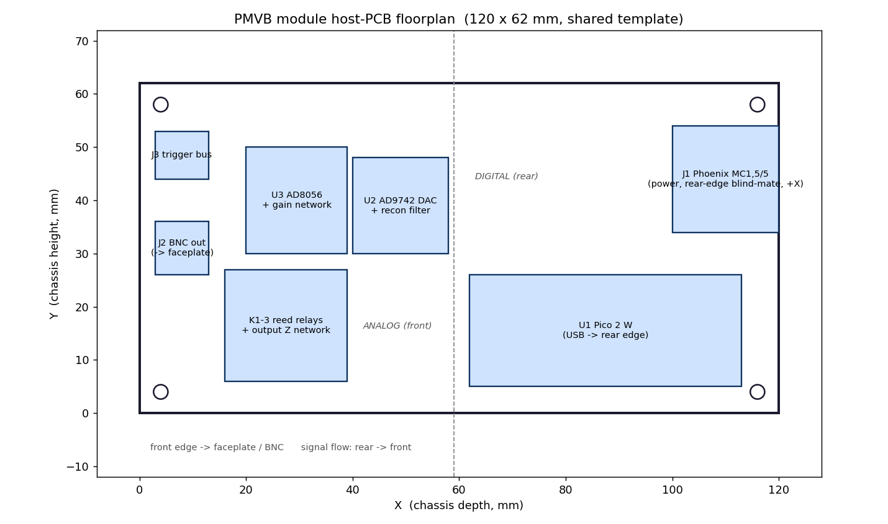

# Module 1E PCB Design Package

**Module:** 1E Function Generator / AWG **Version:** v0.5 (June 2026)
**Parent docs:** [Module 1E Design Document v1.7](../../../docs/modules/Module_1E_Design_Document.html),
PMVB System Design Document section 7.5.5
**Status:** all findings D1-D7 resolved (incl. the D2 filter synthesis and the D6 Phoenix P/N); KiCad project setup and schematic capture pending (you, in KiCad GUI). See `Module_1E_KiCad_Build_Guide.md`.

This package is the bridge between the Module 1E Design Document (theory,
block diagram, BOM) and a laid-out KiCad board. It carries the engineering
decisions the design document left open or stated inconsistently, the
connectivity intent the schematic must realize, the placement floorplan, the
layer stackup, and the design rules.

Schematic capture and board layout happen visually in the KiCad GUI; the
companion documents in this folder are the spec you build the project against.

---

## 1. What is in this folder

| File | Role |
|------|------|
| `Module_1E_PCB_Design_Package.md` | This document - engineering decisions + design spec. |
| `Module_1E_Parts_Checklist.md` | One-time prep: which custom parts to fetch from Component Search Engine and where to drop the files. |
| `Module_1E_KiCad_Build_Guide.md` | KiCad project setup walkthrough + the hierarchical sheet specification (per-sheet symbols and inter-sheet labels). |
| `kicad/` | Will hold the KiCad project (`module_1e.kicad_pro`, `module_1e.kicad_sch`, `module_1e.kicad_pcb`) plus the project-local part library at `kicad/lib/PMVB_1E/`. Created during step 1 of the build guide. |

Shared, in `../../library/`: `module_pcb_outline.py` plus its generated
`module_pcb_outline.dxf` (board outline + mounting holes, import onto KiCad
Edge.Cuts) and `module_pcb_floorplan.png` (annotated placement reference).

---

## 2. Findings and resolved decisions

The design document is internally inconsistent or silent on seven points. Each is
resolved below with a decision baked into this spec. Every one is a fair target
for a second opinion; the rationale is given so the decision can be revisited
deliberately.

### D1 - Op-amp gain is 20, not 10 (RESOLVED)

The design document lists the AD8056 difference-amp network as R_in = 1 k and
R_fb = 10 k, a differential gain of 10. It also specifies a +/-10 V output and
does the worst-case slew-rate budget (628 V/us) for a +/-10 V swing. A gain of
10 on the 1 V differential DAC signal only reaches +/-5 V. The document even
says, one paragraph later, "for +/-10 V output, the gain is 20", but never
updates the resistor values.

**Decision:** gain = 20. R_in1 = R_in2 = 1 k (R4, R5), R_fb = R_ref = 20 k
(R6, R7). This reaches the spec'd +/-10 V. If the real intent was +/-5 V,
change R6 and R7 to 10 k and \1\n\n**Resolved (June 2026):** the design document (v1.6+) now specifies R_fb = R_ref = 20 k / gain 20 in sections 1.6, 4, and 5, matching this decision.

### D2 - Reconstruction filter is two per-leg ladders (RESOLVED)

The design document text describes a single 5th-order L-C-L-C-L Butterworth
ladder. The BOM quantities tell a different story: 6 inductors ("three per
channel") and 4 capacitors ("two per channel"). Three series L plus two shunt C
is one 5th-order ladder; six and four is two of them, one per differential leg.

**Decision:** two identical per-leg 5th-order L-C-L-C-L ladders, one on the
IOUTA path (L1-L3 + C2-C3) and one on the IOUTB path (L4-L6 + C4-C5). This
keeps the differential path balanced into the difference amplifier.

**Resolved (June 2026):** a numerical 5th-order Butterworth synthesis was run against the real per-leg terminations. Source = the 25 ohm DAC termination; load = the op-amp's ~1 kohm input resistor (R4/R5), a 40:1 ratio that rules out a doubly-terminated ladder (it shows 6-11 dB of passband ripple). Each leg is therefore a **singly-terminated** 5th-order Butterworth: series inductors **0.22 uH / 0.68 uH / 0.22 uH** and shunt capacitors **820 pF** per leg (board total 4x 0.22 uH + 2x 0.68 uH + 4x 820 pF). Verified response: -3 dB at ~11 MHz, image rejection ~51 dB at 40 MHz (50 MSPS) and ~26 dB at 20 MHz (30 MSPS) - both meet spec; passband droop to 10 MHz is ~1.5 dB (worst ~2.3 dB at +/-5% parts), removed by the stored frequency-response calibration (design doc section 9.4). The cleaner doubly-terminated alternative (add a 25 ohm shunt load per leg for ~+/-0.5 dB flatness) was rejected: it halves the signal and needs op-amp gain 40, which drops the AD8056 closed-loop bandwidth to ~7.5 MHz, below the 10 MHz band. Values now carried in design doc sections 1.5/4/8.

### D3 - Reed-relay coils run from the Phoenix +5 V rail (RESOLVED)

The design document specifies 5 V relay coils but does not say where the 5 V
comes from. Two candidates: the Phoenix +5 V chassis rail, or the Pico's VBUS
(5 V from its own USB).

**Decision:** Phoenix +5 V rail. It keeps the Pico's USB power budget clean
(the Pico already streams DAC samples at 30-50 MSPS) and it matches the chassis
architecture, where module power is delivered through the Phoenix connector.
Consequence: Module 1E uses the Phoenix pins for +5 V, +12 V, -12 V, GND, and (as of the June 2026 revision) +3.3 V on a 5th pin for the DAC supply - so the connector is now the 5-position MC 1,5/5 (see D6 and section 6). 1E is the board that locks this interface for every other module.

### D4 - AD9742 AVDD/DVDD fed through ferrite beads (RESOLVED)

The design document calls for "local LC filtering" on the 3.3 V feed from the
Pico to the DAC's AVDD and DVDD pins, decoupled separately. The realization is
one ferrite bead per rail (FB1 to AVDD, FB2 to DVDD) plus 0.1 uF and 10 uF
decoupling. Ferrite bead plus capacitor is the standard practical form of that
LC filter.

**Resolved:** FB1 and FB2 (2x ferrite bead, 0805, ~600 ohm at 100 MHz) are now in the design-doc BOM. The 3.3 V they filter now comes from the chassis Phoenix rail (J1.5), not the Pico - see D3.

### D5 - AD9742 pinout corrected against the datasheet (RESOLVED)

RESOLVED. The AD9742 datasheet (Rev. C, Table 6, 28-lead SOIC/TSSOP) confirms
the Module 1E Design Document's AD9742 pin table is wrong. The data bus (pins
1 to 12, DB11 down to DB0) is correct, but pins 13 to 28 are scrambled in the
design doc. The verified pinout for the upper half:

| Pin | Signal | Pin | Signal |
|-----|--------|-----|--------|
| 13, 14 | NC | 21 | IOUTB |
| 15 | SLEEP | 22 | IOUTA |
| 16 | REFLO | 23 | RESERVED |
| 17 | REFIO | 24 | AVDD |
| 18 | FS ADJ | 25 | MODE |
| 19 | NC | 26 | DCOM |
| 20 | ACOM | 27 | DVDD |
|  |  | 28 | CLOCK |

Three corrections that change the board, not just the symbol:

- **Pin 23 is RESERVED.** The datasheet says do not connect it to common or to
  a supply; leave it floating. The design doc had pin 23 as IOUTB.
- **MODE (pin 25) is a data-format strap, not a parallel/serial select.** Tie
  it to DCOM for straight binary or to DVDD for twos complement. This spec
  ties MODE to GND (DCOM), which selects straight binary, so the Pico firmware
  must emit straight-binary sample codes. The design doc's "tie MODE to GND for
  parallel mode" is a misreading of this pin.
- IOUTA and IOUTB are pins 22 and 21, the reverse of the design doc.

The CSE-fetched AD9742 symbol must carry this datasheet-correct pinout; verify
it after the Library Loader import per step 6 of the build guide. Section 7.2
of the build guide is the authoritative per-pin wiring contract.

**Resolved:** the design document pin table (section 5) now carries this datasheet-correct pinout, so the two documents agree.

### D6 - Phoenix is 5-pin right-angle 1803303, rear blind-mate (RESOLVED)

The host PCB mounts vertically (in the chassis Y-Z plane). The connector is a **right-angle** board header (mating axis in the plane of the PCB). Naming is counterintuitive: in this family "MC ...-G" (no V) is the right-angle part and "MCV ...-G" is the straight vertical one. Two June 2026 changes supersede the original 4-pin top-drop scheme: (1) the +3.3 V rail moved onto the connector, so it is now **5-position**; (2) the header moves from the top edge to the **rear edge** beside the USB, mating rearward so it blind-mates onto a fixed rear-of-slot plug as the blade slides in (one insertion motion instead of slide-then-drop). The right-angle orientation is still correct: mating rearward is in the plane of the vertical board.

**Decision (RESOLVED June 2026):** use Phoenix **MC 1,5/5-G-3,81, order no. 1803303** - the 5-position right-angle header (TME spec table "angled 90 deg", 5 pins, 8 A / 160 V, 3.81 mm, THT), Digi-Key 277-1209-ND, ~$1.84 single-qty, in stock. Harness plug: MC 1,5/5-ST-3,81, Phoenix 1803604 (Digi-Key 277-1164-ND). Pin order 1-5 = +5 V, +12 V, -12 V, GND, +3.3 V. (The 4-position 1803293 was the prior choice, before the +3.3 V rail and the blind-mate change.)

**Chassis follow-up (tracked separately):** update the chassis doc's back-wall harness to (a) carry a 5th rail (+3.3 V from the GeeekPi breakout), (b) use the 5-position parts (header 1803303, plug 1803604), and (c) change from per-slot plugs dropped from above to fixed forward-facing plugs at the rear of each slot for blind-mate. The module-side footprint can be locked now; all 14 module PCBs inherit it (see section 6).

### D7 - Output impedance modes: drop 600 ohm, add high-Z (low-impedance source)

The Module 1E Design Document v1.1 specifies a three-position output impedance
switch as 50 ohm / 600 ohm / 10 kohm. The 600 ohm mode was specified to match
legacy audio gear from the matched-impedance era (broadcast consoles, telco
lines, vintage tape machines). For the target use cases on this bench, which
include consumer tube headphone amps and integrated amps (e.g. Bravo Audio
Ocean) with high-impedance line inputs in the 47 to 100 kohm range, 600 ohm
adds no value over a simpler low-impedance source: the DUT sees essentially
the same voltage either way because its input is high-Z. The genuinely useful
addition for that workload is a high-Z output mode in which the op-amp drives
the BNC directly through a relay, with no series back-termination resistor.
That mode delivers the full +/-10 V into a high-Z scope or DUT input.

**Decision:** the three modes become 50 ohm / high-Z / 10 kohm bias.

- K1 -> R8 (50 ohm 1%) -> BNC: back-terminated, for 50 ohm scope inputs and
  RF gear.
- K2 -> direct (no series resistor) -> BNC: low-impedance source, for high-Z
  scope inputs and the consumer tube audio target.
- K3 -> R10 (10 kohm 1%) -> BNC: current-limited safe-bias mode for injection
  on unknown DUT nodes.

The Pico relay-control signal previously named `RELAY_600` (GP14) is renamed
`RELAY_HIZ`. R9 (the former 600 ohm series resistor) drops from the BOM.
K2's branch is just the relay contacts; no other component change. Total
component count goes from 53 to 52.

**Action required:** patch the Module 1E Design Document itself (the parent
design doc) to swap "600 ohm" for "high-Z" in section 3 (impedance switching)
and section 5 (specifications table), and update the Figure 1E-3 typical-app
schematic to label the middle branch "high-Z" instead of "600 ohm". The
TikZ source (`docs/figures/modules/1e_typical_app.tex`) and the rendered
`1e_typical_app.svg` are updated in the same pass as this finding lands.

---

## 3. Connectivity intent

The Module 1E design comprises **53 components in 6 functional blocks**: U1
Pico 2 W; U2 AD9742 + reconstruction filter + DAC supply island; U3 AD8056
difference amplifier; K1-K3 reed-relay output Z switch with Q1-Q3 drivers and
D1-D3 flyback diodes; J1-J3 connectors (Phoenix power, BNC wire-out, trigger
header); plus the passive support and decoupling. The schematic-capture
contract is given block-by-block in section 7 of the build guide; the high-
level summary follows.

### Power distribution

| Net | Source | Loads |
|-----|--------|-------|
| `+5V` | Phoenix J1.1 | K1-K3 relay coils, D1-D3 flyback, decoupling C13/C14 |
| `+12V` | Phoenix J1.2 | AD8056 V+ (U3.8), decoupling C9/C11 |
| `-12V` | Phoenix J1.3 | AD8056 V- (U3.4), decoupling C10/C12 |
| `GND` | Phoenix J1.4 | common return |
| `+3V3` | Phoenix J1.5 (chassis ATX 3.3 V via GeeekPi D-1188 breakout) | DAC supply island via FB1/FB2, bulk C8/C15 |
| `AVDD` | FB1 from +3V3 | AD9742 AVDD (U2.24), decoupling C6/C16 |
| `DVDD` | FB2 from +3V3 | AD9742 DVDD (U2.27), decoupling C7/C17 |

The Pico is powered over its own micro-USB; VSYS and VBUS are not connected on the PCB. The DAC's +3V3 now comes from the Phoenix connector (J1.5, the chassis 3.3 V rail via the GeeekPi breakout), so the Pico's 3V3_OUT no longer feeds the board and is left unconnected. This decouples the DAC analog supply from the Pico's switching regulator. The Pico drives the parallel data bus at its own internal 3.3 V while the DAC DVDD is the chassis 3.3 V; with common GND and both near 3.3 V the logic levels have ample margin.

### Signal chain

| Stage | Nets |
|-------|------|
| Parallel data bus | `DB0`-`DB11`: Pico GP0-GP11 -> AD9742 DB0-DB11 (pins 12 down to 1) |
| DAC clock | `DAC_CLK`: Pico GP12 -> AD9742 CLOCK (pin 28) |
| DAC current outputs | `IOUTA`/`IOUTB`: AD9742 pins 22 / 21 -> 25 ohm term (R2/R3) -> filter |
| Reconstruction filter | leg A: IOUTA -> L1/C2/L2/C3/L3 -> `FILT_A`; leg B mirrors with L4-L6/C4-C5 -> `FILT_B` |
| Difference amp | `FILT_A`->R4(1k)->`OPAMP_IN+`; `FILT_B`->R5(1k)->`OPAMP_IN-`; R6(20k) feedback, R7(20k) balance |
| Output | `OPAMP_OUT` -> K1/K2/K3 -> R8 (50R) / direct / R10 (10k) -> `BNC_CENTER` (J2.1) |

### Control and trigger

`OPAMP_OUT` reaches the BNC through exactly one energized relay. Relay drive:
Pico GP13/GP14/GP15 -> base resistor R11/R12/R13 -> 2N3904 (Q1/Q2/Q3) low-side
switch -> relay coil -> +5 V, with a 1N4148 flyback diode across each coil.
Firmware enforces one-relay-at-a-time. Trigger I/O: Pico GP16 -> `SYNC_OUT` and
GP17 -> `TRIG_IN`, both on the J3 header.

### Output specification envelope (by mode and load)

The amplitude at the BNC depends on both the impedance mode and the load,
because the AD8056 output stage is current-limited (~60 mA continuous). For
the as-designed op-amp:

| Mode | Source side | Into >=1 Mohm load | Into 50 ohm terminated |
|------|-------------|---------------------|------------------------|
| 50 ohm (K1) | back-terminated | +/-10 V | ~+/-3 V |
| High-Z (K2) | direct, low Z | +/-10 V | ~+/-3 V |
| 10 kohm bias (K3) | current-limited | +/-10 V | +/-0.05 V (not for 50 ohm drive) |

The 50 ohm and high-Z modes hit the same op-amp current limit into a 50 ohm
terminated load and effectively yield ~+/-3 V at the scope under those
conditions. The 50 ohm mode adds back-termination for clean transmission-line
behavior on longer cables; the high-Z mode delivers the lowest source
impedance for short cables into high-Z loads. The 10 kohm mode is the
intentionally weak safe-bias mode for injecting onto unknown DUT nodes and
should not be used to drive 50 ohm loads.

If +/-5 V or higher into 50 ohm terminated is ever required for the workload,
the AD8056 is the wrong output stage and a higher-current line driver
(AD811 / LMH6321 / OPA567 class) would replace it. For the current target use
cases (DDS waveforms into oscilloscope inputs, consumer tube audio testing,
swept-sine THD, multitone IMD, white noise, safe-bias injection), the AD8056
is sufficient.

---

## 4. Open questions to iterate

These are the points worth working through before or during schematic capture.

1. **Reconstruction filter synthesis (D2) - resolved.** Singly-terminated 5th-order Butterworth for the 25 ohm source / ~1 kohm load: per-leg series 0.22/0.68/0.22 uH, shunt 820 pF. -3 dB ~11 MHz; image rejection ~51 dB at 40 MHz, ~26 dB at 20 MHz; ~1.5 dB passband droop handled by the section 9.4 calibration. Values in design doc sections 1.5/4/8.
2. **AD9742 pinout (D5) - resolved.** Verified against the AD9742 datasheet
   Rev. C; the build guide and parts checklist carry the correct pin map.
   Only remaining action: patch the design document's own pin table to match.
3. **Phoenix connector (D6) - resolved.** 5-position right-angle MC 1,5/5-G-3,81 (1803303, Digi-Key 277-1209-ND ~$1.84), rear-edge blind-mate, +3.3 V added on pin 5. Module footprint can be locked; the chassis harness redesign is a tracked follow-up.
4. **PCB outline and mounting (section 5).** The 120 x 62 mm outline and the
   4x M2.5 hole pattern are a proposal. They must be co-designed with the v10
   module-body STL, which does not yet define PCB mounting bosses.
5. **Trigger-bus connector (J3).** There is no chassis-wide trigger-bus
   connector standard yet. J3 is modelled as a 3-pin 0.1 inch header
   (SYNC_OUT, GND, TRIG_IN) as a placeholder. Like the Phoenix interface, this
   will eventually need to be locked across modules; 1E and 2E are the first
   two modules that use it.
6. **Pico mounting.** Headers (14.2 mm stack) vs direct-solder (6.2 mm stack).
   The chassis stack budget is 21.5 mm, so either fits; direct-solder leaves
   more room for the analog section but makes Pico replacement harder.

---

## 5. PCB outline and floorplan

All 14 PMVB modules share one outer outline so they are mechanically
interchangeable and so a future 4-rail distribution backplane mates every slot
at the 22.5 mm pitch. Module 1E is the first board to instantiate it.

**Outline (proposal):** 120 mm (chassis depth) x 62 mm (chassis height),
fitting inside the 125 x 68 mm module-body cavity with clearance. 4x M2.5
mounting holes, 4 mm inset. Import `../../library/module_pcb_outline.dxf` onto
the KiCad Edge.Cuts layer to start the board.

**Mount convention (mandatory, from chassis doc 3.6):** the host PCB mounts
vertically against the cavity right wall. All components go on the
cavity-facing (left) copper. Nothing on the back face.

**Placement intent:** signal flows rear to front. Digital section at the rear
(Pico, micro-USB to the rear edge). Mixed section in the middle (AD9742, then
the reconstruction filter). Analog section at the front (AD8056, relay output
network, BNC header to the faceplate). Keep the DAC parallel data bus short and
away from the analog output; keep the digital and analog grounds as a single
plane split under the DAC, joined at one point near the DAC ACOM/DCOM pins.

**Fixed connector positions** (inherited by every module):

| Ref | Connector | Position | Mating direction |
|-----|-----------|----------|------------------|
| J1 | Phoenix MC 1,5/5 power | rear edge, beside the USB | rearward (chassis +Y), blind-mate on insertion |
| U1 micro-USB | Pico USB | rear edge | +Y (rearward, to USB hub) |
| J2 / faceplate | BNC output | front edge | -X (out the faceplate) |

---

## 6. Module-to-backplane Phoenix interface spec

This is the cross-module interface that Module 1E locks. Every other module
PCB and the future custom 4-rail distribution PCB must conform to it.

| Property | Value |
|----------|-------|
| Connector family | Phoenix Contact MC 1,5 series, 3.81 mm pitch, 5 position |
| Module-side part | MC 1,5/5-G-3,81 right-angle PCB header, Phoenix 1803303 (Digi-Key 277-1209-ND) |
| Harness-side part | MC 1,5/5-ST-3,81 cable plug, Phoenix 1803604 (Digi-Key 277-1164-ND) |
| Pin 1 | +5 V |
| Pin 2 | +12 V |
| Pin 3 | -12 V |
| Pin 4 | GND |
| Pin 5 | +3.3 V |
| PCB location | Rear edge, beside the Pico USB, on the shared outline |
| Mating axis | Rearward (chassis +Y) - blind-mates onto a fixed rear-of-slot plug as the blade slides in |
| Keep-out | Per `module_pcb_outline.dxf`, rear-edge zone beside the USB; clear of the rear M2.5 mounting holes |

Pin order matches the chassis back-wall harness (chassis doc 4.4), with the new +3.3 V on pin 5 so the original four-rail order is unchanged. A module that does not need a given rail still passes that pin through for uniformity; Module 1E uses all five. **Chassis follow-up:** the rearward blind-mate means the back-wall harness must change from per-slot plugs dropped on from above to fixed forward-facing plugs at the rear of each slot (the 5-rail distribution backplane, pulled forward from v1.1). That chassis-side rework is tracked separately; this package and the module PCB are specified for it.

**Locking criterion:** D6 is settled (5-pin 1803303, rear-edge blind-mate); once the footprint exists, this table and the keep-out in `module_pcb_outline.dxf` are frozen. Changing them later means re-spinning every module PCB.

---

## 7. Layer stackup

A 4-layer board is recommended over 2-layer. The module mixes a 30-50 MSPS
parallel data bus, a current-output DAC, a wideband (10 MHz) analog path, and
+/-12 V rails. A solid ground plane under the DAC and the analog path is worth
far more than the small fab-cost delta.

| Layer | Use |
|-------|-----|
| 1 (top, cavity-facing) | components and signal routing; DAC data bus, analog path |
| 2 | solid ground plane (continuous under DAC and analog section) |
| 3 | power: +3V3 / AVDD / DVDD pours (rear), +/-12 V (front) |
| 4 (bottom, against body wall) | low-density routing only; no components (mount convention) |

If cost forces 2-layer: bottom layer is a near-solid ground pour, top carries
signals and power, and the analog/digital ground split is a deliberate
plane-cut joined under the DAC.

---

## 8. Netclasses and design rules

Set these as KiCad netclasses before routing.

| Netclass | Nets | Track width | Notes |
|----------|------|-------------|-------|
| Power_12V | +12V, -12V | 0.8 mm | op-amp rails; 100-200 mA |
| Power_5V | +5V | 0.6 mm | relay coils |
| Power_3V3 | +3V3, AVDD, DVDD | 0.5 mm | keep AVDD and DVDD pours separate |
| Analog | IOUTA, IOUTB, FILT_A, FILT_B, OPAMP_IN+/-, OPAMP_OUT, BNC_CENTER | 0.3 mm | short, direct; guard from the data bus |
| DataBus | DB0-DB11, DAC_CLK | 0.25 mm | length-match loosely; keep clear of the analog path |
| Default | everything else | 0.25 mm | |

General rules: 0.2 mm minimum clearance (relax if the chosen fab needs more);
the +/-10 V output net keeps extra clearance to GND; place every decoupling
capacitor within ~4 mm of its IC supply pin per the design document.

---

## 9. Build sequence

The detailed walkthrough is in `Module_1E_KiCad_Build_Guide.md`. Summary:

1. Fetch the five custom parts per `Module_1E_Parts_Checklist.md` and drop
   them in `kicad/lib/PMVB_1E/`.
2. Resolve D6 (Phoenix right-angle P/N) before locking that footprint.
3. Create the KiCad project at `kicad/`; fill the title block; add the
   project library; import `module_pcb_outline.dxf` onto Edge.Cuts; set
   netclasses per section 8.
4. Add the five hierarchical sheets (Pico, DAC, OpAmp, OutputSwitch, Trigger)
   and capture each per section 7 of the build guide.
5. Annotate, ERC, then Tools - Update PCB from Schematic.
6. Place to the floorplan in section 5; pour the L2 ground plane; route the
   data bus on top, kept away from the analog path; route the analog path
   short and direct.
7. DRC clean, then run the section 9 verification checklist in the build
   guide before fab quote.

If connectivity changes during capture, just update the schematic and
re-export. The build guide section 7 is the wiring contract you reconcile
against.

---

## 10. Status and next steps

Done: all engineering findings D1 through D7 resolved. Latest revision (June 2026): the DAC +3.3 V now comes from the chassis Phoenix rail, the connector is the 5-position right-angle MC 1,5/5-G-3,81 (1803303), and it relocates to the rear edge for blind-mate on insertion. Shared PCB outline + floorplan generated (J1 now rear-edge); interface spec at 5-pin; parts checklist and KiCad build guide authored; design-document inconsistencies patched (gain, pinout, high-Z, filter values, ferrite beads, power source).

Next, in rough order: the chassis back-wall harness blind-mate redesign (5-rail, fixed rear-of-slot plugs) is tracked as a follow-up; co-design the PCB mounting bosses with the v10 module body; settle the Pico mount (headers vs direct-solder) and the J3 trigger-bus connector; fetch the five custom parts; build the KiCad project per the guide; capture the schematic; lay out the board. Per the README tracker, this closes "PCB design" and feeds into "PCB fab + assembly".
